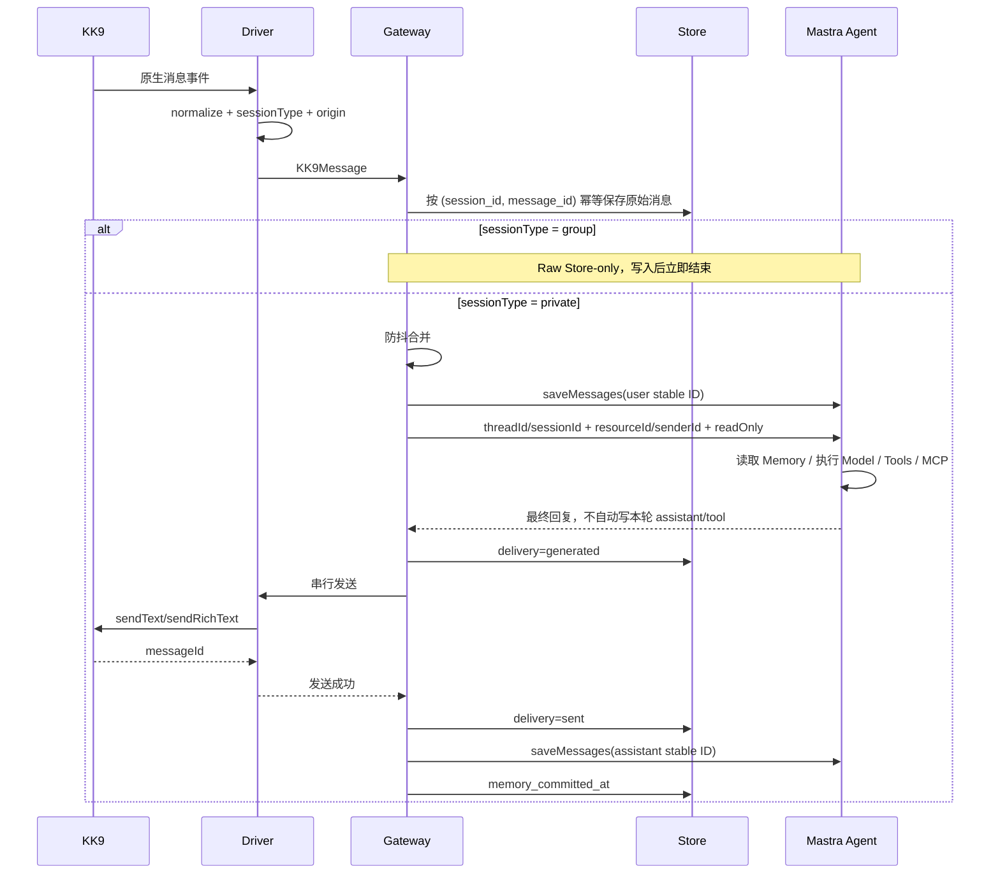
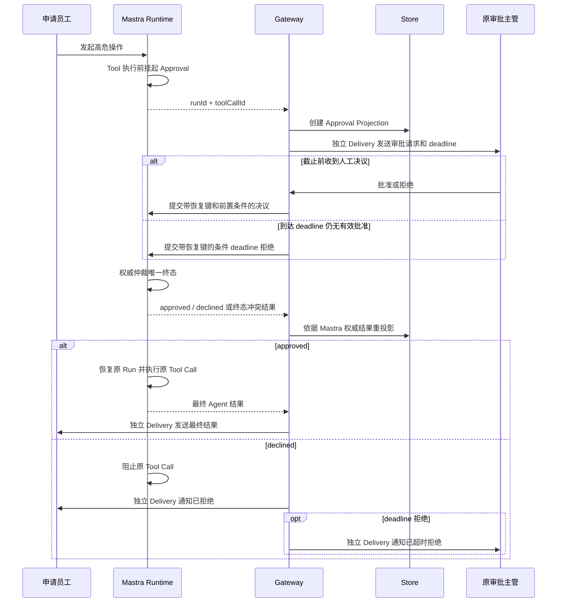

# KKBot Mastra-native 重构总规格

> 仓库：`dnslin/kkbot`
> 文档状态：待确认 / 新重构执行规格
> 取代来源：关闭后的 Issue #107《统一启动器、知识库摄取与生产级运行保障》
> 需求迁移：Issue #107 的 54 条 User Story 均已建立去向
> 技术基线：Node.js `>=22.13`；生产部署与 CI 仅支持仍处于官方维护期的 LTS；Mastra 是唯一 Agent Runtime，不研发自定义 AgentRunner
> 适用范围：仅支持 KK 单一 IM 客户端，不建设多渠道适配层
> 编制日期：2026-08-21

---

## 1. 文档定位与目的

本文件是 KKBot 后续重构的**唯一总规格**。Issue #107 关闭后，不再作为可执行规格；它仅作为历史需求来源保留。本文件完成两件事：

1. 确立 KKBot 的 Mastra-native 目标架构和一次性完整改造范围；
2. 将 Issue #107 的产品需求、运行保障、知识库要求和测试要求迁移到新架构，并明确旧技术决策的去向。

KKBot 当前已经具备 KK9 CDP 驱动、消息收发、组织架构、会话编排、记忆、工具、MCP、HITL、主动任务和知识检索等能力，但 Agent 主链路仍然同时存在两套运行逻辑：

- Mastra 提供部分 Memory、Workflow、Schedule、Tool 和 Storage 能力；
- `KkbotAgentRuntime` 又自行负责模型调用、Tool Call 解析、工具执行、Failover、Prompt 拼装和第二轮模型调用。

这种混合方式会造成运行状态重复、职责重叠、工具存在多条执行路径、Memory 出现双事实源，也使原 Issue #107 中的统一启动器、知识摄取和生产保障建立在不稳定的 Agent 底座上。

本规格把项目收敛为：

> **KKBot 负责 KK 客户端接入、KK 专属业务约束和企业数据；Mastra 负责 Agent 推理、Agent Loop、Memory、Tool Calling、MCP、HITL、Workflow、Schedule 和 Agent Observability。**

本次不引入自研 `AgentRunner`，不构建多 IM Adapter，不拆微服务。Issue #107 的 54 条 User Story 没有被直接丢弃；需求全部迁入本规格，旧 Runtime 相关实现决策则被替换。

### 1.1 Wayfinder 决策回写与生效

- 开放决策票中的候选答案、讨论和推荐只是候选上下文，不是实施依据，不得作为已生效规则提前进入 `master` 上的本规格。
- 一张决策票进入正式解决流程后，可以在独立分支形成只对应该票的最小规格修改；独立分支中未合并的 commit 不代表最终规格已经更新。
- 规格修改、合并、resolution、关闭和地图索引属于同一个解决流程。需要修改规格时，修改必须先通过仓库正常机制合并到 `master`；只有验证修改已进入 `master` 后，才能发布最终 resolution 并关闭该票。
- resolution comment 是该票详细决定及理由的权威来源；本总规格只保存已经生效、供后续实施规划使用的整合规则；Wayfinder 地图只追加上下文指针（`gist + link`，即决策票链接和一行摘要），不复制 resolution 详情。
- 如果一张票不需要修改本规格，resolution 必须明确说明原因；如果所需规格修改无法合并，该票必须保持开放，不得发布最终 resolution。

### 1.2 文档权威与 ADR 生命周期

各类文档承担不同职责，不以“最后修改时间”互相覆盖：

1. `master` 上的本总规格保存已经生效的整合规则，是实施范围、架构边界和验收口径的当前依据。
2. 已关闭决策票的 resolution comment 保存该票的详细决定、理由和被否决方案，是总规格对应规则的决策来源；开放票中的候选答案、推荐或 HITL 选择仍不生效。
3. 状态不是 `Superseded` 的 ADR 保存长期架构理由，只能解释本总规格已经确定的边界，不得覆盖或提前回答本总规格明确留给开放票的事项。
4. `CONTEXT.md` 只定义统一领域语言，不保存 Runtime API、表结构、固定时长、通道、启动顺序或其他实现规则；术语与当前规格冲突时必须清洁更新术语表。
5. 状态为 `Superseded` 的 ADR 只保留历史审计价值，其 Decision 正文不再是实施依据；当前答案必须沿生命周期元数据中的替代链接继续读取。

#### 当前替代索引

| 历史 ADR    | 当前替代                                                                                            | 已生效决议                                                                                                                                                                                                                                                                                                                                                                                                                                                                                                                                                                                                                                                                             | 仍待裁定                                                                                                                                       |
| ----------- | --------------------------------------------------------------------------------------------------- | -------------------------------------------------------------------------------------------------------------------------------------------------------------------------------------------------------------------------------------------------------------------------------------------------------------------------------------------------------------------------------------------------------------------------------------------------------------------------------------------------------------------------------------------------------------------------------------------------------------------------------------------------------------------------------------- | ---------------------------------------------------------------------------------------------------------------------------------------------- |
| ADR 0002    | 本规格 §3.1、§4.7、§12                                                                              | [#112 群聊 Raw Store-only](https://github.com/dnslin/kkbot/issues/112)、[#135 MCP 与 Processor 生命周期](https://github.com/dnslin/kkbot/issues/135#issuecomment-5389833290)                                                                                                                                                                                                                                                                                                                                                                                                                                                                                                           | —                                                                                                                                              |
| ADR 0003    | 本规格 §4.7、§4.21–§4.23、§12                                                                       | [#111 删除独立 Draft](https://github.com/dnslin/kkbot/issues/111)、[#129 Delivery 与 Memory 提交](https://github.com/dnslin/kkbot/issues/129#issuecomment-5389438847)                                                                                                                                                                                                                                                                                                                                                                                                                                                                                                                  | [#137 资产保留与清理恢复](https://github.com/dnslin/kkbot/issues/137)                                                                          |
| ADR 0004    | [ADR 0009](./adr/0009-mastra-runtime-and-kkbot-business-fact-boundaries.md)                         | [#117 Mastra 原生能力缺口](https://github.com/dnslin/kkbot/issues/117)、[#123 审批超时语义](https://github.com/dnslin/kkbot/issues/123)、[#126 Approval 恢复](https://github.com/dnslin/kkbot/issues/126#issuecomment-5389399723)、[#127 Storage 边界](https://github.com/dnslin/kkbot/issues/127#issuecomment-5389294656)、[#129 Delivery/Memory](https://github.com/dnslin/kkbot/issues/129#issuecomment-5389438847)、[#131 兼容版本研究](https://github.com/dnslin/kkbot/issues/131)、[#133 Node.js 基线](https://github.com/dnslin/kkbot/issues/133#issuecomment-5389347634)、[#135 MCP 与 Processor 生命周期](https://github.com/dnslin/kkbot/issues/135#issuecomment-5389833290) | [#161 高危 Tool Approval 范围](https://github.com/dnslin/kkbot/issues/161)                                                                     |
| ADR 0006    | [ADR 0010](./adr/0010-single-composition-root-and-knowledge-lifecycle.md)                           | [#127 Storage 边界](https://github.com/dnslin/kkbot/issues/127#issuecomment-5389294656)、[#130 Knowledge 摄取故障](https://github.com/dnslin/kkbot/issues/130#issuecomment-5391309063)、[#131 兼容版本研究](https://github.com/dnslin/kkbot/issues/131)、[#133 Node.js 基线](https://github.com/dnslin/kkbot/issues/133#issuecomment-5389347634)、[#135 MCP 与 Processor 生命周期](https://github.com/dnslin/kkbot/issues/135#issuecomment-5389833290)、[#136 Knowledge 索引原子替换](https://github.com/dnslin/kkbot/issues/136)                                                                                                                                                      | [#137 资产保留与清理恢复](https://github.com/dnslin/kkbot/issues/137)、[#138 Preflight 与逆序回滚](https://github.com/dnslin/kkbot/issues/138) |
| ADR 0007 §2 | [ADR 0010](./adr/0010-single-composition-root-and-knowledge-lifecycle.md)、本规格 §4.18–§4.19、§9.6 | [#130 Knowledge 摄取故障](https://github.com/dnslin/kkbot/issues/130#issuecomment-5391309063)、[#136 Knowledge 索引原子替换](https://github.com/dnslin/kkbot/issues/136)                                                                                                                                                                                                                                                                                                                                                                                                                                                                                                               | [#137 资产保留与清理恢复](https://github.com/dnslin/kkbot/issues/137)                                                                          |
| ADR 0008    | [ADR 0011](./adr/0011-application-logging-and-mastra-observability.md)                              | [#127 Storage 边界](https://github.com/dnslin/kkbot/issues/127#issuecomment-5389294656)、[#131 兼容版本研究](https://github.com/dnslin/kkbot/issues/131)、[#133 Node.js 基线](https://github.com/dnslin/kkbot/issues/133#issuecomment-5389347634)、[#135 MCP 与 Processor 生命周期](https://github.com/dnslin/kkbot/issues/135#issuecomment-5389833290)                                                                                                                                                                                                                                                                                                                                | [#138 Preflight 与逆序回滚](https://github.com/dnslin/kkbot/issues/138)                                                                        |

---

## 2. 不可变设计原则

### 2.1 只针对 KK

KKBot 只服务 KK9 客户端，不建立通用 IM 平台抽象。

不新增：

- 通用 `ChatTransport`；
- 通用 Channel Adapter；
- 多平台消息协议；
- Slack、飞书、企业微信兼容层；
- 通用插件市场。

允许直接使用 KK 领域概念：

- `KK9Driver`；
- `KK9Message`；
- `KK9Session`；
- KK 红点；
- KK 会话切换；
- KK 原生撤回；
- KK 组织架构；
- KK 人工操作员接管。

### 2.2 Mastra 是唯一 Agent Runtime

以下生产运行能力统一由 Mastra 提供：

- Agent Loop；
- 模型调用；
- Tool Calling；
- MCP Tool；
- Memory；
- 长会话观察与压缩；
- Tool Approval；
- Workflow suspend/resume；
- Schedule；
- Agent Trace；
- 模型重试与回退。

KKBot 不再自行实现第二套 Agent Runtime。

Scorer 不属于生产运行能力基线；仅在启用可选离线评测或质量评价时由 Mastra 提供，KKBot 不自研第二套评分运行时。

“Mastra 原生能力”是指最终锁定的稳定兼容版本通过受支持的公开 API 执行该能力，并由 Mastra 持有对应的运行时状态机和执行语义。仅存在同名 API、博客示例，或需要 KKBot 辅助代码自行补出状态机，不算原生满足。

稳定兼容版本已经原生提供所需能力时，优先选择该版本，不在 KKBot 内复制该能力。若不存在可接受的稳定兼容版本，则将对应需求返回 Wayfinder 重新裁定、缩减、替换或删除；不得以自研 Runtime 回补。本原则不锁定具体 Mastra 版本；Node.js 运行时基线由 2.7 节明确。

### 2.3 不研发 AgentRunner

不新增 `AgentRunner`、`AgentLoopRunner` 或类似运行时。

实际执行者就是 Mastra Agent：

```ts
const agent = mastra.getAgent('kk-assistant');
const result = await agent.generate(/* ... */);
// 或 agent.stream(/* ... */)
```

项目中可以保留“薄集成层”：它只连接 KK 业务边界与 Mastra 公开 API，不持有 Mastra 运行时状态机或执行语义。允许职责包括：

1. 处理 KK 专属 I/O 和数据转换，把 KK 聚合消息转换为 Agent 输入；
2. 创建 `requestContext`、`threadId`、`resourceId`、`traceId`；
3. 定义和注册 KKBot 业务 Tool，并把外部上下文或决议路由给 Mastra 公开 API；
4. 把 Mastra 事件投影为 Delivery、Approval 等 KKBot 可查询和审计的业务状态；
5. 调用 Mastra Agent，并把最终结果交给 KK 发送层执行 KK 专属的可靠交付。

投影不是运行时事实源。若辅助代码自行持有或决定 Agent/模型重试循环、工具循环、第二套 Agent Memory、Memory 提交或回滚、审批挂起或恢复、调度触发、模型回退等状态转换，它就是被禁止的“自研 Runtime 回补”；即使命名为 Gateway、Coordinator、Adapter 或 Wrapper 也不改变性质。KK 专属发送重试和交付补偿不在此列，但不得反向改变 Mastra 的 Agent 执行语义。

### 2.4 单进程、单数据库、单 Mastra 实例

默认运行模型：

- 单机；
- 单 KK 客户端；
- 单进程；
- 单数据目录；
- 单 LibSQL 数据库文件；
- 单 Mastra Storage；
- 单 Mastra 实例。

“单数据库”约束的是同一个规范化本地文件路径，不等于共享同一个 Client。唯一 Composition Root 必须只解析一次数据库配置，创建一个 KKBot Client，并通过同一规范化 `file:` URL 创建一个且仅一个 `LibSQLStore` 及其自有 Client；唯一 Mastra 实例只能使用该 Storage。任何 Memory、Workflow、Schedule、Observability 或其他 Mastra component 都不得私自创建 Storage、Client 或第二个数据库文件。

KKBot Client 与 Mastra Storage 自有 Client 的事务和关闭责任相互独立。共享文件不构成跨 Client、跨 domain 原子事务；需要业务一致性的流程必须依赖所属事实源、状态转换和幂等键，不得伪装成共享数据库事务。

本节不锁定具体 Mastra 版本或构造器细节。最终兼容版本必须通过单库双 Client、唯一 Storage、初始化和关闭契约验证；验证失败时返回 Wayfinder 重新裁定，不自研 Storage 语义补缺口。

不引入 Kafka、Redis、分布式锁或多主高可用。

### 2.5 KK 发送结果才是最终交付事实

模型生成成功不等于用户已经收到。

Delivery 从生成结果创建时起记录完整发送生命周期，必须区分 `generated`、`sending`、`sent`、`failed`、`unknown` 和 `aborted`。只有 KK 发送成功的正向结果才能进入 `sent`，也只有 `sent` 表示已交付事实。只有能够证明消息没有进入 KK 发送路径的结果才能进入 `failed`；发送动作可能已经触发但系统无法无歧义确认时必须进入 `unknown`。`unknown` 不是失败，人工处理前不得自动补发。Mastra Memory 中的 assistant 对话历史必须服从同一边界：本轮 Agent 只读既有 Memory，非 `sent` 内容不得自动提交；Delivery 持久化为 `sent` 后才显式提交最终 assistant 消息。`unknown` 只有经人工正式裁定为已发送并进入 `sent` 后才能补交。

---

### 2.6 Mastra 能力基线

本规格依赖下列 Mastra 原生能力，具体 API 签名以项目最终锁定的兼容版本为准：

| 能力                                  | 本规格中的用途                                                                                                                | 官方依据                                                                                                                                   |
| ------------------------------------- | ----------------------------------------------------------------------------------------------------------------------------- | ------------------------------------------------------------------------------------------------------------------------------------------ |
| Agent Loop 与 Tool Calling            | 取代 `KkbotAgentRuntime` 的自定义模型和工具循环                                                                               | [Agent orchestration](https://mastra.ai/blog/introducing-mastra-improved-agent-orchestration-ai-sdk-v5-support)                            |
| 动态模型与 fallback array             | Agent 动态 model 从 `RequestContext` 读取 Model Tier，并返回配置好的 `ModelWithRetries[]`；重试与 fallback 状态由 Mastra 持有 | [Dynamic model fallback arrays](https://mastra.ai/blog/changelog-2026-03-16)                                                               |
| Observational Memory                  | 取代自定义 L2 摘要和 L3 长期协同记忆                                                                                          | [Observational Memory](https://mastra.ai/blog/observational-memory)                                                                        |
| Tool Approval                         | 高危工具执行前由主管批准或拒绝                                                                                                | [Tool approval](https://mastra.ai/blog/tool-approval)                                                                                      |
| Workflow suspend / resume 与 snapshot | 需要补充信息、跨步骤等待或长流程恢复                                                                                          | [Workflow snapshots](https://mastra.ai/en/reference/workflows/snapshots)                                                                   |
| Agent / Workflow Schedules            | 仅触发不创建 Delivery、无高危 Tool 或第三方写副作用、重复执行安全的内部维护                                                   | [Schedules](https://mastra.ai/blog/introducing-schedules-for-agents-and-workflows)                                                         |
| Input / Output Processors             | 注入防护、PII、安全过滤和输出清洗                                                                                             | [Input processors](https://mastra.ai/blog/changelog-2025-07-30)、[Output processors](https://mastra.ai/blog/introducing-output-processors) |
| Observability 与 OTel                 | 生产运行必需的 Agent、模型、工具、Memory、Workflow、Token Trace 和运行诊断                                                    | [Mastra observability](https://mastra.ai/ai-agent-observability)                                                                           |
| SensitiveDataFilter                   | 生产运行必需的 Agent Trace 导出前字段级敏感信息脱敏                                                                           | [Sensitive data redaction](https://mastra.ai/blog/introducing-sensitive-data-redaction)                                                    |

Observability 是本次重构的生产必需能力。兼容版本必须支持 Trace 采集与导出、关联 ID 传播、敏感信息导出前脱敏，以及初始化、导出、Flush 和 Shutdown 故障的可诊断性。

Scorer 只用于可选离线评测或质量评价，不属于启动、运行、迁移或重构完成门槛。缺失、未注册或禁用 Scorer 不得使 Bootstrapper、Agent、Delivery 或本规格验收失败；启用后的评分结果也只是派生评价数据，不得成为 Agent、Memory、Approval、Delivery 或其他 KKBot 业务事实源。本文不决定具体 Scorer、评价指标与阈值、采样率、存储保留策略或评测数据集。

“兼容版本”是经后续版本决策验证的一组稳定 Mastra 依赖版本。兼容性必须同时满足：所需原生能力存在并受支持；依赖引擎约束覆盖本规格的 Node.js 运行时基线；类型定义和迁移说明支持目标用法；最低 Node.js 版本与实际生产 LTS 上的相关离线契约实验均通过。只看到 API 存在不足以判定兼容。

Tool Approval 还有独立的能力门槛。兼容版本必须通过契约实验证明：持久 Storage 中的 suspended Run 可跨进程重启发现；可按 `runId + toolCallId` 读取 Approval 的权威状态；可提交带前置条件的批准或拒绝；可判定已经存在的终态与新决议是否冲突；重复提交相同或相反决议均安全；deadline、批准和拒绝竞态最多接受一个终态且原 Tool 最多执行一次。本文不锁定实现这些能力的具体 API、Mastra 版本或审批超时时长。

[#131 兼容版本研究](./research/mastra-compatible-version-set.md) 已在 Node.js `22.13.1` 与 `24.14.0` 的冻结环境中验证两组精确候选：A 为 Core `1.60.0` / Memory `1.27.0` / LibSQL `1.21.0`，B 为 Core `1.61.0` / Memory `1.27.0` / LibSQL `1.21.1`，两组共同使用 Observability `1.17.1`、MCP `1.17.1` 与 Zod `4.4.3`；候选 B 同时覆盖六个目标包的 stable latest。两组均通过安装、类型、最小构建、持久 suspended discovery 与基础运行面，且已发布 `sendToolApproval` 可跨重启定位 suspended Run，但它只在恢复调用成功后返回固定 `accepted: true`，不能按 `runId + toolCallId` 回读 approved/declined/deadline 权威终态，也不提供带前置条件的批准或拒绝。当前因此**没有可锁定兼容版本组**。#125 已使 Schedule exactly-once 退出锁版门；唯一最小失败合同是 #126 保留的 Approval 权威终态与条件仲裁。高危 Tool/HITL 的本期产品范围已返回 [#161](https://github.com/dnslin/kkbot/issues/161)重裁，禁止以 Projection CAS + Outbox、自动重放决议或 KKBot 本地 Approval Runtime 回补。

### 2.7 Node.js 运行时基线

- 所有工作区依赖、开发工具和应用入口的最低运行时统一为 Node.js `>=22.13`。
- 生产部署与 CI 只支持验证或部署时仍处于 Node.js 官方维护期的 LTS，且该版本必须同时满足 `>=22.13`；达到依赖下限不等于获得已停止维护版本或非 LTS 版本的生产支持承诺。
- Node.js 20 已于 2026-04-30 EOL，不属于支持矩阵，不保留安装、类型、构建、运行或回归兼容承诺。
- 本基线只确定 Node.js 支持政策与验证矩阵。#131 已确认当前稳定 Mastra 无可锁定精确兼容组；后续版本选择必须等待 #161 裁定高危 Tool/HITL 范围，再按生效范围重新执行完整兼容研究。

---

## 3. 目标架构

```mermaid
flowchart TB
    KK[KK9.exe]
    Driver[@kkbot/driver\nCDP / EventBridge / DOM / Send]
    Gateway[@kkbot/gateway\n防抖 / 撤回 / 接管 / 串行发送]
    Mastra[Mastra Runtime\nAgent / Memory / Tools / MCP / HITL / Workflow]
    Store[@kkbot/store\nKK业务数据 / 组织 / 消息 / 投影 / 配额]
    Knowledge[@kkbot/knowledge\n摄取 / AST Chunk / FTS / Vector / Rerank]
    App[apps/kkbot\nBootstrapper / Config / Preflight / Shutdown]

    App --> Driver
    App --> Gateway
    App --> Mastra
    App --> Store
    App --> Knowledge

    KK <--> Driver
    Driver --> Gateway
    Gateway --> Mastra
    Mastra --> Knowledge
    Mastra --> Store
    Gateway --> Store
    Gateway --> Driver
```

### 3.1 一对一私聊自动回复主链路

```text
KK 原生事件
→ Driver 标准化
→ Gateway 防抖与业务校验
→ Mastra Agent
→ Mastra Memory / Tools / MCP / HITL
→ Gateway 收集最终结果
→ KK 串行发送
→ Delivery 持久化
```

该主链路只适用于 `sessionType = 'private'` 的一对一私聊。`sessionType = 'group'` 的群聊消息由 Driver 捕获并标准化后，Gateway 只调用 Store 幂等写入 KK Raw Store，写入后立即结束处理，不进入上述任何下游环节。

### 3.2 模块边界

| 模块               | 核心职责                                                                                                           | 不再负责                                        |
| ------------------ | ------------------------------------------------------------------------------------------------------------------ | ----------------------------------------------- |
| `@kkbot/driver`    | KK CDP、事件、DOM、发送、撤回、红点、组织读取                                                                      | Agent、Memory、知识检索、审批状态               |
| `@kkbot/gateway`   | 入站消息按会话类型分流、群聊 Raw Store-only 短路、私聊防抖、人工接管、撤回、中断、会话模式、审批消息路由、串行发送 | 模型调用、工具循环、历史拼装、RAG 注入          |
| `@kkbot/agent`     | 定义 Mastra Agent、Tools、Processors、Workflows，以及启用时的 Scorers                                              | 自研 Runtime、自研 Provider、自研 Tool Executor |
| `@kkbot/store`     | KK 原始消息、会话、组织、资产、配额、审批和交付投影                                                                | Mastra Memory、Mastra Workflow 内部状态         |
| `@kkbot/knowledge` | 文档摄取、规范化、Chunk、词法/向量/Rerank 检索                                                                     | Agent Loop、KK 发送                             |
| `apps/kkbot`       | 唯一 Composition Root、配置、自检、启动、关闭                                                                      | 领域实现                                        |

---

## 4. 一次性完整改造清单

## 4.1 把 `@kkbot/agent` 改成 Mastra 定义模块

新的 `@kkbot/agent` 不再以 `KkbotAgentRuntime` 为核心，而是输出：

- Mastra Agent 定义；
- Mastra Memory 配置；
- Mastra Tools；
- MCP Client 配置；
- Mastra Processors；
- Mastra Workflows；
- 启用可选质量评价时的 Mastra Scorers；
- Agent RequestContext 类型。

建议目录：

```text
packages/agent/src/
├── mastra.ts
├── agents/
│   └── kk-assistant.ts
├── context/
│   └── kk-request-context.ts
├── models/
│   ├── model-factory.ts
│   └── model-tier-policy.ts
├── memory/
│   └── kk-memory.ts
├── tools/
│   ├── search-organization.ts
│   ├── query-public-knowledge.ts
│   └── generate-file-deliverable.ts
├── processors/
│   ├── prompt-injection.ts
│   ├── sensitive-input.ts
│   ├── sensitive-output.ts
│   ├── thinking-cleaner.ts
│   ├── grounding.ts
│   └── quota.ts
├── workflows/
│   ├── knowledge-ingestion.ts
│   └── asset-retention.ts
└── scorers/
    ├── grounded-answer.ts
    └── tool-correctness.ts
```

`scorers/` 仅是启用可选质量评价时的结构示意；目录或 Scorer 未实现、未注册或被禁用时，Agent 主链路必须仍可完整运行。

整个应用只创建一个 Mastra 实例：

```ts
const mastra = new Mastra({
  storage,
  agents: {
    kkAssistant: kkAssistantAgent,
  },
  workflows: {
    knowledgeIngestion: knowledgeIngestionWorkflow,
    assetRetention: assetRetentionWorkflow,
  },
  observability,
});
```

以上代码为结构示意，最终 API 以项目锁定的 Mastra 版本为准。

---

## 4.2 删除自研 `KkbotAgentRuntime`

删除：

```text
packages/agent/src/runtime.ts
```

同时删除其中的以下职责：

- 手工构建模型消息；
- 手工执行流式和非流式分支；
- 手工解析 Tool Calls；
- 手工执行工具；
- 手工追加 Tool Message；
- 手工发起第二轮模型调用；
- 手工维护 `finishReason`；
- 手工统计 Token；
- 手工实现模型 Failover；
- 手工处理 Agent Loop。

Gateway 以后直接调用 Mastra Agent：

```text
ConsolidatedMessage
→ RequestContext
→ Mastra Agent
→ Final Response / Tool Approval / Error
```

---

## 4.3 删除自定义 `LLMProvider`

删除或废弃：

```text
LLMProvider
LLMMessage
LLMStreamChunk
ModelEndpointConfig
```

模型接入改为：

```text
YAML 配置
→ ModelFactory
→ Mastra/AI SDK 可用模型对象
→ Mastra Agent
```

保留 OpenAI-compatible 支持，但它只是 `ModelFactory` 的一种配置类型，不再成为项目自定义模型协议。

测试中使用 Mastra/AI SDK 支持的 Fake Model，不再 Mock 项目自定义 `chat()`、`chatStream()`。

---

## 4.4 删除自定义模型 Failover

删除：

```text
packages/agent/src/routing/failover.ts
packages/agent/src/routing/fallback.ts
```

主模型、备用模型、重试次数和超时统一配置给 Mastra。

Gateway 只处理最终失败：

```text
Mastra 模型链全部失败
→ 返回统一故障结果
→ Gateway 决定 KK 提示、红点和人工处理策略
```

不再由 Agent 内部维护自定义 `FallbackHandler`。

模型调用失败不得改变本次请求已经确定的 Model Tier。Mastra 在该 Tier 对应的模型配置内完成 retry 和 fallback；全部模型失败后由 Gateway 处理最终故障，但不得把 `FAST` 升级为 `DEEP`、把 `DEEP` 改为 `VISION`，也不得重新运行分类或自研模型路由循环。

---

## 4.5 把 `IntentModelRouter` 改成纯模型等级策略

原有 Router 同时保存模型、备用模型和 Failover 逻辑，职责过重。重构后，`ModelTierPolicy` 只能根据当前请求的规范化输入计算初始能力与成本等级：

```ts
type ModelTier = 'FAST' | 'DEEP' | 'VISION';

function resolveModelTier(input: NormalizedModelTierInput, rulesVersion: string): ModelTier;
```

`NormalizedModelTierInput` 只包含分类所需的可观测本地事实：规范化文本，以及附件的媒体模态、可用文本表示及其完整性。附件事实必须来自确定性的本地解析、可信元数据或显式配置，不得包含上游预先给出的 Tier 或“是否需要视觉理解”结论，也不得由额外模型推断。相同规范化输入和同一规则版本必须产生相同 Tier。

规则按以下固定优先级执行：

1. **视觉能力优先**：从可观测事实与显式文本规则推导视觉能力需求。附件属于视觉模态且缺少完整可信文本表示，或规范化文本显式要求分析图片内容、图表关系、颜色、位置或版面等视觉属性时，选择 `VISION`。附件存在本身不是条件；纯文本文件，以及已有完整可信文本表示且文本未要求视觉属性的附件，不得仅因是附件而进入 `VISION`。
2. **复杂文本规则**：未命中视觉能力规则时，先匹配显式 `DEEP` 规则。代表性类别包括代码分析、复杂推理和多步骤方案综合；具体规则表由后续实施配置维护，本规格不锁定关键词清单或长度阈值。
3. **简单文本规则**：未命中 `DEEP` 时，再匹配显式 `FAST` 规则。代表性类别包括简单问候、直接组织查询和简单操作性请求。
4. **唯一默认路径**：仍未命中任何显式规则时固定选择 `DEEP`。未知文本无法被确定性证明为简单请求，因此默认保留更强文本能力；不得随机、调用模型或使用概率结果决定。

结果只作为 `ModelTier` 写入 Mastra `RequestContext`。Agent 的动态 model 函数读取该 Tier，再映射到后续决策锁定的模型配置和 `ModelWithRetries[]`。Tier 不是 provider、model ID 或 fallback 数组，也不保存这些配置。

该策略不能：

- 调用额外 LLM、Embedding、远端分类 API、Agent Tool 或概率模型；
- 管理 provider、model ID、备用节点、重试或超时；
- 因模型调用失败升级或重新分类 Tier；
- 参与 Agent Loop、Tool 执行、Memory、Delivery 或失败恢复。

---

## 4.6 使用 Mastra Memory 取代自定义 3-Tier Memory Manager

删除：

```text
packages/agent/src/memory/manager.ts
packages/agent/src/memory/schema.ts
```

删除自定义：

- `agent_working_summaries`；
- `agent_colleague_profiles`；
- 自定义 L2 摘要任务；
- 自定义 L1 历史拼装；
- 自定义 `formatContextForPrompt()`。

以下映射只适用于进入 Agent 链的一对一私聊。群聊消息不创建 Mastra `threadId` 或 `resourceId`，也不写入 Mastra Memory。

固定映射：

```text
Mastra threadId   = KK sessionId
Mastra resourceId = KK senderId / employeeId
```

数据归属：

| 数据                                       | 事实源                               |
| ------------------------------------------ | ------------------------------------ |
| KK 原始消息、native messageId、raw payload | `@kkbot/store`                       |
| Agent 对话历史                             | Mastra Memory                        |
| 长会话压缩和长期观察                       | Mastra Memory / Observational Memory |
| 员工部门、岗位、直属主管                   | `@kkbot/store`                       |
| 员工沟通偏好、长期协同特征                 | Mastra Memory                        |
| 企业制度和公共知识                         | `@kkbot/knowledge`                   |

禁止同时维护两套会话摘要和员工画像。

---

## 4.7 建立 KK 原始消息、群聊短路与 Mastra Memory 同步规则

### 一对一私聊外部员工消息

```text
Driver 收到消息
→ Store 按 (session_id, message_id) 幂等写入原始消息
→ Gateway 防抖
→ 以原始消息标识派生稳定 Mastra message ID
→ Memory.saveMessages 显式保存 user message
→ 使用 memory.options.readOnly 调用 Mastra Agent
```

user message 表达“员工确实说过这句话”，与 Bot 后续是否发送成功无关，因此必须在 Agent 运行前独立提交。显式保存成功是调用 Agent 的前置条件；Raw Store 已成功而 Memory 尚未成功时，恢复或重放必须复用同一个稳定 message ID，不得创建第二条 user message。新一轮只提交本轮新 user message，旧输入由 Thread Memory 读取。

本轮 Agent 必须使用 `memory.options.readOnly = true`：允许读取包含上述 user message 的既有 Thread 和 Observational Memory，但不得由 Agent 自动保存本轮 input、assistant 输出、tool call、tool result 或本轮观察结果。tool 中间结果只保留在 Mastra Run/Trace；有副作用的真实结果由目标业务系统及 Approval/审计记录保存，不进入长期对话 Memory。用户可见结论只由最终 assistant 消息承载。

### 群聊消息

`sessionType = 'group'` 是进入 Agent 链之前的强制短路条件。无论消息是否 `@` 当前账号、`@` 全体、引用其他消息、携带附件，或来源被识别为 `external`、`operator`、`bot_echo`、`system`，处理规则均为：

```text
Driver 捕获并标准化群聊消息
→ Gateway 调用 Store 按 (session_id, message_id) 幂等写入 KK Raw Store
→ 写入完成后立即结束处理
```

群聊消息不得进入 Pending Bucket 或防抖，不得创建或中断 Mastra Agent Run，不得写入 Mastra Memory，不得触发 Model Tier、Processor、Tool、MCP、Knowledge 检索、Tool Approval、Workflow、Schedule、Delivery 或任何 KK 发送。群聊消息也不得触发人工接管、主动回复、自动回复、审批通知、结果通知、文件交付或其他交付链路。

Raw Store 写入失败时必须保留可诊断错误并结束本次群聊处理；不得为了继续下游处理而绕过持久化，也不得把群聊升级为私聊流程。

### 一对一私聊 Bot 回复

```text
Mastra Agent 以 readOnly 生成最终回复
→ 创建 delivery: generated，并预先确定由 deliveryId 派生的稳定 Mastra message ID
→ Gateway 发送 KK：delivery = sending
├─ 正向发送成功并持久化：delivery = sent
│  → Memory.saveMessages 显式保存最终 assistant message
│  → 保存成功后标记该 Delivery 的 Memory 提交完成
├─ 可证明发送动作尚未触发：delivery = failed，可按重试策略自动重试，不提交 assistant
├─ 发送动作可能已触发或无法证明尚未触发：delivery = unknown，禁止自动补发且不自动提交 assistant
└─ 可证明发送动作尚未触发且主动中止：delivery = aborted，不提交 assistant
```

生成结果从创建时起即由 Delivery 表达，不先创建其他未发送内容实体，也不存在转换步骤。`generated`、`sending`、`failed`、`unknown` 和 `aborted` 均不得进入正常 assistant 对话历史，也不得通过删除补偿或 Memory 内 `pending → committed` 状态机模拟交付。`failed` 后即使创建新的发送尝试，也只有同一 Delivery 最终进入 `sent` 后才提交一次最终 assistant 消息。

`unknown` 必须保持人工处理门禁。只有人工取得足够证据、把该 Delivery 正式裁定为已发送并持久化为 `sent` 后，才允许走与正常 `sent` 相同的 Memory 补交流程；裁定为未发送或仍不可判定时不得提交。

`sent` 已持久化但 Memory 尚未提交时形成可恢复的 `sent-but-uncommitted` 检查点。恢复任务只补交 Memory，不再次发送 KK；若 `saveMessages` 已成功但提交完成标记尚未持久化，必须使用稳定 message ID 重放。底层稳定 ID 的串行、并发和重启幂等语义通过 LibSQL 契约实验前，本规格不声称该窗口已实现 exactly-once。

### 中断、撤回、接管与合规删除的共同边界

根据[《确定中断与撤回后的 Memory 清理协议》](https://github.com/dnslin/kkbot/issues/128)的正式决定，KK Raw Store、Delivery、Mastra Run/Trace 和外部 Tool 副作用记录用于表达“实际发生过什么”；Mastra Thread 与 Observational Memory 用于表达“下一轮 Agent 可以使用什么上下文”。中断、普通撤回和人工接管不得通过跨存储删除补偿改写已发生事实；Abort 只停止后续计算和仍可阻止的发送，不回滚已经提交的 user、已经执行的 Tool、已经送达的 assistant 或 Trace。

显式 user/operator/assistant Message 可以按稳定 message ID 移出活动上下文。Observational Memory 没有经过验证的来源级反向删除合同时，只能清空每个可能包含目标内容的完整 Thread/resource scope，再只从仍可见且已经提交的 user、operator 与 `sent` assistant 重新形成观察。OM scope reset 是撤回与合规删除的保守清理原语，不是发送失败、中断或接管后的事务补偿。

被普通撤回或合规删除的稳定 ID 必须保留最小 tombstone/去重身份，永不复用。tombstone 只允许保存阻止复活所需的最小身份和删除状态，不得保存合规删除要求擦除的正文。

### 同一私聊的新消息中断

- 防抖期尚未启动 Run 时，旧、新入站消息分别按自身稳定 ID 保留；被重聚的真实消息不得覆盖旧 ID。
- Run 执行中时 Abort 当前 readOnly Run；已提交的旧 user 保留，新一轮只提交新 user，旧历史由 Thread 读取。中断本身不移除旧 user，也不执行 OM scope reset。
- Delivery=`generated` 或能够证明尚未触发发送时可以进入 `aborted`；发送动作可能已触发或边界不可判定时必须进入 `unknown`；已经 `sent` 的 Delivery 与 assistant Memory 保留。所有非 `sent` assistant 均不进入长期对话 Memory。

### 一对一私聊中的人工操作员消息与接管

- 来源识别为 `operator`，进入 HumanTakeover，并作为真实 assistant/operator 消息以自身稳定 ID 同步到 Store 与 Mastra Thread；不得与 Bot 回显重复入库。
- 接管终止仍在执行的自动 Run，并清空尚未启动的 Pending 自动回复输入；已有 user、Tool、Trace 和 Delivery 事实继续保留。
- 接管发生在 `generated` 或可证明未发送阶段时，Bot Delivery 进入 `aborted` 且不提交 assistant；发生在 `unknown` 时不提交、不自动补发；发生在 `sent` 后时保留已送达 assistant 及其 Memory。接管本身不执行 OM scope reset。

### 一对一私聊普通撤回

- 防抖期撤回：从 Pending Bucket 移除，不创建 user Memory；Raw Store 保留原消息、稳定 ID 和 MessageRecall 事实。
- user 已提交或 Run 正在执行时：按原 user message ID 将正文移出活动上下文并 Abort 当前 Run；不删除 Raw Store 原消息、Tool/Trace、已经执行的外部副作用或 Delivery 事实。
- Delivery=`generated` 或能够证明未发送时进入 `aborted`；`unknown` 保持人工门禁，不提交、不删除审计内容且不自动补发；已经 `sent` 的 assistant 及其 Memory 继续保留，`sent-but-uncommitted` 仍按本节既有规则只补交 Memory。
- 若不能证明被撤回 user 从未进入 Observational Memory，则清空每个受影响的完整 Thread/resource scope；之后只允许从剩余可见且已提交的历史重新形成观察。
- 普通撤回不是 ComplianceDeletion。它保留原消息正文和已发生事实，只阻止原 user 正文继续作为活动上下文；若要求正文及其副本消失，必须执行正式合规删除。

群聊撤回只更新 Raw Store 中对应原始消息的撤回标记；不得由此创建或中断 Agent Run，也不得触发 Memory、Tool、Knowledge、Approval 或 Delivery 补偿。

### 正式合规删除

- ComplianceDeletion 必须由单独授权、可审计的正式删除命令触发；该命令确定删除对象和覆盖范围，优先于普通撤回语义。所有仍使用范围内内容的 Run 必须终止，尚未 `sent` 的输出继续隔离。
- 对范围内的 Raw Store 正文、附件及派生文件、显式 user/operator/assistant Memory、Delivery 正文与附件、Tool 参数/结果正文、Trace prompt/span 正文执行删除或不可逆脱敏；只保留法律或策略允许的最小身份、删除范围、操作者、时间、结果、Delivery 状态和 tombstone。只有政策明确允许时才保留内容哈希。
- `sent` 仍表示当时发生过交付；已完成的外部 Tool 副作用也不能由 Memory 清理伪造成未发生。覆盖范围内的内部正文副本必须擦除，外部业务事实由其权威事实源按自身合规策略处理。
- 必须清空所有可能包含被删正文或派生观察的完整 Observational Memory scope。不能证明 scope 已完整清理时，相关 OM 必须保持禁用或空白并进入人工合规处理，不得从旧观察恢复。
- 合规删除不自动级联删除整个 user→assistant→Tool→Trace→Delivery 因果链；每个内容副本按正式命令范围擦除，范围外的真实状态事实继续保留。

### tombstone 与防复活合同

- 同一稳定 ID 在普通撤回或合规删除生效后，串行重放必须被拒绝，不得再次进入活动上下文、启动 Run、创建 Delivery 或提交 Memory；替代消息必须使用新稳定 ID。
- 并发路径必须满足 tombstone 优先：生效后尚未完成的保存、恢复和补交流程不得重新写入正文。已经跨过发送不可逆边界或已经完成的 Tool 动作仍按真实结果记录，再应用普通撤回或合规删除的对应内容规则。
- 进程重启、日志重放、缓存、恢复扫描或任何未来 Outbox 都必须先遵守持久化 tombstone；不得恢复、补发或重新写入被撤回/删除 ID 的正文。`unknown` 仍不得据此自动裁定或补发。

---

## 4.8 删除 `LayeredPromptCompiler`

删除：

```text
packages/agent/src/prompt/compiler.ts
```

改成 Mastra Agent 动态 Instructions。

Instructions 只负责：

- `soul.md`；
- 当前时间；
- 员工部门和岗位；
- 协同边界；
- 企业安全规则；
- 知识问答必须有来源；
- 未命中时不得编造。

不再手工注入：

- L1 历史；
- L2 摘要；
- L3 画像；
- Tool Messages。

这些由 Mastra Agent 和 Memory 管理。

---

## 4.9 把输入输出安全逻辑改成静态 Mastra Processors

原有确定性规则可以保留，但必须由唯一 Mastra Agent 以固定数组顺序执行；Processor 实例不得保存跨请求可变业务状态，请求内状态使用 Mastra Processor `state` 或 `RequestContext`。

单轮顺序固定为：

```text
Gateway 创建 RequestContext / AbortSignal
→ Mastra Memory input processors
→ UnicodeNormalizer
→ PromptInjectionProcessor
→ SensitiveInputProcessor
→ QuotaAdmissionProcessor（原子准入并预留预算）
→ Mastra Agent Loop（Model / Tools / MCP / Approval）
→ 每个 Tool 结果先经过 processToolResult 安全检查，再进入下一模型 Step
→ QuotaUsageProcessor（只按权威完整 Run Usage 幂等结算；未确认结算时中止且不形成 Delivery）
→ ThinkingTagProcessor
→ KnowledgeGroundingProcessor
→ OutputLengthProcessor（必须保留来源块）
→ SensitiveOutputProcessor（最后一道 Agent 内容安全门）
→ Mastra Memory output processors
→ Gateway 只接收全部 Processor 完成后的最终结果
```

`SensitiveFilter` 和 `ThinkingTagCleaner` 不再嵌在自定义 Runtime 中；规则可以继续由 KKBot 定义，但不得在 Gateway 或自研 Agent Loop 中旁路执行。MCP 与本地 Tool 结果都是下一模型 Step 的输入，注入和敏感内容规则必须通过 `processToolResult` 或兼容版本提供的等价 Processor 钩子覆盖它们。

策略命中使用 Mastra 的确定性拒绝语义，不请求 Processor retry。输入安全、Quota、Grounding 和输出安全 Processor 自身异常或超时一律拒绝本轮；不得返回原始输入、原始模型输出、未经检查的 Tool 结果或未验证答案。Grounding 适用但没有可信来源属于可解释的安全结果，必须替换为固定“未找到企业依据”答复；Grounding 自身异常、来源 Schema 损坏或超时则拒绝本轮。

---

## 4.10 删除自定义 Tool Registry 和 Tool Executor

删除：

```text
packages/agent/src/tools/registry.ts
packages/agent/src/tools/executor.ts
```

以后直接创建 Mastra Tool，并注册给 Agent。

可以保留一个小型 `createKkTool()` 工厂，统一添加：

- Zod 输入输出 Schema；
- 风险等级；
- 是否写操作；
- 权限要求；
- 幂等键；
- 审计字段；
- 超时；
- 结果裁剪。

但它必须返回 Mastra Tool，不能自行接管 Tool Call 执行。

建议工具元数据：

```ts
interface KkToolPolicy {
  effect: 'read' | 'write';
  risk: 'low' | 'medium' | 'high';
  requireApproval: boolean;
  requiredPermission?: string;
  serialKey?: 'session' | 'employee' | 'entity';
}
```

### 写操作

所有写工具必须：

- 支持稳定 `idempotencyKey`；
- 有数据库唯一约束；
- 防止重试重复副作用；
- 对相同业务实体串行；
- 校验 `outputSchema`；
- 大结果只返回摘要和引用。

---

## 4.11 使用唯一进程级 Mastra MCP Client

自定义 `McpClientManager`、自定义 `ToolRegistry` 转换层和 Gateway MCP 重试器均不属于目标架构。唯一 Composition Root 只构造一个长生命周期 Mastra `MCPClient`，Agent 只持有该 Client 在启动期发现的 Mastra Tools，不持有 Client 或第二套 Tool Runtime。

所有 MCP 配置必须在连接前严格校验，包括 transport、URL/command、允许的主机、环境变量白名单、Tool 白名单、命名冲突、权限覆盖和 timeout。每个 Server 可以显式声明 `required: false`；未声明时 `required` 默认 `true`。

启动时使用有界的逐 Server Tool discovery：

- required Server 连接、鉴权、发现或 timeout 失败时禁止启动并逆序回滚；
- optional Server 失败时记录包含 Server 与原因的可诊断 `degraded` 状态，其 Tools 完全不进入本进程的 Agent；
- optional Server 在进程运行中恢复时不热加 Tool，不使用缓存旧 Tool，不改变并发 Run 的 Tool 表面；恢复能力必须通过受控重启获得；
- 成功 discovery 后用固定 MCP Tool 集合创建 Agents，进程运行期不热加、热删或重新转换 Tools。

每个 MCP Tool 结果必须先经过 §4.9 的 Tool result Processor 安全检查，才能进入下一模型 Step。MCP Tool 执行错误或 timeout 留在当前 Mastra Run 内，由 Mastra 原生 Agent Loop 决定是否形成安全最终答复；Gateway 不重试、不切换自研 Tool，也不实现重连状态机。最终兼容版本不能满足逐 Server 错误归属、timeout、原生 reconnect、Tool result 检查、父 `AbortSignal` 传播或 `disconnect()` 资源释放合同时，必须按 #117 返回 Wayfinder 重新裁定，不补写兼容层。

---

## 4.12 使用 Mastra 原生 Tool Approval

高危单工具必须启用兼容 Mastra 版本提供的原生 Tool Approval。配置字段和决议方法的具体名称以最终锁定版本的公开 API 与类型定义为准；本文只规定状态权威、输入输出和故障边界。

```text
Mastra 在 Tool 执行前挂起 Agent Run
→ Gateway 获得 runId / toolCallId 并写入审批业务投影
→ Gateway 按 approval_route_key 定位原审批主管
→ 审批请求通过独立 Delivery 发送
→ Gateway 校验外部决议输入的身份、路由和 deadline
→ Gateway 调用 Mastra 的条件决议原语
→ Gateway 读取 Mastra 权威结果并重投影
├─ 权威结果为 approved：Mastra 恢复原 Run、授权并执行原 Tool Call、继续 Agent Loop
└─ 权威结果为 declined：Mastra 阻止原 Tool Call、终止该 Approval 分支并继续产生最终结果
→ 申请人结果与超时主管通知分别通过独立 Delivery 发送
```

`ApprovalManager` 不得自行执行 Tool、恢复或终止 Agent Run、维护第二套 Agent/Workflow 状态、审批后再次手工调用 Tool，或把本地终态写入后再要求 Mastra 跟随。保留的 KK 审批能力只有主管匹配、多笔待办消歧、deadline 检测、外部决议输入校验、Projection、通知与通知重试，以及调用 Mastra 公开决议 API。

审批投影的最小字段如下；实现可以增加索引和通用审计列，但不得删除或合并这些语义：

```sql
approval_tasks (
  approval_task_id,
  run_id,
  tool_call_id,
  trace_id,
  tool_name,
  args_hash,
  applicant_id,
  applicant_session_id,
  approver_id,
  approval_route_key,
  routing_state,
  status,
  expires_at,
  decision_received_at,
  resolved_at,
  resolution_reason,
  decided_by,
  mastra_observed_state,
  mastra_observed_at,
  request_delivery_id,
  applicant_result_delivery_id,
  timeout_approver_delivery_id,
  created_at,
  updated_at
)
```

字段语义固定如下：

- `approval_task_id` 是 KKBot 投影标识；`run_id + tool_call_id` 是连接 Mastra 权威 Approval 的恢复键；`trace_id + tool_name + args_hash` 用于链路审计，不授权执行。
- `applicant_id`、`applicant_session_id`、`approver_id` 和稳定的 `approval_route_key` 只重建 KK 私聊路由。`routing_state` 只允许 `ready | incomplete | quarantined`，分别表示路由完整、路由信息不足和人工隔离；它不得替代 Approval `status`。
- `status` 只允许 `pending | approved | declined`，并且只能依据 Mastra 权威状态重投影。`decision_received_at` 记录进入仲裁的人工决议到达时间，deadline 拒绝时为空；`decided_by` 记录提交该人工决议的审批人，deadline 拒绝时记录系统 deadline actor。`resolved_at` 记录 Mastra 权威终态形成时间；`resolution_reason` 只允许 `manual_approve | manual_decline | deadline`。
- `mastra_observed_state` 与 `mastra_observed_at` 只是最近一次权威读取的观察缓存。字段名必须显式保留 `observed`，不得把缓存值当作独立事实源或据此直接恢复 Run、执行 Tool。
- 三个通知引用分别指向审批请求、申请人结果和超时主管通知的独立 Delivery。投递状态由各自 Delivery 持有，不复制进 Approval `status`；通知失败、重试或 `unknown` 均不得改变、重开或复活 Approval。

审批请求带不可自动延长的绝对截止时间 `expires_at`。只有在 `expires_at` 之前被 Mastra 条件决议原语有效接受的批准才可能生效；在截止时刻或之后收到，或者虽先收到但截至截止时刻仍未被 Mastra 有效接受的批准，均为无效的迟到批准。截止时间只裁定本次 Approval 是否形成有效批准，不要求已获有效批准的 Tool 必须在截止前执行完成。

到达 deadline 时仍无有效批准，Gateway 只能请求 Mastra 以 deadline 原因为本次 Approval 提交条件拒绝；Projection 不得先写 `declined`、自行终止 Run 或执行 Tool。超时不得升级或改派备用主管、转成无限期人工待办、按风险等级改变结果、自动延长截止时间，或把同一 Approval 留作可重试批准。批准、人工拒绝和 deadline 拒绝并发时，由 Mastra 权威条件决议选出唯一终态；Gateway 读取结果后重投影。终态形成后，迟到批准、重复批准和重复拒绝不得改变终态，原 Tool 最多执行一次。若仍需执行，申请人必须发起新的 Agent Run / Tool Call。

重启恢复必须按以下顺序执行：

1. 只从持久 Mastra Storage 的受支持 suspended discovery 能力发现仍挂起的 Agent Run，并以 `runId + toolCallId` 连接 Projection；不得从 KKBot Outbox 或本地状态机恢复 Approval。
2. suspended Run 缺少 Projection 时，只能补建 `pending` 且路由不完整的审计投影，或进入人工隔离；不得猜测申请人、审批主管或路由，不得自动批准、拒绝或执行 Tool。
3. `pending` Projection 未出现在 suspended 集合中时，不得用“缺席”推断已批准、已拒绝或已完成；必须通过 Mastra 公开能力读取该 `runId + toolCallId` 的权威状态或事件后重投影。权威读取暂时失败时保持可诊断隔离，不得制造本地终态。
4. 仍 suspended 且已过 `expires_at` 的 Approval，只能向 Mastra 提交条件 deadline 拒绝，再按 Mastra 权威结果重投影。
5. 权威状态重建完成后，才按三个独立 Delivery 的现有投递状态恢复通知；通知补偿不得触发 Approval 决议重放。

Mastra 专属动作包括：提交 Approval 状态转换、恢复或终止原 Agent Run、授权或阻止原 Tool Call、执行 Tool、继续 Agent Loop，以及产生最终 Agent 结果。Projection 与 Mastra 发生冲突时以 Mastra 权威状态为准；KKBot 只重投影或隔离异常，不得用本地状态覆盖 Mastra。

上述协议的实施前提是 2.6 所列 Tool Approval 契约实验全部通过。任一能力缺失时必须返回 Wayfinder 重裁，不得改用 Projection CAS + Outbox 自动重放，也不得补写本地 Approval Runtime。本文不指定具体 API、兼容版本或 `expires_at` 时长。

---

## 4.13 区分 Tool Approval 和 Workflow Suspend

### Tool Approval

用于裁定单个高危动作是否允许执行，例如删除、修改权限、更新业务数据、大范围发送、资金或敏感操作。Mastra Tool Approval 是该动作挂起、决议、恢复和执行的唯一运行时状态源；KKBot 只提供 Projection、主管路由、deadline 输入和通知。

### Workflow Suspend/Resume

用于多步骤业务流程等待补充信息或跨步骤恢复：

```text
提交申请
→ 查找审批人
→ 等待补充信息
→ 等待主管
→ 执行业务
→ 通知申请人
```

同一个高危 Tool Approval 不得再由自定义 Approval 状态机或 Mastra Workflow suspend/resume 包裹。Projection、条件决议调用和通知 Delivery 都是集成边界，不构成第二个 Approval 状态机；任何自行持有挂起、终态、恢复或执行语义的代码均越界。

---

## 4.14 简化 `SessionCoordinator`

继续保留：

- 短消息防抖；
- 最大等待时间；
- 新消息中断；
- 消息撤回；
- 人工接管；
- 会话模式；
- 红点守卫；
- 全局串行发送；
- KK 会话切换；
- Bot 回显识别；
- 跨 KK 会话审批通知；
- CDP 重连补偿。

以上防抖、中断、人工接管和审批路由只适用于一对一私聊。群聊消息在 Raw Store 幂等写入后已经结束处理，不进入 `SessionCoordinator` 的这些协调状态。

删除：

- `memoryManager.getContext()`；
- 手工构建 `historyMessages`；
- 手工拼接 L2 摘要；
- 手工拼接 L3 用户画像；
- Gateway 预先执行知识库检索；
- 手工传入 Tool Calls；
- 自定义 Failover；
- 自定义 Agent Runtime。

新的调用关系：

```text
Gateway
→ 创建 RequestContext
→ 调用 Mastra Agent
→ 缓冲最终文本
→ OutboundDispatcher
```

KK 继续以单条完整消息发送，不引入长文本拆包。

---

## 4.15 调整一对一私聊新消息中断和重聚

旧方式会把旧批次消息和新消息重新拼成一个 `ConsolidatedMessage`，迁移到 Mastra Memory 后容易重复写入。

新规则统一遵守 4.7 节：

1. 第一批用户消息已经以稳定 ID 进入 Mastra Thread；
2. 同一 PrivateSession 的新消息到达时 Abort 当前 Run，但不删除旧 user、Tool/Trace、Delivery 或既有 Observational Memory；
3. `generated` 或明确 pre-trigger 的输出进入 `aborted`，跨过发送边界或无法判定的输出进入 `unknown`，已经 `sent` 的输出和 Memory 保留；
4. 非 `sent` assistant/tool 中间结果不进入长期对话 Memory；
5. 新一轮只提交新消息，Mastra 从 Thread Memory 读取此前仍可见的历史；
6. 不重新提交旧批次，也不因普通中断执行 OM scope reset。

新的在途状态：

```ts
interface InFlightSession {
  sessionId: string;
  runId: string;
  inputMessageIds: string[];
  abortController: AbortController;
  startedAt: number;
}
```

---

## 4.16 修复人工操作员消息过滤

当前 Driver/EventBridge 某些路径会直接忽略 `msg.isMe`，这会使真实人工接管消息无法到达 Gateway。

统一消息来源：

```ts
type KkMessageOrigin = 'external' | 'operator' | 'bot_echo' | 'system';
```

识别规则：

- 外部员工：`external`；
- 当前账号发送，且 ID 属于 Bot 发出集合：`bot_echo`；
- 当前账号发送，但不是 Bot 发出：`operator`；
- 撤回和系统通知：`system`。

Driver 必须派发 `operator`。Gateway 只对一对一私聊中的 `operator` 触发人工接管；群聊中的 `operator` 仍遵守 Raw Store-only 短路。

---

## 4.17 合并 Driver 的事件捕获路径

统一优先级：

```text
主路径：KK9EventBridge 原生事件
备用：Polling 补偿扫描
兜底：DOM 状态扫描
```

要求：

- 所有路径使用同一套 normalize 逻辑；
- 所有路径生成同一 native messageId；
- 去重使用 `(sessionId, messageId)`；
- 数据库提供唯一约束；
- 内存 Set 只做短期优化，不能作为最终幂等保证；
- CDP 重连后重新注入 EventBridge；
- 重连补偿只扫描断线窗口内的消息；
- 撤回事件同样遵守幂等。

---

## 4.18 新增 `@kkbot/knowledge`

Issue #107 的知识摄取方向保留，但独立成一个清晰模块。

建议目录：

```text
packages/knowledge/src/
├── ingestion/
│   ├── ingestion-service.ts
│   ├── markdown-adapter.ts
│   ├── docx-adapter.ts
│   ├── pdf-text-adapter.ts
│   └── vision-ocr-adapter.ts
├── chunking/
│   └── markdown-ast-chunker.ts
├── indexing/
│   ├── lexical-index.ts
│   ├── vector-index.ts
│   └── atomic-replacement.ts
├── retrieval/
│   ├── hybrid-retriever.ts
│   ├── rerank-adapter.ts
│   └── fallback-policy.ts
└── types.ts
```

### 摄取流程

```text
扫描 PublicKnowledge 源目录
→ 文件类型识别
→ 规范化 Markdown
→ Remark/Unified AST 解析
→ 标题感知 Chunk
→ 创建不可见 KnowledgeGeneration
→ 构建 FTS 与 profile 要求的 Vector
→ 验证 manifest、覆盖率、校验和与 fingerprint
→ Head CAS 原子发布
→ 保存摄取状态与诊断
```

### 支持格式

- Markdown；
- DOCX；
- 文本型 PDF；
- 扫描 PDF、复杂 PDF 和图片文档通过 Vision/OCR Adapter；
- 旧版 DOC 明确拒绝。

### Vision/OCR 能力与故障门槛

扫描 PDF、复杂 PDF 和图片文档属于本次重构必须交付的知识摄取能力，不是可选扩展。至少一个真实调用受支持 OCR/Vision 能力的 Adapter 通过 Preflight，才可以声明具备这些来源的摄取能力；本节只确定 Knowledge 能力事实，是否因此阻止整个应用开放消息处理仍由 [#138](https://github.com/dnslin/kkbot/issues/138) 裁定。

本地与云端真实 Adapter 都配置且通过 Preflight 时，固定先执行本地 Adapter，再以云端 Adapter 兜底。数据驻留规则禁止外发时，云端 Adapter 不进入尝试链；本地路径失败即本轮构建失败，不得为可用性绕过数据驻留规则。

一次 OCR/Vision 尝试只有同时产出非空可索引文本、正确页序以及能够回到原文件、页或图像区域的完整来源定位，才算成功。HTTP 200、空白或乱码文本、页序错误、定位缺失、schema 或协议错误都属于失败；可以继续尝试链中的下一个真实 Adapter，但不能把无效结果当作健康空文档。

每次尝试必须把 adapter、provider、model、version、输入 checksum、页或区域范围、结果文本 hash、定位完整性和错误分类写入产物 fingerprint 或持久诊断。mock、空实现、人工预处理后再摄取，或仅支持文本层 PDF 的路径，均不能证明该能力完成。

### Chunk 规则

- 章节优先；
- 保留标题链；
- 段落、列表、表格、代码块保持原子性；
- 超长章节只在 AST 节点边界拆分；
- 每个 Chunk 可脱离原文独立理解；
- Chunk ID 稳定；
- 源内容不变时不重复向量化。

### 一致性单元与稳定身份

文件型 `KnowledgeSource` 由“受管来源根 + 规范化相对路径”稳定标识；内容哈希不决定来源身份。文件重命名按旧来源失效与新来源新增处理，复制出的相同内容仍是不同来源。

`SourceVersion` 是不可变派生输入，至少绑定来源内容哈希、converter/OCR fingerprint、normalization fingerprint 与规范化文档哈希。相同源字节在转换器、OCR 模型或规范化规则变化后必须形成新的 SourceVersion。`ChunkSet` 由 SourceVersion 与 chunkerFingerprint 决定；Chunk 保留稳定 ID、内容哈希、标题链和原文件页或区域定位。

唯一查询一致性单元是全局不可变 `KnowledgeGeneration`。构建开始即分配单一不透明 `generationId`，该身份贯穿 `building`、`ready`、`committed`、`retired` 与 `failed`；manifestHash 只用于完整性验证，不充当身份。Generation manifest 把每个有效 KnowledgeSource 映射到恰好一个 SourceVersion，并绑定同代规范化文档、ChunkSet、FTS 部分、能力 profile 要求的 Vector 部分及其全部 fingerprint。FTS 与 Vector 必须具有明确的 generation namespace，不能共享一个无代际边界的活动索引。

lexicalFingerprint 至少包含 tokenizer、企业词典与索引规则版本。embeddingFingerprint 至少包含 provider、model、model revision、dimension、输入规范化、向量类型、向量归一化方式与 distance metric。任一字段变化都形成新的 Vector 部分；dimension、向量类型或 distance metric 变化必须使用新的物理 Vector namespace。只有 fingerprint 完全一致且缓存自身覆盖率、行数与校验和通过时，才允许复用既有派生产物。

### Generation 状态与候选完整性门禁

每次构建开始前固定 `baseGenerationId` 与能力 profile。候选中的所有必需来源必须完成 OCR/Vision（适用时）、规范化、AST 解析、Chunk 和 FTS；profile 启用 Vector 时，每个必需 Chunk 还必须具有完全匹配 embeddingFingerprint 的 Embedding 与 Vector 记录。Rerank 不属于 Generation 构建产物，不参与完整性门禁。

候选只有在 manifest、来源与 SourceVersion 覆盖率、规范化文档与 Chunk 覆盖率、FTS/Vector 行数、校验和、来源定位及全部 fingerprint 同时通过后才能从 `building` 进入 `ready`。`ready` 后候选内容不可变。任一来源或阶段不完整都使整代进入 `failed`，当前 Head 不变；Vector profile 已启用时不得临时降成 FTS-only 后提交。失败候选不得原地修补为 committed，后续尝试必须使用新的 generationId。

### 原子发布与并发构建

新版本的唯一可见性切点是 KKBot Client 上的短写事务。事务只处理已经完成验证且保持不可变的候选：确认候选仍为 `ready`、其 `baseGenerationId` 仍等于唯一 Head，并以 CAS 把 Head 从 base 切到候选；同一事务把候选置为 `committed`，把旧 committed Generation 置为 `retired`。首次发布以空 Head 为 base 执行同一 CAS。事务提交前候选永远不可查询；提交后才取得查询快照的请求只能选择新 Head。LibSQL Client 的 transaction/batch 原子性只在 KKBot Client 内成立，不涉及 Mastra Storage Client。

CAS 受影响行数不为一表示 base 已过期。冲突候选永不 committed，也不能再次使用旧 base 盲试；系统读取胜者 Head、合并重复触发，并在有界次数内以新的 generationId 重建。提交响应丢失时只通过 generationId 权威读取 Head 与状态：Head 已指向候选才算成功，否则候选仍不可查询，禁止再次盲切。

### 来源更新与失效

普通内容更新只为受影响来源产生新 SourceVersion；未变化来源和 fingerprint 完全一致的不可变产物可以复用引用。新 Generation 的全量 manifest 完成并提交前，旧且仍获授权的 SourceVersion 继续服务；任一 Generation 对同一 KnowledgeSource 只能引用一个 SourceVersion，查询不得跨代或把新旧版本拼接为候选。

来源删除、过期或人工禁用必须先持久化为单调 deny 事实；持久化成功前不得返回“失效已生效”。deny 只能禁止来源，不能选择 SourceVersion 或成为第二个 Head。后续完整 Generation 再从 manifest、FTS 与 Vector 正式移除来源；移除构建失败时，旧 Head 可以继续服务其他来源，但失效提交后才取得查询快照的请求不得返回该来源。

### 部分失败、进程中断与清理边界

瞬态错误仅包括有界网络或资源错误、超时、429、5xx 和可恢复锁竞争；自动重试必须使用退避、抖动、`Retry-After`、全局并发上限与熔断，并由 checksum/fingerprint 保证输入幂等。鉴权、配置、schema、维度、协议、路径越界、损坏或不支持输入，以及确定性规范化、AST 或 Chunk 不变量失败，不得自动热重试；只有来源、凭据、配置或实现 fingerprint 改变，或显式触发新 Generation，才允许再次尝试。

进程启动先按 generationId 重读唯一 Head。Head 已指向的 Generation 视为提交成功；其余由前一进程遗留的 `building` 或 `ready` 一律以中断原因进入 `failed`，并用新的 generationId 重建，不自动提交、不跨崩溃续建。Head 缺失、Head 指向非 committed Generation，或 committed Generation 的结构完整性无法证明时，Knowledge 为 `unavailable`；不得自动选择 retired Generation 形成第二个可见性规则。

构建诊断绑定 generationId、source/SourceVersion、stage、adapter/provider/model/version、attempt、base/head revision、输入与规则 fingerprint、错误分类、重试决定、首次/最近发生时间、最终状态和实际服务的 Head。失败候选保持不可查询且可追踪。查询在本地候选和来源元数据物化期间持有对固定 Generation 的活动引用；清理不得删除 Head 指向或仍被查询引用的 Generation，也不得删除任何 retained Generation 仍引用的不可变产物。活动引用的持久化方式、租约、宽限期、rollback 保留数量与清理恢复继续由 [#137](https://github.com/dnslin/kkbot/issues/137) 裁定。

### 检索策略

```text
本地 FTS5 / 加权词法
+
LibSQL Vector
+
可选 Rerank
```

构建期 Embedding 必须遵守候选完整性门禁；查询期 query Embedding、Vector 或 Rerank 的超时、429、5xx 只允许在同一 committed generation 内按下节降级。鉴权、配置、维度和协议错误必须进入诊断与健康状态，不得通过静默回退伪装成健康未命中。

---

## 4.19 知识库通过 Mastra Tool 使用

新增：

```text
query_public_knowledge
```

Tool 的逻辑输出至少表达以下事实；具体字段名由实施类型确定，不得合并可用性与命中结果：

```ts
{
  availability: 'available' | 'degraded' | 'unavailable';
  outcome: 'found' | 'not_found' | null;
  generationId: string | null;
  degradationReasons: string[];
  chunks: Array<{
    chunkId: string;
    title: string;
    headingPath: string[];
    content: string;
    sourcePath: string;
    score: number;
    updatedAt: number;
  }>;
}
```

Agent 应主动调用该 Tool，不再由 Gateway 在调用 Agent 前预先检索并拼入 Prompt。

需要 query Embedding 时，查询先短暂读取当前 Head 的 generationId 与 profile，在不持有本地读事务的情况下获取对应 embedding；随后开启最终 LibSQL 只读事务并要求 Head 仍等于该 generationId。若 Head 已变化，必须丢弃准备结果并基于新 Head 有界重试，不能用旧 query embedding 查询新 Vector namespace。

最终只读事务是查询的线性化点：它一次读取唯一 Head 与同一快照中的来源 deny，确认 Head 指向 committed Generation，校验 manifest 与 FTS/Vector 的 generation 绑定、覆盖率、fingerprint 和校验和，然后在同一快照内物化本地候选及完整来源元数据。Head 切换或 deny 提交前已经取得该快照的在途查询可以完成旧视图；提交后才取得快照的查询只能看到新 Head 或新 deny。候选物化后立即结束数据库事务；远程 Rerank 在事务外只重排这批候选，不得补查、换代或引入候选集外内容。

可用性与检索结果是两个独立事实：

- `available`：当前 profile 期望的查询层全部健康执行；未启用的层不构成故障。
- `degraded`：至少一个期望查询层发生普通运行故障，但 FTS 或 Vector 至少一个基础检索层能够独立证明属于同一 Generation 并安全执行。
- `unavailable`：不存在 committed Generation、FTS 与 Vector 都无法安全执行，Head 或 committed 状态不一致，或 manifest、generation 绑定、覆盖率、fingerprint、dimension、distance metric、行数或校验和存在结构性不一致。此时不得任选一层、切换 retired Generation 或写成 `not_found`。
- `found`：来源 deny 过滤后至少存在一个可用于 Grounding 的候选。
- `not_found`：至少一个基础检索层健康执行，但来源 deny 过滤后没有候选；`degraded + not_found` 合法，不能隐藏降级事实。

普通运行故障的降级只能关闭同代读取层，不能改变 Generation 或 SourceVersion：

- query Embedding 或 Vector 失败且 FTS 健康并通过同代校验时，返回 FTS-only 结果；
- FTS 失败且 Vector 健康并通过同代校验时，返回 Vector-only 结果；
- Rerank 失败、超时、429、鉴权失效、协议错误或返回候选集外内容时，丢弃本次 Rerank，返回同代 FTS/Vector 融合后的限定候选；
- FTS 与 Vector 都失败，或任一结构性不一致使同代完整性无法证明时，返回 `unavailable`。

所有 `available` 或 `degraded` 结果仍必须保留来源、执行 deny 过滤并遵守 Grounding。企业制度、规范、流程问题必须先检索；`unavailable` 或没有可信来源时，Agent 不得用模型常识编造内部政策或事实。PublicKnowledge 与个人 Memory 完全分离。

---

## 4.20 用户可见主动任务不进入本期范围

根据[《确定主动任务的恢复与重复发送语义》](https://github.com/dnslin/kkbot/issues/125)的正式决定，本期不提供定时提醒、定时推送、主动文件交付或其他会由 Schedule 创建用户可见 KK Delivery 的产品能力。配置、Tool、Workflow、注册入口和完成门槛中不得保留此类能力；未来如需恢复，必须重新进入 Wayfinder 裁定可接受的交付合同。

本节的“用户可见主动任务”不包括由既有入站请求产生的审批请求、审批结果和审批超时通知。它们仍是 4.12 节原 Approval 生命周期中的独立 Delivery，并继续受 Mastra Tool Approval 能力门槛约束。

Mastra Schedule 只允许作为内部维护的唤醒信号。内部维护不得创建 Delivery、调用高危 Tool 或产生第三方业务写入；每项维护必须基于当前业务事实执行 reconciliation，并由所属业务域证明重复执行、并发执行和中断恢复安全。Schedule fire 本身不得被解释为唯一业务事件，也不得作为删除、提交或其他不可逆副作用的安全证明。

恢复语义统一为：

- 未形成 Mastra 原生持久 run/snapshot 的 missed fire 不补建、不扫描本地时间窗回放，也不逐 tick 追赶；下一次唤醒只检查当前事实；
- 重启只恢复 Mastra 公开能力可发现的持久 run/snapshot，不得从 Delivery、资产引用、Outbox、本地到期时间或自建 occurrence 表反向创建或恢复 run；
- 重复 trigger、重复 run 和并发 resume 必须视为正常输入；若所属业务域不能证明重复安全，该维护不得启用；
- KKBot 不建设 fire claim、resume 去重循环、Schedule Outbox、启动补跑器或第二套 Scheduler Runtime。

资产保留可以继续作为内部维护，但 Schedule 唯一性不能承担删除安全。物理清理必须等待[《确定资产保留、引用与清理恢复协议》](https://github.com/dnslin/kkbot/issues/137)正式解决并把可验证协议写入本规格；在此之前只保留保护与诊断，不执行依赖未生效候选方案的物理删除。

---

## 4.21 统一单库、双 Client 和单 Mastra Storage

配置只声明一个数据库位置。唯一 Composition Root 必须把它解析为唯一规范化绝对文件路径和对应的 `file:` URL；相对路径、工作目录差异或重复配置不得产生第二个数据库文件。

默认数据库：

```text
data/kkbot.db
```

应用启动时只能创建：

```text
同一规范化数据库文件
├── 一个 KKBot Client
└── 一个 LibSQLStore 及其自有 Client
    └── 一个 Mastra Instance
```

KKBot repositories 只接收 KKBot Client，不持有 Mastra Storage。唯一 Mastra 实例只接收该 `LibSQLStore`；Memory、Workflow、Schedule、Observability 以及启用时的 Scorer 复用这一个 composite Storage，不得分别新建 Storage 或额外 Client。不得为了共享对象而把 KKBot Client 注入 `LibSQLStore`；共享 Client 不能提供跨 domain 原子性，只会合并关闭责任。

### Mastra 管理

- Agent threads/messages；
- Memory；
- Observational Memory；
- Workflow snapshots；
- Schedules；
- Agent traces；
- Scorer 结果（仅在启用可选质量评价时）；
- suspended runs。

Scorer 结果属于派生评价数据，不得作为 Agent、Memory、Approval、Delivery 或 KKBot 业务状态的事实源。

### KKBot Store 管理

- KK sessions；
- KK raw messages；
- 组织架构；
- 媒体与文件；
- Delivery；
- Approval Projection；
- Knowledge source metadata；
- Token quotas；
- Asset references。

KKBot migrations 和 repositories 只操作 KKBot 所有表、索引和 migration ledger。禁止对 Mastra 内部表执行 DDL 或 DML，也禁止依赖其内部列、表名或迁移实现；Mastra 内部表只由最终锁定兼容版本的 Storage 初始化逻辑管理。

两个 Client 依靠同一文件上的 SQLite 锁和 WAL 协调，但对象分离不代表写入不会竞争。最终兼容版本和连接配置必须通过 WAL、busy timeout、并发写入、事务创建连接以及 `SQLITE_BUSY` 诊断契约测试；锁冲突不得被静默吞掉。

每个 Client 内由其公开 transaction/batch API 执行的语句可以按该 API 的契约原子提交。KKBot repository 写入与 Mastra Memory、Workflow、Schedule 或 Observability 写入不属于同一 Client transaction，也不承诺跨 Client、跨 domain 原子提交。

---

## 4.22 引入正式数据库迁移

新增：

```text
packages/store/migrations/
├── 0001_initial.sql
├── 0002_message_idempotency.sql
├── 0003_deliveries.sql
├── 0004_approval_projection.sql
├── 0005_knowledge.sql
├── 0006_quotas.sql
└── 0007_asset_references.sql
```

KKBot 使用独立且明确归属的 migration ledger：

```sql
CREATE TABLE kkbot_schema_migrations (
  version INTEGER PRIMARY KEY,
  applied_at INTEGER NOT NULL
);

CREATE UNIQUE INDEX uniq_session_native_message
ON session_messages(session_id, message_id)
WHERE message_id IS NOT NULL;
```

持有单实例锁后，启动顺序固定为：

```text
KKBot Client 执行全部待应用 KKBot migrations
→ KKBot migration 成功提交
→ 创建唯一 LibSQLStore
→ 显式执行 storage.init()
→ 创建并启动唯一 Mastra 实例
```

KKBot migration ledger 与 Mastra 内部迁移状态互不读取、互不写入。KKBot migration 只允许创建、修改或删除 KKBot 所有表和索引，禁止对 Mastra 内部表执行 `CREATE`、`ALTER`、`DROP`、`INSERT`、`UPDATE` 或 `DELETE`，也不得依赖 Mastra 内部列或迁移编号。`storage.init()` 只负责最终锁定兼容版本定义的 Mastra domain；具体 API 签名和内部表名不在本规格中冻结。

KKBot migrations 与 `storage.init()` 是两个顺序执行、可独立诊断和重试的阶段，不存在合并为一个跨 Client 回滚事务的承诺。空库、仅含旧 KKBot schema、仅含旧 Mastra schema、两者并存的库都必须通过启动契约测试；任一步失败后重试不得产生半套 KKBot schema、重复 ledger 记录或第二套 Mastra 表。

消息写入使用幂等 Upsert 或 `ON CONFLICT DO NOTHING`。

---

## 4.23 新增 Delivery 数据模型

模型每次生成出准备发送的结果时，立即创建一个 Delivery 并进入 `generated`。Delivery 是生成内容及其发送生命周期的唯一 KKBot 业务投影；不先创建其他未发送内容实体，也不存在转换步骤。

若未来增加可编辑、人工确认、延迟发送、共享或恢复未发送内容的产品交互，必须重新进入 Wayfinder 裁定；当前不为假设需求预留实体、表、ID、Repository 或 Projection。

### Schema

```sql
message_deliveries (
  id,
  run_id,
  session_id,
  mastra_message_id,
  kk_message_id,
  content,
  content_hash,
  status,
  memory_committed_at,
  error_code,
  created_at,
  updated_at
)
```

状态：

```text
generated / sending / sent / failed / unknown / aborted
```

`generated` 表示生成内容已经持久化但尚未开始发送；开始发送时 Delivery 进入 `sending`；获得 KK 发送成功的正向结果后进入 `sent`。`sent` 是唯一已交付事实，其他状态都不得被解释为用户已经收到。

每次 OutboundDispatcher 调用构成一次发送尝试。发送尝试的不可逆边界是第一项可能使消息进入 KK 发送路径的动作；实现细节可以变化，但判断标准始终是“是否仍能证明消息不可能已经进入 KK 发送路径”。发送尝试从属于同一 Delivery，不创建另一份生成结果事实。

一个 Delivery 可以包含多个顺序发送尝试。自动重试必须开始新的发送尝试，并且只允许前一次尝试明确进入 `failed` 后启动；任一次尝试进入 `unknown`，该 Delivery 立即停止自动重试链并进入人工处理。

- **pre-trigger failure**：系统能够证明失败发生在不可逆边界之前，发送动作尚未触发。例如发送锁获取前失败、会话切换明确失败、输入校验失败，或调用 KK 发送动作前连接已确定不可用。此类结果记为 `failed`，允许自动重试。
- **confirmed failed**：存在正面证据证明该次发送尝试没有触发 KK 发送动作。当前没有经证实的 post-send confirmed-failed 信号，因此现阶段只有明确的 pre-trigger failure 能进入 `failed`。
- **unknown outcome**：发送动作已经触发，或系统无法证明其尚未触发。发送后的回读超时、CDP 超时、CDP 断开、UI 回读失败和响应丢失都必须记为 `unknown`，不得自动重试或补发。
- `aborted` 仅能用于能够证明发送动作尚未触发的主动中止；中止发生在边界之后或边界位置不可判定时仍必须记为 `unknown`。
- `unknown` 必须进入人工处理路径；人工决议前禁止任何自动补发。
- 内容哈希、DOM 历史扫描、bot_echo、本地 ID 集合和幂等键都不能证明一次具体 outbound 调用是否发生，不得据此把 `unknown` 自动改写为 `sent` 或 `failed`，也不得据此授权补发。
- 用户可见主动消息不在本期范围；未来如重新引入，必须重新进入 Wayfinder，且不得获得比普通回复更宽松的发送边界。

Delivery 创建时必须确定由 `deliveryId` 派生的稳定 `mastra_message_id`；它只标识最终 assistant 对话消息，不标识 tool 中间消息。`memory_committed_at` 仅能在 `Memory.saveMessages` 成功后写入。`status = 'sent' AND memory_committed_at IS NULL` 是恢复扫描的 `sent-but-uncommitted` 条件；恢复只补交 Memory，不再次触发 OutboundDispatcher。

若进程在 KK 已发送但 `sent` 尚未落库时中断，必须按发送不可逆边界进入 `unknown`，不得猜测、补交 Memory 或自动补发。若人工随后正式裁定该消息已发送，必须先把 Delivery 持久化为 `sent`，再按稳定 `mastra_message_id` 补交。若进程在 `saveMessages` 成功后、`memory_committed_at` 写入前中断，恢复允许按同一 ID 重放，但是否能够得到一条且仅一条逻辑消息取决于后续 LibSQL/Memory 契约实验；不得用“先查后写”推导 exactly-once。

该模型用于解决：

- 生成结果尚未触发发送；
- 模型生成成功但 KK 发送失败或结果不确定；
- 中断内容与已交付事实隔离；
- 审计用户实际收到或可能收到的内容。

本节同时定义 Delivery 与 Mastra Memory 的提交边界：只有 `sent` 允许显式提交最终 assistant 消息；`generated`、`sending`、`failed`、`unknown`、`aborted` 不自动提交，tool 中间消息不进入长期对话 Memory。根据[《确定主动任务的恢复与重复发送语义》](https://github.com/dnslin/kkbot/issues/125)，本期不存在需要跨重启恢复的用户可见主动 Delivery；内部维护 Schedule 不得创建 Delivery。

---

## 4.24 UnifiedLogger 与 Mastra Observability 分工

### UnifiedLogger

负责应用运行日志：

- Bootstrapper；
- Driver；
- Gateway；
- Store；
- Knowledge ingestion；
- CDP；
- 文件；
- 数据库；
- module 字段；
- traceId；
- runId；
- sessionId；
- senderId；
- Pino 输出；
- 日志滚动；
- PII 脱敏。

### Mastra Observability（生产必需）

负责 Agent 内部运行：

- Model Calls；
- Agent Loop；
- Tool Calls；
- MCP；
- Memory；
- Workflow；
- HITL；
- Token Usage；
- 初始化、导出、Flush 和 Shutdown 的运行诊断。

生产配置必须启用 Mastra Observability，并显式启用 Trace `SensitiveDataFilter`。该对象是 Observability Span Output Processor，只负责 Agent Trace 导出前的字段脱敏；它不是 §4.9 的 `SensitiveInputProcessor` / `SensitiveOutputProcessor`，不得用 Trace 脱敏替代 Agent 内容安全门，也不得把两者合并为同一生命周期对象。

Bootstrapper 必须在开放消息处理前完成 Observability 与 Trace `SensitiveDataFilter` 的初始化和配置校验；失败必须阻止启动。单个 Trace 顶层字段处理失败时只允许按 Mastra 原生语义导出脱敏失败标记，不得导出该字段原文；瞬时导出失败可以进入明确 `degraded` 并留下诊断，但不得改变 Agent、Delivery 或其他业务事实。

应用日志与 Agent Trace 分别在各自导出前完成敏感信息脱敏。Observability/Mastra 持有 Trace `SensitiveDataFilter` 的关闭所有权；Composition Root 负责 Flush 接线并只调用一次 `mastra.shutdown()`，不得再次直接调用 `SensitiveDataFilter.shutdown()`。不要再为 Agent Loop 自建第二套 Trace 系统。

### Mastra Scorer（可选）

Scorer 只用于离线评测或质量评价，不参与生产业务状态转换。缺失、未注册或禁用 Scorer 不得影响 Bootstrapper、Agent 调用、Delivery 状态转换或生产验收；启用后的评分结果不得决定模型路由、工具执行、审批、Memory 提交、发送重试或 Delivery 结论。

本规格不锁定具体 Scorer、评价指标与阈值、采样率、存储保留策略或评测数据集。

---

## 4.25 统一 Trace Context

Gateway 完成消息聚合时创建：

```ts
interface KkTraceContext {
  traceId: string;
  runId: string;
  sessionId: string;
  senderId?: string;
  inputMessageIds: string[];
}
```

传播到：

- Pino child logger；
- Mastra `requestContext`；
- Mastra `tracingContext`；
- Tool context；
- Approval Projection；
- Delivery；
- Knowledge Tool；
- Store 操作。

完整链路必须关联 `traceId`、`runId`、`sessionId` 和输入消息 ID；进入 Tool、Approval 和 Delivery 后，还必须用 `toolCallId`、`approvalTaskId`、`deliveryId` 与同一链路关联。Scorer 结果如存在，只能引用这些关联 ID，不得反向改写链路中的业务事实。

禁止通过全局可变变量传播上下文。

---

## 4.26 Token 配额接入 Mastra Usage

Quota Repository 是 KKBot 业务事实源，只接收 KKBot Client；它不接管 Agent Loop。硬日配额采用整 Run 双台账 escrow：一个 Run 的最大预算同时形成全局每日配额与单用户每日配额的 `RunQuotaReservation`，完整权威 Usage 到达后再结算实际消耗并释放差额。

准入前必须固定 `runId`、Employee、准入日期、Model Tier 与 `reserved_max` 等不可变事实。`reserved_max` 必须覆盖固定 Tier 下初始模型调用、全部 retry、fallback、Tool Loop 后续 Step，以及会调用模型的 Processor；存在无界模型调用路径或无法证明覆盖时，必须在首次模型调用前拒绝本轮。

`QuotaAdmissionProcessor` 必须在一个 KKBot Client 事务内同时：

- 检查全局每日 Token 上限、单用户每日请求上限、单用户每日 Token 上限和两个 Token 桶的完整性状态；
- 对两个 Token 桶验证 `used + reserved + reserved_max <= limit`；
- 首次成功准入时只增加一次用户请求次数，并把同一 `reserved_max` 同时计入两个桶的 `reserved`；
- 创建按 `runId` 幂等的 Run 预留事实。

两个 Token 桶只能全部成功或全部失败；禁止“先查询余额、后单独累加”，也禁止先预留一个桶再补另一个桶。任意串行或并发顺序下，健康桶都必须保持 `used + reserved <= limit`。相同 `runId` 以相同不可变事实重放时只返回权威现状，不重复增加请求次数或预算；Employee、准入日期、Tier 或 `reserved_max` 等事实冲突时必须拒绝并保留诊断。

准入提交被权威确认后、首次模型调用前，还必须按同一 `runId` 原子领取一次整 Run 模型执行权，并证明此前尚未开始任何模型 attempt。只有一个执行者可以领取成功；并发调用、重启重放或提交响应丢失的调用方只能回读权威状态，不能重复进入 Mastra。领取后崩溃而无法证明模型从未开始时，预留进入未知占用，不得盲目重跑。该整 Run 门禁不是每 attempt 账本；不得为 retry、fallback 或 Tool Loop 自建模型调用状态机。

`QuotaUsageProcessor` 只有取得覆盖整个 Run 的完整权威累计 Usage 时才能结算。该 Usage 必须包含 Input、Output、Reasoning、Cached Tokens，以及所有 retry、fallback、Tool Loop 和 Processor 模型调用的实际消耗，并能区分“权威完整的零消耗”与“Usage 完整性未知”。当 `actual <= reserved_max` 时，结算事务必须同时对两个 Token 桶执行 `reserved -= reserved_max`、`used += actual`，记录终态并释放差额；相同事实的重复结算是无副作用成功，冲突的重复结算事实属于完整性错误。

Run 失败、Abort、timeout、部分 Usage、任一 attempt Usage 缺失，或只有 `totalTokens = 0` 而没有完整性证明时，整份 `reserved_max` 必须保持 `held_unknown`。已观察到的部分数字只能用于诊断，不能触发部分结算、按零释放或自动超时释放；恢复只能按相同 `runId` 取得完整权威 Usage 后结算。长期 `held_unknown` 继续占用原准入日期的历史桶，不迁移到新日期，也不消耗其他日期的额度。

完整权威 `actual > reserved_max` 表示最大预算合同已经被破坏，不得执行会破坏计数不变量的普通结算。系统必须保留原预留和观测到的实际值，标记相关准入日期的全局桶与用户桶为完整性破坏，并停止这些桶的后续准入，直到有可审计的修复结果。

Quota 结算成功并按相同 `runId` 回读确认前，最终输出不得创建或进入 Delivery。结算成功后，Delivery 创建、KK 发送或 Memory 提交失败都不得退还已经发生的 Token，也不得据此重跑模型。

Run 始终结算到准入时已经持久化的配额日期。准入事实必须保留足以解释该日期的时区标识、当时有效 UTC 偏移和时区规则或运行时版本；跨午夜、DST 切换或后续时区配置修改都不得移动账期。

`SQLITE_BUSY`、Repository timeout、进程崩溃或准入/结算 commit 响应丢失都必须 fail-closed。重试耗尽或结果不明时，只能按相同 `runId` 回读权威状态：准入未确认则不调用模型，结算未确认则不进入 Delivery，已经存在的预留、未知占用或结算终态不得被猜测、重复扣减或按零释放。

Mastra `TokenCostControl` 基于异步 Observability 聚合，只能用于告警或诊断；Observability 延迟指标和 Gateway 手工累计同样不能作为硬配额事实源。最终兼容版本的契约实验必须证明：准入与整 Run 执行权领取发生在任何模型 attempt 之前；最终 Usage 对成功、失败、Abort、timeout、retry、fallback、Tool Loop 与 Processor 模型调用均完整；零消耗带有可判定的完整性语义。任一门槛未通过时不得启用硬配额模型路径，也不得以自建 attempt 账本回补。

---

## 4.27 资产保留使用内部 Schedule + Workflow

新增：

```text
assetRetentionWorkflow
```

定期处理：

- 接收图片；
- 接收文件；
- OCR 中间文件；
- 规范化临时文件；
- 生成交付物；
- 失败任务残留。

删除前检查：

- 是否被消息引用；
- 是否被未完成 Workflow 引用；
- 是否处于审批中；
- 是否处于发送中；
- 是否被知识索引引用。

数据库保留必要元数据和删除状态。

`assetRetentionWorkflow` 属于 4.20 节允许的内部维护：重复 trigger、重复 run、并发 resume 和中断恢复都不能造成重复副作用，missed fire 只在下一次唤醒时检查当前事实，不逐次回放。Schedule 只负责唤醒，资产引用、删除资格和恢复状态必须由资产业务域持有。

资产引用模型、删除状态机和清理恢复协议仍由[《确定资产保留、引用与清理恢复协议》](https://github.com/dnslin/kkbot/issues/137)裁定。其正式 resolution 进入本规格前，本文不把该票的人类选择或 Decision brief 写成既成事实，也不启用依赖这些候选语义的物理删除。

---

## 4.28 重写 UnifiedBootstrapper

Issue #107 的 UnifiedBootstrapper 保留，但围绕唯一 Mastra 实例、唯一进程级 MCP Client 和单库双 Client 边界重写。

### 启动顺序

```text
1. 加载 YAML、环境变量插值并完成 Zod 校验
2. 校验 MCP required/transport/权限/白名单/timeout、Processor、Grounding、Quota 和 Trace 脱敏规则
3. 初始化 UnifiedLogger，解析唯一数据库路径并获取单实例锁
4. 创建 KKBot Client，执行 KKBot migrations
5. 创建唯一 LibSQLStore 及其自有 Client，显式执行 storage.init()
6. 创建 Knowledge、Models、Memory 和 Quota Repository
7. 构造静态 Agent Content Processors
8. 构造 Observability 并启用 Trace SensitiveDataFilter
9. 构造唯一进程级 MCPClient，执行有界逐 Server Tool discovery
10. 用固定 MCP Tool 集合、Memory 和固定 Processor 数组创建 Agents
11. 创建 Workflows 和 Schedules
12. 创建使用唯一 Storage/Observability 的唯一 Mastra 实例
13. 创建 KK Driver、Gateway 和 Coordinator
14. 执行 required MCP、Processor 注册、Quota 原子准入、Grounding fixture、Trace 脱敏和关闭接线 Preflight
15. 连接 CDP、注入 EventBridge 并开放消息处理
```

所有 Agent Content Processors、Quota、Grounding、Observability 和 Trace `SensitiveDataFilter` 都是生产启动必需能力。Scorer 不在启动顺序中，其缺失、未注册或禁用不得导致配置校验、Preflight 或 Bootstrapper 失败。

### 初始化、运行和关闭故障矩阵

| 阶段与故障                                                                                           | 处置                                                                                  |
| ---------------------------------------------------------------------------------------------------- | ------------------------------------------------------------------------------------- |
| MCP、Processor、Grounding、Quota 或 Trace 脱敏配置非法；凭据缺失；Tool 命名冲突或权限覆盖非法        | 禁止启动；静态错误不得通过降级掩盖                                                    |
| required MCP 连接、鉴权、Tool discovery 失败或启动 timeout                                           | 禁止启动并逆序回滚                                                                    |
| optional MCP 连接、发现失败或启动 timeout                                                            | 允许明确 `degraded`；记录 Server 和原因，其 Tools 完全缺席，本进程不热加              |
| Agent Content Processor、Quota、Grounding、Observability 或 Trace `SensitiveDataFilter` 初始化失败   | 禁止启动并逆序回滚                                                                    |
| MCP Tool 单次执行错误或 timeout                                                                      | 留在当前 Mastra Run；Gateway 不重试；无法形成安全最终结果时拒绝本轮                   |
| 输入安全策略命中或 Quota 达限                                                                        | 不调用模型或继续执行；返回固定、可理解的本轮拒绝                                      |
| 输入 Processor 自身异常或 timeout                                                                    | 拒绝本轮；不得跳过后继续调用模型                                                      |
| Quota 准入或整 Run 执行权领取发生 Repository 错误、timeout、`SQLITE_BUSY` 重试耗尽或 commit 响应丢失 | 按相同 `runId` 回读权威状态；准入或唯一执行权未确认时不调用模型，不猜测余额或重复预留 |
| 模型已执行但完整 Usage、结算 commit 或权威结算状态不可确认                                           | 保留整份预留并拒绝本轮；按相同 `runId` 恢复，确认结算前不得创建 Delivery              |
| 完整权威 `actual > reserved_max`                                                                     | 保留原预留与实际值，标记相关全局桶和用户桶完整性破坏并停止其后续准入                  |
| Grounding 适用但没有可信来源                                                                         | 用固定“未找到企业依据”结果安全替换，不让模型常识补写企业事实                          |
| Grounding 自身异常、来源 Schema 损坏或 timeout                                                       | 拒绝本轮；不得伪装成普通未命中                                                        |
| SensitiveOutput 可确定性完整脱敏                                                                     | 仅在 Quota 结算已经权威确认后发送变换后的结果                                         |
| SensitiveOutput 无法安全脱敏、自身异常或 timeout                                                     | 拒绝本轮并禁止 Delivery 原始输出；已结算的实际 Token 不退款                           |
| Trace 单字段脱敏失败                                                                                 | 只导出 Mastra 原生错误标记，不导出原字段；不改变用户 Run                              |
| Trace 导出瞬时失败                                                                                   | 允许明确遥测 `degraded` 并诊断；不得导出未脱敏原文                                    |
| 关闭动作失败或 timeout                                                                               | 不重新开放流量；继续关闭其余独立所有者资源并汇总诊断                                  |

### 关闭顺序

```text
停止接收新消息
→ Abort 并等待活跃 Mastra Runs（此后不得再开始 MCP Tool Call）
→ 停止 Schedules 和 Workers
→ 停止 Coordinator
→ 断开 Driver
→ 调用唯一 MCPClient.disconnect() 一次
→ Observability.flush()，等待其 Storage 写入完成
→ 调用 mastra.shutdown() 一次
   （由 Mastra 关闭 Observability、Trace SensitiveDataFilter、注册组件、Storage 及其自有 Client）
→ 关闭 KKBot Client 一次
→ Flush 并关闭 Logger
→ 释放单实例锁
```

Composition Root 是唯一 closer，即唯一关闭编排者。它可以调用各资源公开的关闭入口，但不得重复关闭非自身所有资源：不得再次直接调用 `SensitiveDataFilter.shutdown()`，不得在 `mastra.shutdown()` 之外再次关闭 Mastra Storage 或其 Client，也不得让 KKBot Store 关闭 Mastra Client。唯一 MCP Client 只由 Composition Root `disconnect()` 一次；KKBot Client 只由 Composition Root 关闭一次。

任何启动失败都只回滚已经成功取得所有权的资源，并按取得顺序严格逆序关闭。任一关闭动作失败时记录中文诊断并继续后续独立资源；若最终兼容版本不能满足上述关闭所有权与时序，则该版本组不兼容，必须按 #117 返回 Wayfinder 重新裁定。

---

## 4.29 统一 YAML 配置

建议结构：

```yaml
kk:
  cdp:
    url: http://127.0.0.1:9222
  debounceMs: 1500
  maxWaitMs: 5000
  takeoverMinutes: 10

storage:
  url: file:./data/kkbot.db

mastra:
  observability:
    enabled: true
    redactSensitiveData: true

mcp:
  perServerTimeoutMs: 5000
  servers:
    enterprise-search:
      required: true

agent:
  id: kk-assistant
  soulPath: ./config/soul.md
  maxSteps: 5
  memory:
    lastMessages: 20
    observationalMemory: true

  # provider、model ID、每 Tier fallback、retry 和 timeout
  # 由后续专门决策锁定，不从 FAST、DEEP、VISION 名称直接推导。

knowledge:
  sources: ./data/knowledge/sources
  normalized: ./data/knowledge/normalized
  lexical:
    enabled: true
  embedding:
    enabled: true
    baseUrl: ${EMBEDDING_BASE_URL}
    apiKey: ${EMBEDDING_API_KEY}
    model: ${EMBEDDING_MODEL}
  rerank:
    enabled: false

limits:
  timezone: Asia/Shanghai
  globalDailyTokens: 1000000
  userDailyTokens: 50000
  userDailyRequests: 100

retention:
  mediaDays: 30
  deliverableDays: 30
  logDays: 7
```

所有凭据只能来自环境变量。

每个 MCP Server 的 `required` 未声明时默认 `true`；只有显式 `required: false` 才允许在启动 discovery 失败时进入可诊断降级。MCP 配置变化、optional Server 恢复或 Tool 清单变化均通过受控重启生效，不支持运行时热加或热删 Agent Tools。

Model Tier 配置只描述本地分类规则及其版本，不直接绑定 provider 或 model ID。Agent 的动态 model 函数负责把 `RequestContext` 中的 Tier 映射为后续锁定的 `ModelWithRetries[]`；本节不决定任何实际模型、fallback 顺序、retry 或 timeout 数值。

---

## 4.30 新增正式应用入口

新增：

```text
apps/kkbot/
├── src/
│   ├── main.ts
│   ├── bootstrapper.ts
│   ├── config.ts
│   ├── preflight.ts
│   ├── instance-lock.ts
│   └── shutdown.ts
└── package.json
```

根命令：

```json
{
  "scripts": {
    "dev": "pnpm --filter @kkbot/app dev",
    "start": "pnpm --filter @kkbot/app start",
    "doctor": "pnpm --filter @kkbot/app doctor",
    "knowledge:ingest": "pnpm --filter @kkbot/app knowledge:ingest",
    "knowledge:rebuild": "pnpm --filter @kkbot/app knowledge:rebuild"
  }
}
```

Mastra 嵌入 KKBot 进程，不要求单独部署 HTTP 服务。

---

## 4.31 固定 Mastra 依赖版本

当前各包不应分别使用可漂移的 Mastra 版本。

统一使用 pnpm catalog 或 workspace overrides：

```yaml
catalog:
  '@mastra/core': '<locked-version>'
  '@mastra/memory': '<locked-version>'
  '@mastra/libsql': '<locked-version>'
  '@mastra/mcp': '<locked-version>'
  '@mastra/rag': '<locked-version>'
  '@mastra/observability': '<locked-version>'
```

要求：

- #131 已验证候选 A/B，且候选 B 覆盖六个目标包的 stable latest；两组均未通过 Approval 权威终态与条件仲裁门，当前不得把任一版本写入 catalog。只有 #161 完成高危 Tool/HITL 范围重裁，且后续候选通过 9.10 节完整双环境验证后，才能锁定一组精确版本；
- 不允许不同包分别使用 `^` 漂移；
- 统一 Zod 和 AI SDK 版本；
- 候选兼容组的依赖引擎必须覆盖 Node.js `>=22.13`，并通过 9.10 节规定的双环境验证；
- 升级时重新执行 9.10 节规定的完整验证。

---

## 5. 当前模块处理表

| 当前模块                   | 新处理方式                                                       |
| -------------------------- | ---------------------------------------------------------------- |
| `KkbotAgentRuntime`        | 删除，直接使用 Mastra Agent                                      |
| 自定义 `LLMProvider`       | 删除，使用 Mastra/AI SDK Model                                   |
| `ModelFailoverManager`     | 删除，使用 Mastra Model Fallback                                 |
| `IntentModelRouter`        | 改为纯 `ModelTierPolicy`                                         |
| `FallbackHandler`          | 删除，最终失败由 Gateway 处理                                    |
| `AgentMemoryManager`       | 删除，使用 Mastra Memory                                         |
| `LayeredPromptCompiler`    | 改为动态 Agent Instructions                                      |
| `SensitiveFilter`          | 改为 Mastra Input/Output Processor                               |
| `ThinkingTagCleaner`       | 改为 Mastra Output Processor                                     |
| `ToolRegistry`             | 删除，直接注册 Mastra Tools                                      |
| `ReadWriteSplitExecutor`   | 删除，Mastra 负责 Tool Loop                                      |
| `ApprovalManager`          | 改为审批业务投影、路由和超时协调，不执行 Tool                    |
| `LeaderApprovalRouter`     | 保留                                                             |
| `StatefulApprovalMatcher`  | 保留                                                             |
| 自定义 `McpClientManager`  | 删除；Composition Root 只创建并关闭唯一进程级 Mastra `MCPClient` |
| `ProactiveScheduleManager` | 删除；本期不提供用户可见主动 Schedule，也不保留兼容入口          |
| `SessionCoordinator`       | 保留并简化                                                       |
| `KK9Driver`                | 保留，修复 operator/bot_echo 来源识别                            |
| `KK9EventBridge`           | 保留，作为主事件入口                                             |
| `@kkbot/store`             | 保留，只管理 KK 业务数据                                         |
| 当前 Markdown 检索工具     | 替换为正式 Knowledge Module + Tool                               |
| `UnifiedBootstrapper`      | 保留，围绕唯一 Mastra 实例实现                                   |
| `UnifiedLogger`            | 保留，但不重复实现 Agent Trace                                   |

---

## 6. Issue #107 需求迁移

### 6.1 迁移原则

Issue #107 关闭后，其正文不再作为实施依据。迁移状态统一为：

| 状态                        | 含义                                                               |
| --------------------------- | ------------------------------------------------------------------ |
| `carry` / 直接保留          | 需求和主要实现边界仍然适用。                                       |
| `adapt` / 改写后保留        | 产品目标保留，但实现必须切换到 Mastra-native 架构。                |
| `separate` / 迁入独立子系统 | 需求仍属于本总规格，但主要由 Knowledge、Retention 等独立模块承担。 |
| `drop` / 删除               | 仅用于旧技术实现决策；不再进入新代码。                             |

结论：Issue #107 的 **54 条 User Story 全部有新归属，没有产品需求被直接丢弃**：

- 16 条直接保留；
- 14 条改写后保留；
- 24 条迁入 Knowledge、Retention 等独立子系统；
- 0 条产品需求删除。

被删除的是自研 Runtime、LLMProvider、Memory Manager、Tool Executor、Failover 和双重 HITL 等旧实现路径。

### 6.2 User Story 迁移台账

| ID      | #107 原需求                                | 处理           | 新归属                                              | 新验收口径                                                                           |
| ------- | ------------------------------------------ | -------------- | --------------------------------------------------- | ------------------------------------------------------------------------------------ |
| R107-01 | 统一 YAML 配置                             | 直接保留       | `apps/kkbot / UnifiedBootstrapper`                  | 一个 YAML 与环境变量可启动完整 KKBot。                                               |
| R107-02 | 配置支持环境变量插值                       | 直接保留       | `ConfigLoader`                                      | 未解析变量和空凭据在启动前报错。                                                     |
| R107-03 | 中文字段级配置错误                         | 直接保留       | `Zod Config Schema`                                 | 错误包含字段路径、原因和修复提示。                                                   |
| R107-04 | 单一命令启动 Driver、Store、Agent、Gateway | 直接保留       | `apps/kkbot`                                        | 只有一个正式启动入口和生命周期。                                                     |
| R107-05 | 按依赖顺序初始化模块                       | 改写后保留     | `UnifiedBootstrapper`                               | 先创建唯一 Mastra 实例和存储，再开放 Gateway 消息处理。                              |
| R107-06 | 启动前检查目录、数据库、CDP 和 LLM         | 改写后保留     | `PreflightHealthcheck`                              | LLM 检查改由 Mastra ModelFactory/模型实例执行。                                      |
| R107-07 | 同一数据目录单实例运行                     | 直接保留       | `InstanceLock`                                      | 第二实例拒绝启动，陈旧锁仅在进程不存在时清理。                                       |
| R107-08 | Ctrl+C / 容器停止时级联释放                | 改写后保留     | `CascadedGracefulShutdown`                          | 停止接收消息、Abort Mastra Runs、停止 Schedule、关闭 CDP/MCP/DB。                    |
| R107-09 | KK9 重启后 CDP 自动重连                    | 直接保留       | `@kkbot/driver`                                     | 有界指数退避并重新注入事件桥。                                                       |
| R107-10 | CDP 重连后补偿未处理消息                   | 直接保留       | `Driver + Gateway + Store`                          | 补偿扫描依赖原生消息 ID 和数据库唯一约束去重。                                       |
| R107-11 | Markdown 文档摄取                          | 迁入独立子系统 | `@kkbot/knowledge`                                  | 源文档可被规范化、切片和索引。                                                       |
| R107-12 | DOCX 转换为规范化 Markdown                 | 迁入独立子系统 | `@kkbot/knowledge / DOCX Adapter`                   | 保留标题、段落、列表和表格语义。                                                     |
| R107-13 | 文本型 PDF 转换                            | 迁入独立子系统 | `@kkbot/knowledge / PDF Adapter`                    | 保留页和段落边界并产生诊断信息。                                                     |
| R107-14 | 扫描件/复杂 PDF 路由 Vision/OCR            | 迁入独立子系统 | `@kkbot/knowledge / OCR Adapter`                    | 不静默输出乱码，明确记录转换路径和置信度。                                           |
| R107-15 | 旧版 DOC 或损坏文件明确失败                | 迁入独立子系统 | `KnowledgeIngestion`                                | 返回结构化失败结果，不进入索引。                                                     |
| R107-16 | 原始文件和规范化 Markdown 分离             | 迁入独立子系统 | `Knowledge Storage`                                 | 源文件不被覆盖，生成物可复核。                                                       |
| R107-17 | 记录来源哈希、转换器版本和状态             | 迁入独立子系统 | `knowledge_sources`                                 | 每个来源可追踪其摄取版本和失败原因。                                                 |
| R107-18 | 未变化文件跳过重复解析和向量化             | 迁入独立子系统 | `KnowledgeIngestion`                                | 相同来源哈希返回 skipped。                                                           |
| R107-19 | 源文件修改后增量重建                       | 迁入独立子系统 | `KnowledgeIngestion`                                | 只更新受影响文档。                                                                   |
| R107-20 | 源文件删除后传播删除                       | 迁入独立子系统 | `KnowledgeIngestion`                                | 先提交来源 deny，再由完整新 Generation 从规范化文档、Chunk、FTS 和 Vector 移除。     |
| R107-21 | 更新时原子替换旧 Chunk/向量                | 迁入独立子系统 | `KnowledgeGeneration + Head CAS`                    | 单一短事务切换全局 Head；一次查询只固定一个 committed Generation。                   |
| R107-22 | Embedding 模型或维度变化要求重建           | 迁入独立子系统 | `KnowledgeGeneration / Vector part`                 | 保存完整 embeddingFingerprint；维度、向量类型或距离规则变化使用新 Vector namespace。 |
| R107-23 | Chunk 携带完整来源元数据                   | 迁入独立子系统 | `knowledge_chunks`                                  | 包含标题、标题链、来源、哈希、更新时间。                                             |
| R107-24 | 按章节语义切片                             | 迁入独立子系统 | `Markdown AST Chunker`                              | 不得按固定字符截断句子、列表或表格。                                                 |
| R107-25 | Chunk 继承文档标题和标题链                 | 迁入独立子系统 | `Markdown AST Chunker`                              | Chunk 脱离原文仍具备自包含语义。                                                     |
| R107-26 | 中文、英文缩写、工单号、系统代号可检索     | 迁入独立子系统 | `LexicalTokenizer`                                  | 保留中文 Bigram、英文数字和连字符 Token。                                            |
| R107-27 | 支持企业专有词典                           | 迁入独立子系统 | `LexicalTokenizer`                                  | 专有词优先作为不可拆分 Token。                                                       |
| R107-28 | 无 Embedding 时本地词法检索                | 迁入独立子系统 | `KnowledgeRetriever`                                | 零外部 API 仍可运行。                                                                |
| R107-29 | 配置 Embedding 后启用向量检索              | 迁入独立子系统 | `KnowledgeRetriever + LibSQL Vector`                | 支持语义近似召回。                                                                   |
| R107-30 | 可选 Rerank                                | 迁入独立子系统 | `Rerank Adapter`                                    | 只重排限定候选并返回限定最终结果。                                                   |
| R107-31 | Embedding/Rerank 故障降级本地检索          | 迁入独立子系统 | `KnowledgeFallbackPolicy`                           | 超时、429、5xx 降级；鉴权和配置错误由 Preflight 暴露。                               |
| R107-32 | 知识不足时明确未命中                       | 改写后保留     | `Knowledge Tool + Grounding Processor`              | 企业制度类回答无来源时禁止模型按常识编造。                                           |
| R107-33 | 仅摄取 PublicKnowledge                     | 迁入独立子系统 | `KnowledgeIngestion Policy`                         | 未明确归类的文档不得进入全局知识。                                                   |
| R107-34 | 统一 Provider Adapter 接入模型             | 改写后保留     | `MastraModelFactory`                                | 删除自定义 LLMProvider，输出 Mastra/AI SDK 模型实例。                                |
| R107-35 | 配置 FAST、DEEP 和备用模型                 | 改写后保留     | `ModelTierPolicy + Mastra dynamic model`            | 本地确定性策略只选 Tier；动态 model 映射到配置，重试和 fallback 由 Mastra 执行。     |
| R107-36 | 集中配置 LLM、Embedding、Rerank            | 改写后保留     | `Unified Config`                                    | 模型配置不再映射到自定义 Runtime。                                                   |
| R107-37 | 四模块共享统一日志策略                     | 改写后保留     | `UnifiedLogger`                                     | 应用日志统一；Agent 内部 Trace 交给 Mastra Observability。                           |
| R107-38 | 日志保留 module 字段                       | 直接保留       | `UnifiedLogger child logger`                        | Driver/Gateway/Store/Knowledge 可按模块筛选。                                        |
| R107-39 | traceId 跨 Driver、Gateway、Agent、Store   | 改写后保留     | `TraceContext + Mastra tracingContext`              | 并发会话不依赖全局可变上下文。                                                       |
| R107-40 | 日志带 sessionId 和必要 senderId           | 直接保留       | `TraceContext`                                      | 标识可追踪且正文默认不入日志。                                                       |
| R107-41 | API Key、Token、Cookie、手机号等脱敏       | 改写后保留     | `PiiRedactionPolicy + SensitiveDataFilter`          | 应用日志和 Mastra Trace 分别在导出前脱敏。                                           |
| R107-42 | 开发可读日志、生产 JSON                    | 直接保留       | `UnifiedLogger`                                     | 开发 pino-pretty，生产结构化输出。                                                   |
| R107-43 | 日志滚动与保留周期                         | 直接保留       | `Log Rotation Adapter`                              | 默认保留 7 天，可配置日期或大小轮转。                                                |
| R107-44 | Tool/HITL 稳定审计字段                     | 改写后保留     | `Mastra Trace + approval projection`                | 使用 traceId/runId/toolCallId/approvalTaskId 串联。                                  |
| R107-45 | 全局每日 Token 上限                        | 改写后保留     | `Quota Processor + token_usage_daily`               | 按完整 Mastra Run usage 原子累计。                                                   |
| R107-46 | 单用户每日调用上限                         | 直接保留       | `Quota Repository`                                  | 并发调用不能越过上限。                                                               |
| R107-47 | 达到配额后明确提示                         | 直接保留       | `Quota Processor / Gateway`                         | 返回可理解的恢复时间和限制原因。                                                     |
| R107-48 | 媒体和交付物按策略清理                     | 迁入独立子系统 | `AssetRetention Workflow`                           | 默认 30 天并保护活跃引用。                                                           |
| R107-49 | 访问已过期文件时明确提示                   | 迁入独立子系统 | `Asset Repository / Delivery Tool`                  | 保留元数据和 expired 状态。                                                          |
| R107-50 | 三级主管寻路                               | 直接保留       | `LeaderApprovalRouter`                              | 直接 leaderId → ReportingLine/部门负责人 → fallbackLeaderId。                        |
| R107-51 | 无主管时高危操作 Fail-Closed               | 直接保留       | `Approval Projection + Gateway`                     | 不得绕过 Mastra Tool Approval。                                                      |
| R107-52 | KK 长文本保持单条发送                      | 直接保留       | `KkOutboundDispatcher`                              | 不实现未经真机需求证明的拆包。                                                       |
| R107-53 | 启动、摄取、日志暴露小而深接口             | 改写后保留     | `Bootstrapper / KnowledgeIngestion / UnifiedLogger` | 不新增 AgentRunner、LLMProvider、ToolExecutor 等重复接口。                           |
| R107-54 | 通过最高层接口做确定性测试                 | 改写后保留     | `Test Harness`                                      | 使用 Fake Mastra Model、临时 Storage、Fake KK Driver 和临时知识目录。                |

### 6.3 旧 Implementation Decisions 迁移

| #107 Implementation Decision             | 处理       | 新决策                                                                                           |
| ---------------------------------------- | ---------- | ------------------------------------------------------------------------------------------------ |
| 唯一顶层 Composition Root                | 直接保留   | 保留 `apps/kkbot` 与 `UnifiedBootstrapper`。                                                     |
| Bootstrapper 小而深接口                  | 直接保留   | 隐藏 YAML、依赖构造、信号和关闭顺序。                                                            |
| YAML + Zod + 环境变量插值                | 直接保留   | 保持不变。                                                                                       |
| 现有 LLMProvider seam                    | 删除       | 删除，改为 `MastraModelFactory` 创建 Mastra/AI SDK 模型。                                        |
| 复用现有 KkbotAgentRuntime               | 删除       | 删除，自定义 Runtime 不再是执行入口。                                                            |
| 复用现有 ModelFailoverManager            | 删除       | 使用 Mastra fallback array 和每模型重试配置。                                                    |
| 复用现有 AgentMemoryManager              | 删除       | 使用 Mastra Memory/Observational Memory；KK 原始消息仍由 Store 管理。                            |
| 复用 ToolRegistry/ReadWriteSplitExecutor | 删除       | Tool 直接注册给 Mastra Agent，由 Agent Loop 执行。                                               |
| 自定义 ApprovalManager 执行高危 Tool     | 删除       | Mastra Tool Approval 为执行状态源；KKBot 只保存业务投影和主管路由。                              |
| Gateway 预读 Memory/RAG 并拼 Prompt      | 删除       | Memory 由 Mastra 注入；知识通过 `query_public_knowledge` Tool 获取。                             |
| KnowledgeIngestion 高层模块              | 直接保留   | 保留并迁入 `@kkbot/knowledge`。                                                                  |
| Markdown/DOCX/PDF/OCR Adapter            | 直接保留   | 保持格式边界和失败诊断。                                                                         |
| Markdown AST 标题感知 Chunker            | 直接保留   | 保持节点原子性、自包含标题链和稳定 ID。                                                          |
| 本地词法 + Vector + Rerank               | 改写后保留 | 检索实现保留；Agent 使用方式改为 Mastra Tool。                                                   |
| AtomicVectorReplacement                  | 替换       | 改为全局不可变 KnowledgeGeneration + 唯一 Head CAS；删除单来源 Delete-then-Insert 活动索引协议。 |
| PublicKnowledge 单一知识域               | 直接保留   | 保持，权限知识库继续 Out of Scope。                                                              |
| UnifiedLogger 覆盖完整 Agent Trace       | 改写后保留 | 应用日志由 UnifiedLogger，Agent Trace 由 Mastra Observability。                                  |
| TraceContextPropagation                  | 改写后保留 | 同时写入 Pino context、Mastra requestContext 和 tracingContext。                                 |
| PiiRedactionPolicy                       | 改写后保留 | 应用日志规则与 Mastra SensitiveDataFilter 双层覆盖。                                             |
| PreflightHealthcheck                     | 改写后保留 | 模型与 Mastra Storage 也纳入检查。                                                               |
| 单实例锁                                 | 直接保留   | 保持数据目录作用域。                                                                             |
| CDP 重连和补偿扫描                       | 直接保留   | 增加数据库唯一约束作为最终幂等防线。                                                             |
| Token 配额                               | 改写后保留 | usage 来源改为完整 Mastra Run。                                                                  |
| AssetRetentionPolicy                     | 改写后保留 | 由 Mastra Schedule 触发 Workflow，物理删除由 KKBot Repository 执行。                             |
| LeaderHierarchyResolution                | 直接保留   | 保持三级寻路和 Fail-Closed。                                                                     |
| 不做长文本拆包                           | 直接保留   | 保持。                                                                                           |
| SkillPackage/DeclarativeMcpLoader 延后   | 直接保留   | 继续 Out of Scope；不建设空兼容层。                                                              |

### 6.4 新架构补充要求

以下要求并非 Issue #107 原文完整覆盖，但它们是消除当前混合架构所必需的约束：

| ID   | 新增要求                               | 说明                                                                                                                                                                                                 |
| ---- | -------------------------------------- | ---------------------------------------------------------------------------------------------------------------------------------------------------------------------------------------------------- |
| N-01 | 唯一 Mastra Runtime                    | 整个进程只有一个根级 Mastra 实例，包内不得私自创建第二套 Agent Runtime。                                                                                                                             |
| N-02 | 禁止自研 AgentRunner                   | Gateway 直接调用注册在 Mastra 中的 KK Agent；辅助函数只构造上下文。                                                                                                                                  |
| N-03 | 单一 Agent Memory 事实源               | 自定义 L2/L3 表退出 Agent 记忆链，组织资料和公共知识保持独立领域数据。                                                                                                                               |
| N-04 | KK 交付一致性                          | `generated`、`sending`、`sent`、`failed`、`unknown`、`aborted` 必须持久化；只有 `sent` 表示用户已经收到。                                                                                            |
| N-05 | 未交付生成结果隔离                     | user message 在 Agent 前以原始消息稳定 ID 显式提交；本轮 Agent 使用 `readOnly`；只有 `sent` 后才以 Delivery 稳定 ID 显式提交最终 assistant，tool 中间结果与所有非 `sent` 内容不进入长期对话 Memory。 |
| N-06 | 消息来源四分类                         | Driver 输出 external/operator/bot_echo/system，人工消息不得被 isMe 过滤。                                                                                                                            |
| N-07 | 事件入口优先级                         | EventBridge 为主，Polling 为断线补偿，DOM 扫描为兜底。                                                                                                                                               |
| N-08 | 数据库最终幂等                         | 以 `(session_id, message_id)` 唯一约束防止多事件路径重复入库。                                                                                                                                       |
| N-09 | Mastra Tool Approval 为唯一执行状态源  | 审批投影不得自行执行高危 Tool。                                                                                                                                                                      |
| N-10 | Tool Approval 与 Workflow Suspend 分离 | 风险确认使用 Approval；补充信息和多步骤等待使用 suspend/resume。                                                                                                                                     |
| N-11 | 中断后不重放旧用户消息                 | Abort 当前 Run 后只提交新消息，旧内容由 thread memory 提供。                                                                                                                                         |
| N-12 | 正式数据库迁移                         | KKBot 业务表使用独立 `kkbot_schema_migrations` ledger 和版本化 migration；完成后再执行 Mastra `storage.init()`，不得操作 Mastra 内部表。                                                             |
| N-13 | Mastra 依赖版本锁定                    | Core、Memory、LibSQL、MCP、RAG、Observability 使用经契约测试验证的兼容版本组。                                                                                                                       |
| N-14 | 知识查询由 Agent 主动 Tool Call        | Gateway 不再提前执行知识检索并拼入 Prompt。                                                                                                                                                          |
| N-15 | 完整 Run 关联                          | traceId、runId、sessionId、toolCallId、approvalTaskId、deliveryId 可重建完整链路。                                                                                                                   |
| N-16 | 单库双 Client 单 Storage               | Composition Root 只解析一个规范化数据库路径；KKBot Client 与唯一 Mastra Storage 自有 Client 分离，不承诺跨 Client、跨 domain 原子事务。                                                              |
| N-17 | 事实保留与活动上下文清理               | 新消息中断和接管只停止未来动作；普通撤回移除原 user 正文并在必要时重置受影响的完整 OM scope；合规删除擦除授权范围正文并保留 tombstone；不得级联改写真实 Delivery、Tool、Trace 或外部副作用事实。     |

### 6.5 Testing Decisions 迁移

原 Issue #107 的测试方向整体保留，测试 seam 调整如下：

| 原测试 seam                         | 新测试 seam                                               |
| ----------------------------------- | --------------------------------------------------------- |
| Fake `LLMProvider`                  | Fake Mastra / AI SDK Model                                |
| Fake `KkbotAgentRuntime`            | 真实 Mastra Agent 配置 + Fake Model                       |
| Fake `AgentMemoryManager`           | 临时 Mastra Storage + Memory                              |
| 自定义 ToolExecutor 测试            | Mastra Agent 多轮 Tool Call 契约测试                      |
| 自定义 ApprovalManager 工具执行测试 | Mastra Tool Approval 挂起/批准/拒绝/恢复测试              |
| Gateway 手工 RAG 注入测试           | `query_public_knowledge` Tool 和 Grounding Processor 测试 |
| 自定义 Failover 测试                | Mastra fallback chain 契约测试                            |
| 单模块脚本装配测试                  | `UnifiedBootstrapper` 最高层启动/关闭测试                 |

仍需覆盖：配置、知识摄取、AST Chunk、词法/向量/Rerank、日志脱敏、并发 Trace、单实例锁、单库双 Client 的 WAL/timeout/`SQLITE_BUSY` 与关闭顺序、CDP 重连补偿、Token 配额、资产清理、主管寻路和真机冒烟。

### 6.6 Issue #107 关闭后的处理

1. 关闭 Issue #107，并注明“需求已迁入《KKBot Mastra-native 重构总规格》”。
2. 不再从 #107 创建实现分支、PR 或 Agent 任务。
3. 新 Issue、PR 和提交引用本文件中的 `R107-xx` 或 `N-xx` 编号。
4. 如后续发现 #107 有遗漏，只允许更新本文件的迁移台账，不重新打开旧规格。
5. 仓库中的旧 ADR 若与本文件冲突，应新增替代 ADR，不直接篡改历史决策记录。

建议关闭说明：

> Issue #107 的产品需求、知识库要求、生产保障和测试要求已完整迁入《KKBot Mastra-native 重构总规格》。原 Issue 中基于自研 Agent Runtime、LLMProvider、Memory Manager、Tool Executor 和双重 HITL 状态机的实现路径不再采用，因此关闭旧规格，后续以新总规格为唯一实施依据。

---

## 7. 核心运行流程

## 7.1 入站消息按会话类型分流



## 7.2 一对一私聊新消息到达时中断

```text
Agent Run 或 Delivery 正在处理
→ 同一 PrivateSession 收到新消息
→ Gateway Abort 当前 Run
→ 保留已显式写入的旧 user、Tool/Trace、Delivery 和既有观察
→ generated/pre-trigger 输出进入 aborted；发送边界不明进入 unknown；sent 保持已交付
→ 非 sent assistant 不进入长期 Memory，且不执行 OM scope reset
→ 只以新消息的稳定原始 ID 显式提交新 user
→ Mastra 从 Thread Memory 读取此前仍可见的上下文
```

## 7.3 一对一私聊人工接管

```text
Driver 捕获当前账号发出的消息
→ 不是 bot_echo
→ 标记 origin=operator
→ Gateway Abort 当前 Agent Run，并清空 Pending Bucket
→ generated/pre-trigger Bot 输出进入 aborted；unknown 不补发；sent 保留
→ 写入 HumanTakeover 截止时间
→ operator 消息以自身稳定 ID 进入 Store 和 Mastra Thread
→ 接管本身不清空既有 Observational Memory
→ 退避期内外部消息只存储，不自动回复
```

## 7.4 高危 Tool 审批



该时序图不指定条件决议、权威读取或 suspended discovery 的具体 API。进程重启后，Gateway 先从持久 Mastra Storage 发现 suspended Runs，以 `runId + toolCallId` 重连 Projection；缺失 Projection 时只补建路由不完整投影或人工隔离，Projection 缺席于 suspended 集合时必须再读 Mastra 权威状态，已过期且仍 suspended 时只能向 Mastra 提交条件 deadline 拒绝。

决议响应丢失、进程崩溃或 Projection 与 Mastra 冲突时，不得依据本地 `status` 猜测结果或从 Approval Outbox 自动重放。Gateway 必须重新读取 Mastra 权威状态，再重投影并按各 Delivery 状态恢复通知。超时、迟到批准、重复决议和通知分离统一遵循 4.12。

## 7.5 一对一私聊知识问答

```text
用户询问企业制度
→ Agent 判断需要企业事实
→ 调用 query_public_knowledge
→ 词法 + 向量 + 可选 Rerank
→ 返回带来源 Chunk
→ Agent 基于 Chunk 回答
→ Grounding Processor 检查依据
→ 未命中则明确说明没有找到依据
```

## 7.6 CDP 重连

```text
CDP 断开
→ Gateway 暂停新 Agent Run
→ Driver 有界指数退避重连
→ 重注入 EventBridge
→ 根据断线时间窗执行补偿扫描
→ 数据库唯一约束去重
→ 恢复消息处理
```

---

## 8. 建议数据表

KKBot 自有表建议至少包括：

```text
kkbot_schema_migrations
sessions
session_messages
message_deliveries
approval_tasks
org_departments
org_employees
org_employee_departments
knowledge_sources
knowledge_source_invalidations
knowledge_documents
knowledge_chunks
knowledge_generations
knowledge_generation_sources
knowledge_index_parts
knowledge_generation_head
token_usage_daily
asset_references
```

### 8.1 关键唯一约束

```text
(session_id, message_id)
(run_id, tool_call_id)
(run_id, session_id, content_hash)
(source_root, normalized_relative_path)
(source_version_id, chunk_id)
(generation_id, source_id)
(generation_id, index_part_type)
(usage_date, user_id)
```

### 8.2 关键幂等键

```text
消息：sessionId + nativeMessageId
Tool：runId + toolCallId
发送：runId + contentHash
来源观测：sourceRoot + normalizedRelativePath + sourceHash
SourceVersion：sourceId + sourceHash + converter/OCRFingerprint + normalizationFingerprint
Generation：generationId；manifestHash 只校验完整性
向量：chunkContentHash + embeddingFingerprint
```

`runId + contentHash` 标识一个 Delivery，只约束 KKBot 本地的重复记录和并发创建；它既不标识单次发送尝试，也不能证明某次 KK 发送动作是否发生。发送记录进入 `unknown` 后，不得用该幂等键、DOM 历史或内容相似性将其自动改写为 `sent` / `failed`，也不得据此自动补发。

---

## 9. 测试与验收清单

## 9.1 Mastra Agent Loop

- 模型连续调用两个及以上 Tool；
- Tool 结果回传后继续推理；
- 达到 `maxSteps` 时安全停止；
- 无 Tool Call 时正常结束；
- Fallback 后仍能完成；
- 非重试错误不会无意义重试；
- Agent Content Processors 按 §4.9 固定顺序执行，Memory input/output processors 的相对位置不被改写；
- MCP 与本地 Tool 结果在进入下一模型 Step 前均经过 `processToolResult` 或等价安全检查；检查异常或 timeout 不会把原结果继续传入模型；
- Input/Output Processor 的确定性拒绝与自身异常可区分，安全、Quota、Grounding 异常均拒绝本轮且不触发默认 retry。

## 9.2 Model Tier

- 相同规范化输入和同一规则版本始终产生相同 Tier，分类过程不发起任何模型、Embedding、远端 API 或 Tool 调用；
- 视觉模态附件缺少完整可信文本表示，或规范化文本显式要求分析图片内容、图表关系、颜色、位置或版面时优先进入 `VISION`；纯文本文件，以及已有完整可信文本表示且文本未要求视觉属性的附件不进入 `VISION`；
- 未命中视觉规则时，明确的复杂文本请求进入 `DEEP`，简单请求进入 `FAST`，冲突时按 `DEEP` 规则优先于 `FAST` 规则处理；
- 未命中显式规则时稳定进入默认 `DEEP`，显式 `FAST` 规则必须与默认路径产生可观察差异；
- Model Tier 只写入 `RequestContext` 并决定初始能力等级，不绑定 provider、model ID 或 fallback 数组；
- 模型失败、retry 和 fallback 不改变 Tier；Mastra 模型链全部失败后由 Gateway 处理最终故障，不重新分类或升级。

## 9.3 Memory

- `sessionId → threadId`，`senderId → resourceId`，两个会话不串线；
- user message 在 Agent 前通过 `Memory.saveMessages` 显式保存，并使用由 `(session_id, message_id)` 派生的稳定 ID；串行重放、并发重放和进程重启后仍只形成一条逻辑 user message；
- 目标兼容版本中的 `memory.options.readOnly` 能读取既有 Thread 与 Observational Memory，同时阻止本轮 input、assistant、tool 和观察结果自动写入；
- assistant 只在 Delivery 已持久化为 `sent` 后通过 `Memory.saveMessages` 显式保存，并使用由 `deliveryId` 派生的稳定 ID；`generated`、`sending`、`failed`、`unknown`、`aborted` 均不会自动提交；
- `Memory.saveMessages` 接受调用方稳定 message ID；相同 ID 的串行与并发重放行为、约束错误处理和重启后结果必须通过 LibSQL 实验固定。在这些实验通过前，不得声称 assistant 提交具备 exactly-once；
- user 前置保存、assistant 后置保存后的 role、content、时间顺序和下一轮 Agent 读取结果正确；tool call / tool result 不进入长期对话 Memory，下一轮仍能从最终 assistant 消息和外部事实源得到一致上下文；
- 显式 `saveMessages` 与 Observational Memory 的联动必须通过契约实验固定：无论显式保存是否立即触发观察，OM 都只能覆盖已提交的 user 与 `sent` assistant，不得观察非 `sent` assistant 或 tool 中间结果；若声称观察只发生一次，必须验证稳定 ID 重放不会产生重复观察；
- `persistPartialOnAbort = false` 且关闭 `savePerStep` 时，各阶段 Abort 和进程强杀不会遗留 partial assistant、tool 消息或基于它们形成的观察；
- `sent-but-uncommitted` 恢复扫描只补交 Memory，不再次发送 KK；`saveMessages` 成功但 `memory_committed_at` 写入前崩溃时，以相同稳定 ID 重放并验证最终只有一条逻辑 assistant 消息；
- `unknown` 不自动提交；只有人工正式裁定为已发送、先持久化为 `sent` 后才能补交，裁定未发送或仍不可判定时继续隔离；
- 同一 LibSQL Client/Storage 下的 WAL、事务可见性、并发条件更新和重启恢复顺序满足 user 前置提交、`sent` 后置提交与 `sent-but-uncommitted` 扫描检查点；
- 同一私聊新消息在 Pending、Run 执行中、`generated`、发送边界不明和 `sent` 阶段到达时，分别满足 4.7/4.15 的终止与保留语义：旧 user 不重复提交，非 `sent` assistant 不进入 Memory，`unknown` 不补发，`sent` 与既有 OM 保留且中断本身不 reset；
- operator 在 Pending、Run 执行中、`generated`、`unknown` 和 `sent` 阶段接管时，真实 operator 消息进入 Thread，自动 Run/Pending 被停止，Delivery 与 Memory 按真实状态保留，接管本身不 reset OM；
- 普通撤回在 user 尚未提交、user 已提交且 Run 执行中、Tool 已产生外部副作用、Delivery=`unknown` 和 assistant 已 `sent` 的场景下，均保留 Raw Store、MessageRecall、Tool/Trace、Delivery 与外部事实；只移除原 user 正文，必要时 reset 每个受影响的完整 OM scope，已 `sent` assistant 保留；
- 显式消息按稳定 ID 移出活动上下文后，契约实验必须证明下一轮不可再读取该 user 正文；OM scope reset 后不得读取旧观察，只能从仍可见且已提交的 user、operator 与 `sent` assistant 重新形成；
- ComplianceDeletion 覆盖 Raw Store 正文、附件及派生文件、显式 Memory、Delivery 内容、Tool 参数/结果和 Trace prompt/span 时，所有范围内正文均被删除或不可逆脱敏，Delivery/Tool 已发生状态保留为最小事实，相关完整 OM scope 必须清空；
- 普通撤回与合规删除的稳定 ID tombstone 在串行、并发和跨进程重启重放中都阻止正文复活、Run/Delivery 重建和 Memory 重写；已经真实跨过发送边界的结果仍按 `sent` 或 `unknown` 记录，`unknown` 不自动裁定或补发；
- 目标 Mastra/LibSQL 兼容版本必须通过显式 message ID 删除、OM 完整 scope clear、readOnly 隔离、稳定 ID/tombstone 并发与重启恢复的契约验证。任一关键合同缺失时按 #117 返回 Wayfinder，并保持最终验收 #124 阻塞；不得用来源过滤层、删除补偿、Outbox 或第二套 Memory Runtime 回补；
- 群聊消息不创建 Thread、不写入 Memory，也不触发任何 Memory 提交或补偿。

## 9.4 HITL

- Tool Approval 在原 Tool 执行前正确挂起，并暴露可跨重启关联的 `runId + toolCallId`；
- Approval Projection 包含 4.12 规定的关联、路由、deadline、决议、Mastra 观察缓存和三个独立 Delivery 引用字段；
- 直属主管可提交批准或拒绝，非主管无法审批，多笔任务必须通过稳定路由键和序号消歧；
- 兼容 Mastra 版本的契约实验能跨进程重启发现持久 suspended Runs，并按 `runId + toolCallId` 读取权威 Approval 状态；
- 契约实验能证明条件批准、条件拒绝与 deadline 前置条件由 Mastra 权威仲裁，已经存在的终态冲突可被无歧义判定；
- 契约实验能证明重复提交相同或相反决议均安全，批准、拒绝与 deadline 竞态最多接受一个终态，原 Tool 最多执行一次；
- suspended Run 缺少 Projection 时只补建路由不完整投影或人工隔离，不猜测审批人，不自动决议或执行 Tool；
- `pending` Projection 缺席于 suspended 集合时不会被当作完成证据，必须读取 Mastra 权威状态后重投影；
- 到期仍无有效批准时只通过 Mastra 条件决议形成 `declined`，不得升级备用主管、转无限待办、按风险改写结果或自动延长；
- 迟到批准不能复活已超时 Approval；重新执行必须创建新的 Agent Run / Tool Call；
- 审批请求、申请人结果和超时主管通知分别使用独立 Delivery，通知失败或补偿不改变 Approval 终态；
- 决议响应丢失、进程重启或状态冲突时以 Mastra 权威读取结果重投影，不从 Approval Outbox 自动重放决议；
- 任一权威读取、条件决议、终态冲突判定或重复决议安全实验不通过时，按 #117 返回 Wayfinder 重裁，不得退化为 Projection CAS + Outbox 或本地 Approval Runtime；
- 验收不锁定具体 Mastra API、依赖版本或审批超时时长。

## 9.5 Driver 和 Gateway

- 原始 Payload 能识别 external/operator/bot_echo/system；
- 一对一私聊中的 operator 能真实触发接管；
- Bot 回显不触发接管；
- EventBridge 主链路和 Polling 补偿不会重复入库；
- 群聊消息由所有捕获路径按 `(session_id, message_id)` 唯一约束幂等写入 Raw Store；
- 群聊消息写入后不进入防抖、Agent Run、Model Tier、Memory、Tool/MCP、Knowledge、Approval、Workflow、Schedule、Delivery 或 KK 发送；
- 群聊中的 `@我`、`@全体`、operator、引用和附件不会改变 Raw Store-only 边界；
- 一对一私聊撤回能中断当前 Run；
- 两个会话并发生成不会串发；
- 会话切换失败时 Fail-Closed；
- 发送失败时保留红点；
- 明确的 pre-trigger failure 可以自动重试；
- 自动重试只在前一次尝试明确 `failed` 后创建新的发送尝试；任一次尝试进入 `unknown` 后停止自动重试链；
- 发送动作可能已触发后的超时、断线、UI 回读失败或响应丢失进入 `unknown`；
- 无法证明发送动作尚未触发时按 `unknown` 处理；
- `unknown` 在人工处理前不会被自动重试或补发；
- 内容哈希、DOM 历史、bot_echo 和幂等键不能自动消除 `unknown`；
- 用户可见主动 Schedule 的配置、注册、Workflow 和 Delivery 路径不存在；Approval 生命周期通知不属于该产品能力，继续按 9.4 和 Delivery 规则验收。

## 9.6 Knowledge

- Markdown、DOCX、文本 PDF；
- 扫描 PDF 和图片文档由真实可运行的 Vision/OCR Adapter 处理，产出可索引文本；
- 代表性扫描 PDF 与图片文档必须通过 fixture 驱动的真实 Adapter 验证，或分别执行真实文档冒烟；两种方式都不得 mock OCR/Vision 结果、使用空实现或依赖人工预处理；
- OCR/Vision 产物可进入规范化、AST Chunk 和索引流程，并保留来源文件及页或图像区域定位；
- 仅文本 PDF Adapter 通过不能视为扫描 PDF 或图片文档能力通过；
- 损坏文件有明确错误；
- AST 标题感知 Chunk；
- 列表、表格、代码块不被腰斩；
- 未变化文件跳过；
- 修改文件增量替换；
- 删除文件传播到 Chunk 和 Vector；
- Embedding 模型变化要求重建；
- Rerank 超时自动回退；
- 鉴权错误在 Preflight 暴露；
- 无命中时 Agent 不编造；
- 最终回答保留来源；
- Grounding 适用但无可信来源时返回固定安全结果；Grounding 自身异常、来源 Schema 损坏或 timeout 时拒绝本轮；
- OutputLength 变换保留来源块，SensitiveOutput 作为最后一道内容门，失败时原始模型输出不会进入 Delivery 或发送。
- 至少一个真实 OCR/Vision Adapter 通过 Preflight；本地与云端都可用时验证本地优先、云端兜底，数据驻留禁止外发时验证云端完全不被调用；
- OCR/Vision HTTP 200 但空白、页序错误、定位缺失、schema 或协议错误均使尝试失败；所有真实路径失败时禁止候选 `ready/commit`，不得产生健康空文档；
- 每个候选构建开始即分配单一不透明 generationId，并固定 baseGenerationId 与能力 profile；同一身份贯穿 `building/ready/committed/retired/failed`；
- KnowledgeGeneration manifest 把每个有效 KnowledgeSource 映射到恰好一个不可变 SourceVersion；文件型来源以来源根加规范化相对路径保持身份，重命名验证为旧来源失效加新来源新增；
- OCR、规范化、AST、Chunk、FTS 或 profile 要求的任一 Vector 不完整时，整个候选失败且旧 Head 不变；Rerank 不参与构建门禁；
- manifest、来源/SourceVersion、规范化文档、Chunk、FTS/Vector 的覆盖率、行数、校验和、来源定位与 fingerprint 任一不一致时禁止 `ready/commit`；失败候选不得原地补成 committed；
- 唯一 Head CAS 在 KKBot Client 短写事务内同时验证 ready/base、切换 Head、提交新 Generation 并退休旧 Generation；事务前候选不可见，CAS 失败者不可查询；
- 首次构建失败或 Head/committed 结构无法证明时，Knowledge 返回 `unavailable`，不得创建空 committed Generation、自动选择 retired Generation 或返回 `not_found`；
- 普通更新失败时旧且仍获授权的 SourceVersion 继续服务；任一查询不得跨 Generation 或同时召回同一来源的新旧 SourceVersion；
- 删除、过期或禁用只在单调 deny 提交后返回生效；不含该来源的新 Generation 构建失败时，旧 Head 继续服务其他来源且新快照保持 deny；
- 查询以最终 LibSQL 只读事务为线性化点，同时固定 Head 与 deny；提交前已取得快照的查询可完成旧视图，提交后才取得快照的查询只能见新视图；远程 Rerank 不持有数据库事务；
- query Embedding 预备后 Head 变化时丢弃结果并基于新 Head 有界重试；不得用旧 fingerprint 的 query embedding 查询新 Vector namespace；
- Embedding provider/model/revision/dimension、输入规范化、向量类型、向量归一化或 distance metric 变化时验证新 Vector namespace 全量覆盖当前 Chunk；旧向量不得混入；
- query Embedding/Vector 普通运行故障验证同代 FTS-only，FTS 普通运行故障验证同代 Vector-only，Rerank 失败或越界验证返回未重排限定候选；
- generation 绑定、覆盖率、fingerprint、dimension、distance metric、行数或校验和结构性不一致时整次查询 `unavailable`，不得任选 FTS 或 Vector 降级；
- 可用性与检索结果分别验证 `available/degraded/unavailable` 和 `found/not_found`，包括 `degraded + not_found`；任何 `unavailable` 都不得伪装成 `not_found`；
- Head CAS base 过期时验证旧 base 不盲重试、冲突候选不提交，并从最新 Head 以新 generationId 有界重建；响应丢失只通过权威读取确认；
- 进程重启先确认 Head；未被 Head 引用的遗留 `building/ready` 一律失败并以新 generationId 重建，不自动提交、不跨崩溃续建；
- 构建与查询诊断绑定 generationId、source/SourceVersion、stage、adapter/provider/model/version、attempt、base/head revision 和实际服务 Head；长期降级、鉴权/协议错误与重试耗尽进入健康状态、指标和告警；
- 查询引用释放前不得清理固定 Generation；Head 指向、查询仍引用或 retained Generation 仍引用的产物不得删除；租约、宽限期、rollback 保留与清理恢复继续由 #137 裁定；
- 最终验收 #124 必须以代表性真实 OCR 文档和故障注入覆盖上述完整构建、Head CAS、查询快照、来源失效、Embedding 重建、结构损坏、进程恢复、诊断与引用保护合同；#137、#138 未正式 resolution 的候选方向不得作为通过前提。

## 9.7 Bootstrapper

- 配置合法且所有 required MCP 可用时完整启动；
- MCP `required` 缺省值为 `true`，只有显式 optional Server 可在启动失败时进入包含原因的 `degraded`；
- optional Server 的 Tools 在本进程完全缺席，恢复后不热加；受控重启后才重新 discovery；
- 构造观测证明全进程只有一个 Mastra `MCPClient`，不存在自定义 `McpClientManager` / `ToolRegistry` 执行路径；
- 缺失环境变量返回中文字段错误；
- 非法 URL、MCP 权限覆盖、Tool 命名冲突、Processor/Quota/Grounding/Trace 脱敏配置错误均在启动前失败；
- 第二实例被拒绝；
- 陈旧锁可安全恢复；
- Preflight 未通过时不开放消息处理；
- 任一步初始化失败只回滚已取得所有权的资源，并严格逆序关闭；
- Ctrl+C 完整级联关闭；
- 活跃 Run 被中断后不再开始新的 MCP Tool Call；
- Composition Root 是唯一 closer：MCPClient、Driver、Logger、Mastra 和 KKBot Client 各按所有权关闭一次，Trace `SensitiveDataFilter` 与 Mastra Storage 不被重复直接关闭。

## 9.8 Observability 与可选 Scorer

- 生产启动在开放消息处理前完成 Mastra Observability 初始化和配置校验；
- 进入 Agent 链的一对一私聊，其 `traceId` 在 Driver、Gateway、Mastra、Store 间一致；
- 一对一私聊的 `runId` 与审批和 Delivery 对应；
- `toolCallId`、`approvalTaskId`、`deliveryId` 可关联回同一条 `traceId / runId` 链路；
- 并发私聊会话上下文不串线；
- 一对一私聊的 Model、Tool、Memory、Workflow 有 Mastra Trace；
- API Key、Cookie、Authorization、手机号和身份证号在应用日志与 Agent Trace 导出前分别完成脱敏；
- Observability 初始化、导出、Flush 和 Shutdown 故障有可定位诊断，不被静默吞掉；
- Trace `SensitiveDataFilter` 与 Agent 内容 `SensitiveInputProcessor` / `SensitiveOutputProcessor` 是独立对象、独立职责，前者由 Mastra 生命周期关闭；
- Trace 单字段脱敏失败只导出错误标记而不导出原字段；Trace 导出降级不改变 Agent、Delivery 或配额业务事实；
- Token Usage 可以按用户和日期查询；
- Scorer 缺失、未注册或禁用时，Bootstrapper、Agent、Delivery 和上述验收仍通过；
- 启用 Scorer 时，评分结果只用于离线评测或质量评价，不作为任何业务事实源。

## 9.9 单数据库 Storage 连接边界

- 不同相对路径写法只解析为一个规范化数据库文件，运行期不存在额外数据库文件；
- 构造观测证明只有一个 KKBot Client、一个 `LibSQLStore`、该 Storage 的一个自有 Client 和一个 Mastra 实例；Memory、Workflow、Schedule、Observability 和启用时的 Scorer 不私建 Storage；
- 空库、旧 KKBot 库、旧 Mastra 库和两者并存库都按“KKBot migrations → `storage.init()`”启动，失败重试不产生半套 KKBot schema、重复 ledger 或第二套 Mastra 表；
- KKBot migration SQL 对 Mastra 内部表零 DDL、零 DML，且不依赖 Mastra 内部列、表名或迁移编号；
- 双 Client 在 WAL 和最终 timeout 配置下的并发写行为确定，`SQLITE_BUSY` 可诊断且不被静默吞掉；
- 契约测试明确证明只保证单个 Client transaction/batch 内的原子性，不声明 KKBot 与 Mastra 跨 Client、跨 domain 原子事务；
- SIGINT 和启动失败回滚路径中，Observability 停止写入后再关闭 Mastra；Mastra Storage 自有 Client 与 KKBot Client 各关闭一次，关闭后不再写入。

## 9.10 Node.js 与 Mastra 兼容矩阵

- 每组版本候选必须分别在最低 Node.js `22.13.x` 和验证时仍处官方维护期的实际生产 LTS 干净环境中验证；#131 本轮精确环境为 Node.js `22.13.1` 与 `24.14.0`。
- 两个环境都必须使用锁文件完成冻结安装，并分别通过 TypeScript 类型检查、工作区构建和 Mastra 契约测试；任何一个环境失败或关键合同未证实，都不能判定该兼容组可用。
- Mastra 契约至少覆盖动态模型 fallback/retries、Memory `readOnly` 与稳定消息 ID、Storage 生命周期与迁移、Tool Approval 跨进程 suspended discovery、`runId + toolCallId` 权威终态、条件决议与重复/相反/deadline 竞态、Workflow 跨进程 snapshot/resume、内部维护 Schedule 的创建、重启读取和重复触发，以及 Observability Flush/Shutdown。Schedule 实验不得声称同一 fire 或并发 resume 唯一；验收必须证明重复 run 不创建 Delivery、高危 Tool 或第三方写副作用，未形成原生持久 run 的 missed fire 不由 KKBot 补建或逐次回放。
- Mastra MCP 契约必须覆盖 `listToolsWithErrors()` 的逐 Server timeout、错误归属、成功 Tool 保留、固定 Tool 集合、父 `AbortSignal` 传播、原生 reconnect 和 `disconnect()` 释放；
- Processor 契约必须覆盖固定顺序、普通异常传播、TripWire 非重试、Tool result 检查、最终 Output Processor 完成前不暴露文本，以及安全门失败时不进入 Memory/Delivery；
- Quota 契约必须完整覆盖 §9.11；任何调用前门禁或 Usage 完整性实验未通过，都不能判定兼容组支持硬配额。
- [#131 研究矩阵](./research/mastra-compatible-version-set.md) 已确认候选 A/B 的基础能力通过，但 Approval 权威终态、条件决议和竞态唯一性失败；因此当前验证门不通过且无版本组可锁。
- 支持矩阵中的生产 LTS 退出官方维护期时，部署与 CI 必须移除该版本并在新的实际生产 LTS 上重新执行上述完整验证。
- Node.js 20 不属于验收环境；缺少 Node.js 20 兼容测试或其执行失败不构成本规格回归。

## 9.11 Token 配额

- 多个 Run 并发争用全局桶和用户桶最后额度时，双桶在同一事务中全部预留或全部失败，所有健康桶始终满足 `used + reserved <= limit`；
- 相同 `runId` 串行、并发和跨重启重放只形成一次预留、一次请求计数和一个整 Run 模型执行者；不可变准入事实冲突时 fail-closed；
- 固定 Tier 的 `reserved_max` 覆盖 retry、fallback、Tool Loop 和 Processor 模型调用；无法静态证明覆盖时首次模型调用不会发生；
- retry 或 fallback 中部分 attempt Usage 缺失时，整份预留保持 `held_unknown`，部分数字不用于结算或释放；
- `totalTokens = 0` 只有同时存在完整性证明时才按零结算，否则保持 `held_unknown`；
- 首次模型调用前能够权威证明双桶预留已提交、整 Run 执行权已唯一领取且此前没有模型 attempt；领取后的崩溃不会触发盲目重跑；
- 结算成功后 Delivery、KK 发送或 Memory 提交失败不退还 Token，也不重新执行模型；
- 模型完成但结算失败或结算状态不明时，最终输出不创建 Delivery，预留按相同 `runId` 恢复；
- 准入或结算 commit 响应丢失时只回读相同 `runId` 的权威状态，不重复预留、结算、调用模型或发送；
- Run 跨午夜、DST 或时区配置修改时仍结算原准入日期，持久化信息足以解释当时的日期计算；
- 完整 `actual > reserved_max` 时不执行普通结算，相关全局桶和用户桶停止准入且计数不变量不被静默破坏；
- 旧日期长期 `held_unknown` 不自动释放、不迁移到新日期，仍可按原 `runId` 诊断和恢复；
- `SQLITE_BUSY` 重试耗尽时，准入阶段没有模型调用，结算阶段没有 Delivery，已有权威状态保持不变；
- Mastra 契约实验覆盖成功、模型错误、Tool 错误、Processor 拒绝、Abort、timeout、retry、fallback、Tool Loop、Processor 模型调用与零 Usage 完整性；`TokenCostControl`、Observability 和 Gateway 累计均不参与硬配额事实判定。

---

## 10. 明确不做的内容

本次重设计不包括：

- 多 IM 平台；
- 通用 Channel Adapter；
- 自研 AgentRunner；
- 自研 Agent Loop；
- 自研 LLM Provider 协议；
- 自研模型 Failover；
- 自研 Tool Executor；
- 第二套 Memory；
- 多 Agent 协同；
- 独立向量数据库；
- Redis、Kafka 或消息队列；
- 微服务拆分；
- 多主高可用；
- Web 运维控制台；
- 长文本消息拆包；
- 目录式 Skill 热加载；
- 部门级私有知识权限系统；
- 群聊自动回复、主动回复、审批通知或任何群聊交付链路。

---

## 11. 完成定义

本次架构重设计完成后，应满足以下结果：

1. 仓库中不存在自定义 Agent Loop；
2. `KkbotAgentRuntime`、自定义 `LLMProvider`、自定义 Tool Executor 被移除；
3. Agent 的执行入口只有 Mastra Agent；
4. Memory 只有 Mastra 一套事实源；
5. Tool Approval 的运行状态只有 Mastra 一套事实源；
6. KKBot Store 只保存 KK 业务数据和必要投影；
7. user message 在 Agent 前以稳定原始消息 ID 显式提交，本轮 Agent 使用 `readOnly`；只有 `sent` 后才显式提交最终 assistant，tool 中间结果与非 `sent` 内容不进入长期对话 Memory，`sent-but-uncommitted` 可恢复补交；
8. Driver 能识别真实人工操作员消息，并只在一对一私聊中触发接管；
9. EventBridge、Polling 和补偿扫描具备数据库级幂等；
10. 企业知识通过正式摄取、AST Chunk 和混合检索进入 Agent；扫描 PDF 和图片文档必须具备真实可运行的 Vision/OCR 摄取路径，并产出可索引文本与来源定位；
11. Agent 对企业制度回答必须具备来源，没有来源时拒绝编造；
12. 整个应用由一个 YAML、一个启动命令、一个 Bootstrapper 启动；
13. 全系统只解析一个规范化 LibSQL 数据库文件路径，使用一个 KKBot Client、一个 Mastra Storage 及其自有 Client，并只创建一个使用该 Storage 的 Mastra 实例；
14. Agent 内部必须使用 Mastra Observability，应用侧使用 UnifiedLogger，并在各自导出前完成敏感信息脱敏；
15. 进入 Agent 链的一对一私聊能通过 `traceId + runId + sessionId` 以及后续的 `toolCallId + approvalTaskId + deliveryId` 重建完整链路；
16. 所有高危写 Tool 都具备审批、权限、幂等和审计；
17. 所有关键行为都有高层 Interface 和端到端测试；
18. Issue #107 已关闭且全部需求完成迁移，后续只以本规格为实施依据；
19. 群聊消息只幂等写入 KK Raw Store，所有 Agent、工具、知识、审批和交付下游均不会启动；
20. Scorer 可以缺失、未注册或禁用而不影响启动、运行、迁移、Delivery 或重构完成；启用后的评分结果不成为业务事实源。
21. 全进程只有一个由 Composition Root 持有的 Mastra `MCPClient`；required MCP 默认阻止启动，只有显式 optional MCP 可在启动时降级，运行期 Tool 集合保持静态；
22. Agent Content Processors、Tool result 检查、Quota 原子准入/预留/结算和 Grounding/输出安全门按固定顺序 fail-closed；
23. Trace `SensitiveDataFilter` 与 Agent 内容过滤职责和生命周期分离，Composition Root 作为唯一 closer 不重复关闭 Mastra 所有资源；
24. 用户可见主动 Schedule 的配置、Tool、Workflow、注册入口和 Delivery 路径均不存在；仅保留重复执行安全的内部维护，且不把 Schedule fire 或本地恢复器当作唯一业务事件；

---

## 12. 最终架构边界

### KKBot 自己研发

- KK 专属 I/O 和数据转换；
- `requestContext`、`threadId`、`resourceId`、`traceId` 标识创建；
- 纯本地、确定性、无状态或显式规则版本驱动的 Model Tier 分类；
- KKBot 业务 Tool 定义和注册；
- KK CDP Driver；
- KK DOM 和原生事件桥；
- KK 消息去重与补偿；
- KK 撤回；
- KK 红点；
- KK 会话切换和串行发送；
- 人工操作员接管；
- 组织架构和主管路由；
- 企业知识摄取规则；
- PublicKnowledge 检索策略；
- Delivery、Approval Projection；
- 配额、资产和运行保障；
- 统一启动与应用日志。

### 直接使用 Mastra

- Agent Runtime；
- Agent Loop；
- Model 调用；
- Tool Calling；
- MCP；
- Memory；
- 长会话观察和压缩；
- Tool Approval；
- Workflow suspend/resume；
- Schedule（仅用于 4.20 节定义的内部维护触发）；
- Agent Trace；
- Scorer（仅用于可选离线评测或质量评价）；
- Model Retry/Fallback。

最终关系：

> **KKBot 可靠捕获 KK 的真实事件；群聊事件只沉淀为 KK Raw Store 事实，获准进入 Agent 链的一对一私聊事件、企业上下文和业务 Tool 才交给 Mastra；Mastra 完成 Agent 推理与执行后，KKBot 再把已完成结果可靠地交付给 KK 私聊用户。**

边界按事实权威判断，而不是按包名或类名判断：KKBot 可以负责 KK I/O、业务数据、群聊 Raw Store-only 短路、Approval Projection、主管路由、deadline 检测、外部决议输入校验、通知和可靠交付；Mastra 必须负责获准进入 Agent 链后的 Agent、模型、工具、Memory、Approval、Workflow、Schedule 和 Failover 运行时状态机与执行语义。Approval 的状态转换、原 Run 恢复或终止、原 Tool Call 授权或阻止、Tool 执行、Agent Loop 继续和最终结果生成只能由 Mastra 完成。

Projection 与 Mastra 冲突时以 Mastra 权威状态为准。任何让 KKBot 成为这些状态转换事实权威的辅助代码，或用 Projection CAS + Outbox、自动决议重放、本地恢复器补足 Mastra Approval 能力的实现，均属于禁止的自研 Runtime 回补；任何让群聊越过 Raw Store 短路进入这些状态机或交付链的实现，同样违反本规格。兼容版本不能通过 2.6 和 9.4 所列 Approval 契约实验时，唯一后续动作是返回 Wayfinder 重裁。

---

## 13. 来源与版本说明

### 13.1 需求来源

- GitHub Issue #107：`[Spec] 统一启动器、知识库摄取与生产级运行保障`
- 本文件已迁移该 Issue 的 54 条 User Story、主要 Implementation Decisions 和 Testing Decisions。
- Issue 关闭后，本文件成为唯一可执行规格。

### 13.2 Mastra 参考资料

- [Agent orchestration and tool loop](https://mastra.ai/blog/introducing-mastra-improved-agent-orchestration-ai-sdk-v5-support)
- [Dynamic model fallback arrays](https://mastra.ai/blog/changelog-2026-03-16)
- [Model fallback](https://mastra.ai/blog/model-fallback)
- [Observational Memory](https://mastra.ai/blog/observational-memory)
- [Tool approval](https://mastra.ai/blog/tool-approval)
- [Approval versus suspension](https://mastra.ai/blog/human-in-the-loop-when-to-use-agent-approval)
- [Workflow snapshots and resume](https://mastra.ai/en/reference/workflows/snapshots)
- [Agent and workflow schedules](https://mastra.ai/blog/introducing-schedules-for-agents-and-workflows)
- [Input processors](https://mastra.ai/blog/changelog-2025-07-30)
- [Output processors](https://mastra.ai/blog/introducing-output-processors)
- [Mastra observability](https://mastra.ai/ai-agent-observability)
- [Sensitive data redaction](https://mastra.ai/blog/introducing-sensitive-data-redaction)

### 13.3 版本约束

本文描述的是能力边界和目标架构，不把博客示例代码视为稳定 API 契约。开始实施前必须：

1. 统一使用 Node.js `>=22.13`，并确保部署与 CI 选择的实际生产版本仍处于官方维护期的 LTS；
2. #131 已确认当前稳定 Mastra 无可锁定精确兼容组；待 #161 正式裁定高危 Tool/HITL 范围后，由后续兼容研究按生效范围锁定全部精确版本；
3. 根据该版本的公开 API、类型定义和迁移说明更新所有示例调用；
4. 在最低 Node.js `22.13` 与实际生产 LTS 上分别验证冻结安装、类型检查、工作区构建和 9.10 节规定的 Mastra 契约，并对 Tool Approval 单独证明持久 suspended discovery、`runId + toolCallId` 权威状态读取、条件决议、终态冲突判定、重复决议安全及 deadline 竞态唯一终态；任一 Tool Approval 实验失败时按 #117 返回 Wayfinder 重裁，不得补写 Projection CAS + Outbox 或本地 Approval Runtime；
5. 禁止各 package 单独升级 Mastra 依赖。
