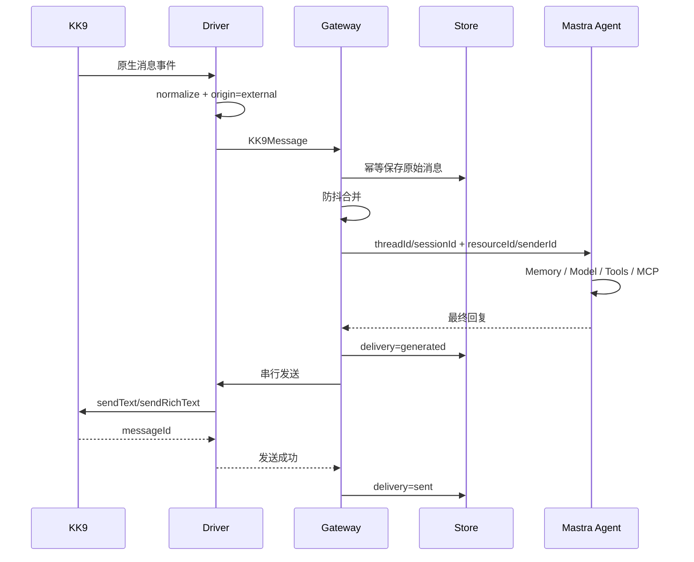
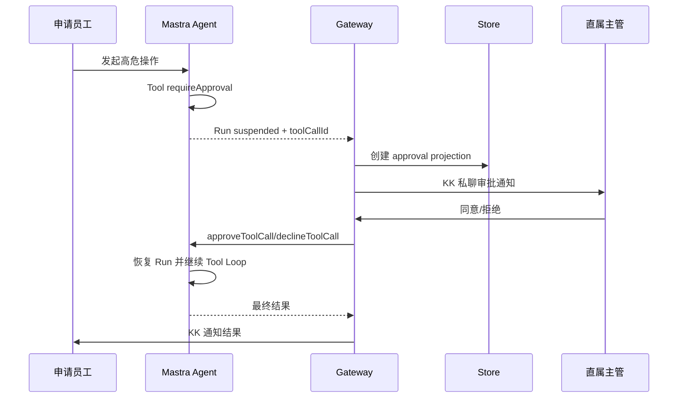

# KKBot Mastra-native 重构总规格

> 仓库：`dnslin/kkbot`
> 文档状态：待确认 / 新重构执行规格
> 取代来源：关闭后的 Issue #107《统一启动器、知识库摄取与生产级运行保障》
> 需求迁移：Issue #107 的 54 条 User Story 均已建立去向
> 技术基线：Mastra 是唯一 Agent Runtime，不研发自定义 AgentRunner
> 适用范围：仅支持 KK 单一 IM 客户端，不建设多渠道适配层
> 编制日期：2026-08-21

---

## 1. 文档定位与目的

本文件是 KKBot 后续重构的**唯一总规格**。Issue #107 关闭后，不再作为可执行规格；它仅作为历史需求来源保留。本文件完成两件事：

1. 确立 KKBot 的 Mastra-native 目标架构和一次性完整改造范围；
2. 将 Issue #107 的产品需求、运行保障、知识库要求和测试要求迁移到新架构，并明确旧技术决策的去向。

KKBot 当前已经具备 KK9 CDP 驱动、消息收发、组织架构、会话编排、记忆、工具、MCP、HITL、主动任务和知识检索等能力，但 Agent 主链路仍然同时存在两套运行逻辑：

- Mastra 提供部分 Memory、Workflow、Schedule、Tool 和 Storage 能力；
- `KkbotAgentRuntime` 又自行负责模型调用、Tool Call 解析、工具执行、Failover、Prompt 拼装和第二轮模型调用。

这种混合方式会造成运行状态重复、职责重叠、工具存在多条执行路径、Memory 出现双事实源，也使原 Issue #107 中的统一启动器、知识摄取和生产保障建立在不稳定的 Agent 底座上。

本规格把项目收敛为：

> **KKBot 负责 KK 客户端接入、KK 专属业务约束和企业数据；Mastra 负责 Agent 推理、Agent Loop、Memory、Tool Calling、MCP、HITL、Workflow、Schedule 和 Agent Observability。**

本次不引入自研 `AgentRunner`，不构建多 IM Adapter，不拆微服务。Issue #107 的 54 条 User Story 没有被直接丢弃；需求全部迁入本规格，旧 Runtime 相关实现决策则被替换。

### 1.1 Wayfinder 决策回写与生效

- 开放决策票中的候选答案、讨论和推荐只是候选上下文，不是实施依据，不得作为已生效规则提前进入 `master` 上的本规格。
- 一张决策票进入正式解决流程后，可以在独立分支形成只对应该票的最小规格修改；独立分支中未合并的 commit 不代表最终规格已经更新。
- 规格修改、合并、resolution、关闭和地图索引属于同一个解决流程。需要修改规格时，修改必须先通过仓库正常机制合并到 `master`；只有验证修改已进入 `master` 后，才能发布最终 resolution 并关闭该票。
- resolution comment 是该票详细决定及理由的权威来源；本总规格只保存已经生效、供后续实施规划使用的整合规则；Wayfinder 地图只追加上下文指针（`gist + link`，即决策票链接和一行摘要），不复制 resolution 详情。
- 如果一张票不需要修改本规格，resolution 必须明确说明原因；如果所需规格修改无法合并，该票必须保持开放，不得发布最终 resolution。

---

## 2. 不可变设计原则

### 2.1 只针对 KK

KKBot 只服务 KK9 客户端，不建立通用 IM 平台抽象。

不新增：

- 通用 `ChatTransport`；
- 通用 Channel Adapter；
- 多平台消息协议；
- Slack、飞书、企业微信兼容层；
- 通用插件市场。

允许直接使用 KK 领域概念：

- `KK9Driver`；
- `KK9Message`；
- `KK9Session`；
- KK 红点；
- KK 会话切换；
- KK 原生撤回；
- KK 组织架构；
- KK 人工操作员接管。

### 2.2 Mastra 是唯一 Agent Runtime

以下能力统一由 Mastra 提供：

- Agent Loop；
- 模型调用；
- Tool Calling；
- MCP Tool；
- Memory；
- 长会话观察与压缩；
- Tool Approval；
- Workflow suspend/resume；
- Schedule；
- Agent Trace；
- Scorer；
- 模型重试与回退。

KKBot 不再自行实现第二套 Agent Runtime。

“Mastra 原生能力”是指最终锁定的稳定兼容版本通过受支持的公开 API 执行该能力，并由 Mastra 持有对应的运行时状态机和执行语义。仅存在同名 API、博客示例，或需要 KKBot 辅助代码自行补出状态机，不算原生满足。

稳定兼容版本已经原生提供所需能力时，优先选择该版本，不在 KKBot 内复制该能力。若不存在可接受的稳定兼容版本，则将对应需求返回 Wayfinder 重新裁定、缩减、替换或删除；不得以自研 Runtime 回补。本原则不锁定具体 Mastra 版本或 Node.js 基线。

### 2.3 不研发 AgentRunner

不新增 `AgentRunner`、`AgentLoopRunner` 或类似运行时。

实际执行者就是 Mastra Agent：

```ts
const agent = mastra.getAgent('kk-assistant');
const result = await agent.generate(/* ... */);
// 或 agent.stream(/* ... */)
```

项目中可以保留“薄集成层”：它只连接 KK 业务边界与 Mastra 公开 API，不持有 Mastra 运行时状态机或执行语义。允许职责包括：

1. 处理 KK 专属 I/O 和数据转换，把 KK 聚合消息转换为 Agent 输入；
2. 创建 `requestContext`、`threadId`、`resourceId`、`traceId`；
3. 定义和注册 KKBot 业务 Tool，并把外部上下文或决议路由给 Mastra 公开 API；
4. 把 Mastra 事件投影为 Draft、Delivery、Approval 等 KKBot 可查询和审计的业务状态；
5. 调用 Mastra Agent，并把最终结果交给 KK 发送层执行 KK 专属的可靠交付。

投影不是运行时事实源。若辅助代码自行持有或决定 Agent/模型重试循环、工具循环、第二套 Agent Memory、Memory 提交或回滚、审批挂起或恢复、调度触发、模型回退等状态转换，它就是被禁止的“自研 Runtime 回补”；即使命名为 Gateway、Coordinator、Adapter 或 Wrapper 也不改变性质。KK 专属发送重试和交付补偿不在此列，但不得反向改变 Mastra 的 Agent 执行语义。

### 2.4 单进程、单数据库、单 Mastra 实例

默认运行模型：

- 单机；
- 单 KK 客户端；
- 单进程；
- 单数据目录；
- 单 LibSQL 数据库；
- 单 Mastra 实例。

不引入 Kafka、Redis、分布式锁或多主高可用。

### 2.5 KK 发送结果才是最终交付事实

模型生成成功不等于用户已经收到。

Delivery 必须区分 `sent`、`failed` 和 `unknown`。只有 KK 发送成功的正向结果才能进入 `sent`；只有能够证明消息没有进入 KK 发送路径的结果才能进入 `failed`；发送动作可能已经触发但系统无法无歧义确认时必须进入 `unknown`。`unknown` 不是失败，人工处理前不得自动补发。草稿、发送失败内容和被中断内容不能污染下一轮 Agent Memory。

---

### 2.6 Mastra 能力基线

本规格依赖下列 Mastra 原生能力，具体 API 签名以项目最终锁定的兼容版本为准：

| 能力 | 本规格中的用途 | 官方依据 |
|---|---|---|
| Agent Loop 与 Tool Calling | 取代 `KkbotAgentRuntime` 的自定义模型和工具循环 | [Agent orchestration](https://mastra.ai/blog/introducing-mastra-improved-agent-orchestration-ai-sdk-v5-support) |
| 动态模型与 fallback array | 按 FAST / DEEP / VISION 选择模型并配置备用链 | [Dynamic model fallback arrays](https://mastra.ai/blog/changelog-2026-03-16) |
| Observational Memory | 取代自定义 L2 摘要和 L3 长期协同记忆 | [Observational Memory](https://mastra.ai/blog/observational-memory) |
| Tool Approval | 高危工具执行前由主管批准或拒绝 | [Tool approval](https://mastra.ai/blog/tool-approval) |
| Workflow suspend / resume 与 snapshot | 需要补充信息、跨步骤等待或长流程恢复 | [Workflow snapshots](https://mastra.ai/en/reference/workflows/snapshots) |
| Agent / Workflow Schedules | 主动提醒、定时推送和保留策略任务 | [Schedules](https://mastra.ai/blog/introducing-schedules-for-agents-and-workflows) |
| Input / Output Processors | 注入防护、PII、安全过滤和输出清洗 | [Input processors](https://mastra.ai/blog/changelog-2025-07-30)、[Output processors](https://mastra.ai/blog/introducing-output-processors) |
| Observability 与 OTel | Agent、模型、工具、Memory、Workflow 和 Token Trace | [Mastra observability](https://mastra.ai/ai-agent-observability) |
| SensitiveDataFilter | Agent Trace 在导出前执行字段级敏感信息脱敏 | [Sensitive data redaction](https://mastra.ai/blog/introducing-sensitive-data-redaction) |

“兼容版本”是经后续版本决策验证的一组稳定 Mastra 依赖版本。兼容性必须同时满足：所需原生能力存在并受支持；Node.js 运行时与依赖引擎约束一致；类型定义和迁移说明支持目标用法；相关离线契约实验通过。只看到 API 存在不足以判定兼容。

版本选择必须优先寻找满足上述条件且原生提供能力的组合。若没有可接受组合，对应需求必须返回 Wayfinder 重新裁定，不得用 KKBot 辅助代码补成第二套 Runtime。具体 Mastra 依赖版本和 Node.js 基线由后续专门决策锁定，本节不提前指定。

---

## 3. 目标架构

```mermaid
flowchart TB
    KK[KK9.exe]
    Driver[@kkbot/driver\nCDP / EventBridge / DOM / Send]
    Gateway[@kkbot/gateway\n防抖 / 撤回 / 接管 / 串行发送]
    Mastra[Mastra Runtime\nAgent / Memory / Tools / MCP / HITL / Workflow]
    Store[@kkbot/store\nKK业务数据 / 组织 / 消息 / 投影 / 配额]
    Knowledge[@kkbot/knowledge\n摄取 / AST Chunk / FTS / Vector / Rerank]
    App[apps/kkbot\nBootstrapper / Config / Preflight / Shutdown]

    App --> Driver
    App --> Gateway
    App --> Mastra
    App --> Store
    App --> Knowledge

    KK <--> Driver
    Driver --> Gateway
    Gateway --> Mastra
    Mastra --> Knowledge
    Mastra --> Store
    Gateway --> Store
    Gateway --> Driver
```

### 3.1 主链路

```text
KK 原生事件
→ Driver 标准化
→ Gateway 防抖与业务校验
→ Mastra Agent
→ Mastra Memory / Tools / MCP / HITL
→ Gateway 收集最终结果
→ KK 串行发送
→ Delivery 持久化
```

### 3.2 模块边界

| 模块 | 核心职责 | 不再负责 |
|---|---|---|
| `@kkbot/driver` | KK CDP、事件、DOM、发送、撤回、红点、组织读取 | Agent、Memory、知识检索、审批状态 |
| `@kkbot/gateway` | 防抖、人工接管、撤回、中断、会话模式、审批消息路由、串行发送 | 模型调用、工具循环、历史拼装、RAG 注入 |
| `@kkbot/agent` | 定义 Mastra Agent、Tools、Processors、Workflows、Scorers | 自研 Runtime、自研 Provider、自研 Tool Executor |
| `@kkbot/store` | KK 原始消息、会话、组织、资产、配额、审批和交付投影 | Mastra Memory、Mastra Workflow 内部状态 |
| `@kkbot/knowledge` | 文档摄取、规范化、Chunk、词法/向量/Rerank 检索 | Agent Loop、KK 发送 |
| `apps/kkbot` | 唯一 Composition Root、配置、自检、启动、关闭 | 领域实现 |

---

## 4. 一次性完整改造清单

## 4.1 把 `@kkbot/agent` 改成 Mastra 定义模块

新的 `@kkbot/agent` 不再以 `KkbotAgentRuntime` 为核心，而是输出：

- Mastra Agent 定义；
- Mastra Memory 配置；
- Mastra Tools；
- MCP Client 配置；
- Mastra Processors；
- Mastra Workflows；
- Mastra Scorers；
- Agent RequestContext 类型。

建议目录：

```text
packages/agent/src/
├── mastra.ts
├── agents/
│   └── kk-assistant.ts
├── context/
│   └── kk-request-context.ts
├── models/
│   ├── model-factory.ts
│   └── model-tier-policy.ts
├── memory/
│   └── kk-memory.ts
├── tools/
│   ├── search-organization.ts
│   ├── query-public-knowledge.ts
│   ├── generate-file-deliverable.ts
│   └── register-proactive-schedule.ts
├── processors/
│   ├── prompt-injection.ts
│   ├── sensitive-input.ts
│   ├── sensitive-output.ts
│   ├── thinking-cleaner.ts
│   ├── grounding.ts
│   └── quota.ts
├── workflows/
│   ├── knowledge-ingestion.ts
│   ├── proactive-message.ts
│   └── asset-retention.ts
└── scorers/
    ├── grounded-answer.ts
    └── tool-correctness.ts
```

整个应用只创建一个 Mastra 实例：

```ts
const mastra = new Mastra({
  storage,
  agents: {
    kkAssistant: kkAssistantAgent,
  },
  workflows: {
    knowledgeIngestion: knowledgeIngestionWorkflow,
    proactiveMessage: proactiveMessageWorkflow,
    assetRetention: assetRetentionWorkflow,
  },
  observability,
});
```

以上代码为结构示意，最终 API 以项目锁定的 Mastra 版本为准。

---

## 4.2 删除自研 `KkbotAgentRuntime`

删除：

```text
packages/agent/src/runtime.ts
```

同时删除其中的以下职责：

- 手工构建模型消息；
- 手工执行流式和非流式分支；
- 手工解析 Tool Calls；
- 手工执行工具；
- 手工追加 Tool Message；
- 手工发起第二轮模型调用；
- 手工维护 `finishReason`；
- 手工统计 Token；
- 手工实现模型 Failover；
- 手工处理 Agent Loop。

Gateway 以后直接调用 Mastra Agent：

```text
ConsolidatedMessage
→ RequestContext
→ Mastra Agent
→ Final Response / Tool Approval / Error
```

---

## 4.3 删除自定义 `LLMProvider`

删除或废弃：

```text
LLMProvider
LLMMessage
LLMStreamChunk
ModelEndpointConfig
```

模型接入改为：

```text
YAML 配置
→ ModelFactory
→ Mastra/AI SDK 可用模型对象
→ Mastra Agent
```

保留 OpenAI-compatible 支持，但它只是 `ModelFactory` 的一种配置类型，不再成为项目自定义模型协议。

测试中使用 Mastra/AI SDK 支持的 Fake Model，不再 Mock 项目自定义 `chat()`、`chatStream()`。

---

## 4.4 删除自定义模型 Failover

删除：

```text
packages/agent/src/routing/failover.ts
packages/agent/src/routing/fallback.ts
```

主模型、备用模型、重试次数和超时统一配置给 Mastra。

Gateway 只处理最终失败：

```text
Mastra 模型链全部失败
→ 返回统一故障结果
→ Gateway 决定 KK 提示、红点和人工处理策略
```

不再由 Agent 内部维护自定义 `FallbackHandler`。

---

## 4.5 把 `IntentModelRouter` 改成纯模型等级策略

原有 Router 同时保存模型、备用模型和 Failover 逻辑，职责过重。

改成：

```ts
type ModelTier = 'FAST' | 'DEEP' | 'VISION';

function resolveModelTier(input: {
  text: string;
  attachments: Attachment[];
}): ModelTier;
```

它只做分类：

- 简单问候、简单组织查询：`FAST`；
- 代码、分析、复杂方案：`DEEP`；
- 图片或需要视觉理解：`VISION`。

结果写入 Mastra `requestContext`，由 Agent 动态选择模型。

该策略不能再：

- 调用模型；
- 管理备用节点；
- 管理重试；
- 管理超时；
- 负责 Tool Loop。

---

## 4.6 使用 Mastra Memory 取代自定义 3-Tier Memory Manager

删除：

```text
packages/agent/src/memory/manager.ts
packages/agent/src/memory/schema.ts
```

删除自定义：

- `agent_working_summaries`；
- `agent_colleague_profiles`；
- 自定义 L2 摘要任务；
- 自定义 L1 历史拼装；
- 自定义 `formatContextForPrompt()`。

固定映射：

```text
Mastra threadId   = KK sessionId
Mastra resourceId = KK senderId / employeeId
```

数据归属：

| 数据 | 事实源 |
|---|---|
| KK 原始消息、native messageId、raw payload | `@kkbot/store` |
| Agent 对话历史 | Mastra Memory |
| 长会话压缩和长期观察 | Mastra Memory / Observational Memory |
| 员工部门、岗位、直属主管 | `@kkbot/store` |
| 员工沟通偏好、长期协同特征 | Mastra Memory |
| 企业制度和公共知识 | `@kkbot/knowledge` |

禁止同时维护两套会话摘要和员工画像。

---

## 4.7 建立 KK 原始消息与 Mastra Memory 的同步规则

### 外部员工消息

```text
Driver 收到消息
→ Store 幂等写入原始消息
→ Gateway 防抖
→ 调用 Mastra Agent
→ Mastra 写入 Thread Memory
```

### Bot 回复

```text
Mastra 生成回复
→ 创建 delivery: generated
→ Gateway 发送 KK：delivery = sending
→ 正向发送成功：delivery = sent
→ 可证明发送动作尚未触发：delivery = failed，可按重试策略自动重试
→ 发送动作可能已触发或无法证明尚未触发：delivery = unknown，禁止自动补发并进入人工处理
```

发送失败的 assistant 内容不能成为下一轮“用户已经收到”的事实。`unknown` 是否以及何时提交到 Mastra Memory，由[《确定回复交付与 Memory 提交协议》](https://github.com/dnslin/kkbot/issues/129)决定，本节不提前裁定。

### 草稿

- 草稿写入独立 `drafts` 表；
- 草稿不进入 Mastra 对话历史；
- 草稿真正发送成功后才成为 assistant 消息。

### 人工操作员消息

- 来源识别为 `operator`；
- 进入人工接管状态；
- 作为真实 assistant/operator 消息同步到 Mastra Thread；
- 不与 Bot 回显重复入库。

### 撤回

- 防抖期撤回：从 Pending Bucket 删除；
- Agent 运行中撤回：Abort 当前 Mastra Run；
- 已进入 Memory：删除对应 Memory Message；
- Raw Store 保留记录并标记 `is_recalled = 1`。

---

## 4.8 删除 `LayeredPromptCompiler`

删除：

```text
packages/agent/src/prompt/compiler.ts
```

改成 Mastra Agent 动态 Instructions。

Instructions 只负责：

- `soul.md`；
- 当前时间；
- 员工部门和岗位；
- 协同边界；
- 企业安全规则；
- 知识问答必须有来源；
- 未命中时不得编造。

不再手工注入：

- L1 历史；
- L2 摘要；
- L3 画像；
- Tool Messages。

这些由 Mastra Agent 和 Memory 管理。

---

## 4.9 把输入输出安全逻辑改成 Mastra Processors

原有能力可以保留，但运行位置改变。

建议 Processor：

```text
Input Processors
├── UnicodeNormalizer
├── PromptInjectionProcessor
├── SensitiveInputProcessor
└── QuotaProcessor

Output Processors
├── ThinkingTagProcessor
├── SensitiveOutputProcessor
├── KnowledgeGroundingProcessor
└── OutputLengthProcessor
```

`SensitiveFilter` 和 `ThinkingTagCleaner` 不再嵌在自定义 Runtime 中。

它们可以继续使用项目自己的规则，但必须作为 Mastra Processor 运行。

---

## 4.10 删除自定义 Tool Registry 和 Tool Executor

删除：

```text
packages/agent/src/tools/registry.ts
packages/agent/src/tools/executor.ts
```

以后直接创建 Mastra Tool，并注册给 Agent。

可以保留一个小型 `createKkTool()` 工厂，统一添加：

- Zod 输入输出 Schema；
- 风险等级；
- 是否写操作；
- 权限要求；
- 幂等键；
- 审计字段；
- 超时；
- 结果裁剪。

但它必须返回 Mastra Tool，不能自行接管 Tool Call 执行。

建议工具元数据：

```ts
interface KkToolPolicy {
  effect: 'read' | 'write';
  risk: 'low' | 'medium' | 'high';
  requireApproval: boolean;
  requiredPermission?: string;
  serialKey?: 'session' | 'employee' | 'entity';
}
```

### 写操作

所有写工具必须：

- 支持稳定 `idempotencyKey`；
- 有数据库唯一约束；
- 防止重试重复副作用；
- 对相同业务实体串行；
- 校验 `outputSchema`；
- 大结果只返回摘要和引用。

---

## 4.11 MCP 直接接入 Mastra

不再把 MCP Tool 转换到自定义 Registry 再执行。

新的 MCP 层只负责：

- MCP Server 配置；
- 生命周期；
- Tool 白名单；
- 命名冲突；
- 权限覆盖；
- 高危 Tool 标记；
- 启动失败诊断。

Agent 直接使用 Mastra MCP Client 获取的 Tools。

---

## 4.12 使用 Mastra 原生 Tool Approval

高危单工具统一配置：

```ts
requireApproval: true
```

当模型调用高危工具时：

```text
Mastra Agent Run 挂起
→ Gateway 得到 runId / toolCallId
→ 写审批业务投影
→ 查找直属主管
→ KK 私聊发送审批提示
→ 主管回复同意/拒绝
→ Gateway 调用 Mastra approve/decline
→ Mastra 恢复原 Agent Run
→ Tool 执行
→ Agent 生成最终回复
```

当前 `ApprovalManager` 不再：

- 自行执行 Tool；
- 同时维护第二套 Agent Workflow 状态；
- 审批后再次手工调用 Tool；
- 负责 Agent Loop 恢复。

保留的 KK 审批能力：

- `LeaderApprovalRouter`；
- `StatefulApprovalMatcher`；
- 多笔待办消歧；
- 主管私聊通知；
- 申请人结果通知；
- 超时策略；
- 审计投影；
- Fail-Closed。

审批投影建议：

```sql
approval_tasks (
  id,
  run_id,
  tool_call_id,
  tool_name,
  applicant_id,
  applicant_session_id,
  approver_id,
  args_hash,
  status,
  expires_at,
  resolved_at,
  created_at,
  updated_at
)
```

该表是业务投影，不是 Agent Run 的事实源。

---

## 4.13 区分 Tool Approval 和 Workflow Suspend

### Tool Approval

用于单个高危动作是否允许执行：

- 删除；
- 修改权限；
- 更新业务数据；
- 大范围发送；
- 资金或敏感操作。

### Workflow Suspend/Resume

用于多步骤业务流程：

```text
提交申请
→ 查找审批人
→ 等待补充信息
→ 等待主管
→ 执行业务
→ 通知申请人
```

禁止同一个审批同时使用：

```text
自定义 Approval 状态机
+ Mastra Tool Approval
+ Mastra Workflow Suspend
```

必须明确唯一状态源。

---

## 4.14 简化 `SessionCoordinator`

继续保留：

- 短消息防抖；
- 最大等待时间；
- 新消息中断；
- 消息撤回；
- 人工接管；
- 会话模式；
- 红点守卫；
- 全局串行发送；
- KK 会话切换；
- Bot 回显识别；
- 跨 KK 会话审批通知；
- CDP 重连补偿。

删除：

- `memoryManager.getContext()`；
- 手工构建 `historyMessages`；
- 手工拼接 L2 摘要；
- 手工拼接 L3 用户画像；
- Gateway 预先执行知识库检索；
- 手工传入 Tool Calls；
- 自定义 Failover；
- 自定义 Agent Runtime。

新的调用关系：

```text
Gateway
→ 创建 RequestContext
→ 调用 Mastra Agent
→ 缓冲最终文本
→ OutboundDispatcher
```

KK 继续以单条完整消息发送，不引入长文本拆包。

---

## 4.15 调整新消息中断和重聚

旧方式会把旧批次消息和新消息重新拼成一个 `ConsolidatedMessage`，迁移到 Mastra Memory 后容易重复写入。

新规则：

1. 第一批用户消息已进入 Mastra Thread；
2. 新消息到达时 Abort 当前 Run；
3. 删除或排除未交付的 assistant/tool 中间结果；
4. 新一轮只提交新消息；
5. Mastra 从 Thread Memory 读取前一批用户消息；
6. 不重新提交旧批次。

新的在途状态：

```ts
interface InFlightSession {
  sessionId: string;
  runId: string;
  inputMessageIds: string[];
  abortController: AbortController;
  startedAt: number;
}
```

---

## 4.16 修复人工操作员消息过滤

当前 Driver/EventBridge 某些路径会直接忽略 `msg.isMe`，这会使真实人工接管消息无法到达 Gateway。

统一消息来源：

```ts
type KkMessageOrigin =
  | 'external'
  | 'operator'
  | 'bot_echo'
  | 'system';
```

识别规则：

- 外部员工：`external`；
- 当前账号发送，且 ID 属于 Bot 发出集合：`bot_echo`；
- 当前账号发送，但不是 Bot 发出：`operator`；
- 撤回和系统通知：`system`。

Driver 必须派发 `operator`，由 Gateway 触发人工接管。

---

## 4.17 合并 Driver 的事件捕获路径

统一优先级：

```text
主路径：KK9EventBridge 原生事件
备用：Polling 补偿扫描
兜底：DOM 状态扫描
```

要求：

- 所有路径使用同一套 normalize 逻辑；
- 所有路径生成同一 native messageId；
- 去重使用 `(sessionId, messageId)`；
- 数据库提供唯一约束；
- 内存 Set 只做短期优化，不能作为最终幂等保证；
- CDP 重连后重新注入 EventBridge；
- 重连补偿只扫描断线窗口内的消息；
- 撤回事件同样遵守幂等。

---

## 4.18 新增 `@kkbot/knowledge`

Issue #107 的知识摄取方向保留，但独立成一个清晰模块。

建议目录：

```text
packages/knowledge/src/
├── ingestion/
│   ├── ingestion-service.ts
│   ├── markdown-adapter.ts
│   ├── docx-adapter.ts
│   ├── pdf-text-adapter.ts
│   └── vision-ocr-adapter.ts
├── chunking/
│   └── markdown-ast-chunker.ts
├── indexing/
│   ├── lexical-index.ts
│   ├── vector-index.ts
│   └── atomic-replacement.ts
├── retrieval/
│   ├── hybrid-retriever.ts
│   ├── rerank-adapter.ts
│   └── fallback-policy.ts
└── types.ts
```

### 摄取流程

```text
扫描 PublicKnowledge 源目录
→ 文件类型识别
→ 规范化 Markdown
→ Remark/Unified AST 解析
→ 标题感知 Chunk
→ 写入文档和 Chunk
→ 可选 Embedding
→ 原子替换旧索引
→ 保存摄取状态
```

### 支持格式

- Markdown；
- DOCX；
- 文本型 PDF；
- 扫描件和复杂 PDF 通过 Vision/OCR Adapter；
- 旧版 DOC 明确拒绝。

### Chunk 规则

- 章节优先；
- 保留标题链；
- 段落、列表、表格、代码块保持原子性；
- 超长章节只在 AST 节点边界拆分；
- 每个 Chunk 可脱离原文独立理解；
- Chunk ID 稳定；
- 源内容不变时不重复向量化。

### 检索策略

```text
本地 FTS5 / 加权词法
+
LibSQL Vector
+
可选 Rerank
```

远程 Embedding/Rerank 超时、429、5xx 时回退本地检索；鉴权和配置错误在 Preflight 暴露。

---

## 4.19 知识库通过 Mastra Tool 使用

新增：

```text
query_public_knowledge
```

输出至少包含：

```ts
{
  found: boolean;
  chunks: Array<{
    chunkId: string;
    title: string;
    headingPath: string[];
    content: string;
    sourcePath: string;
    score: number;
    updatedAt: number;
  }>;
}
```

Agent 应主动调用该 Tool，不再由 Gateway 在调用 Agent 前预先检索并拼入 Prompt。

知识回答规则：

- 企业制度、规范、流程问题必须先检索；
- 未命中时明确说明没有找到依据；
- 不允许用模型常识编造内部政策；
- 最终结果保留来源信息；
- 删除或过期文档不能继续被召回；
- PublicKnowledge 与个人 Memory 完全分离。

---

## 4.20 主动任务使用 Mastra Schedule + Workflow

保留主动任务能力，但由 Mastra 正式管理。

建议 Workflow：

```text
proactiveMessageWorkflow
```

流程：

```text
读取任务
→ 可选调用 kkAssistant 生成内容
→ 调用 KK OutboundDispatcher
→ 写入 Delivery
→ 保存执行结果
```

所有主动发送必须经过 Gateway 的 OutboundDispatcher，不能直接调用 `driver.sendText()`。

主动消息与普通回复共享同一 outbound 结果语义。主动发送进入 `unknown` 后，Schedule、Workflow 和补偿逻辑都不得自动再次发送；重启后的恢复与人工决议后的继续方式由[《确定主动任务的恢复与重复发送语义》](https://github.com/dnslin/kkbot/issues/125)决定。

这样可以继续保证：

- 全局发送锁；
- 会话切换；
- 人工接管检查；
- 红点策略；
- 发送持久化；
- 失败诊断。

---

## 4.21 统一单库和单 Storage

统一数据库：

```text
data/kkbot.db
```

应用启动时创建：

```text
一个 LibSQL Client
一个 Mastra Storage
一个 Mastra Instance
```

### Mastra 管理

- Agent threads/messages；
- Memory；
- Observational Memory；
- Workflow snapshots；
- Schedules；
- Agent traces；
- Scorer 结果；
- suspended runs。

### KKBot Store 管理

- KK sessions；
- KK raw messages；
- 组织架构；
- 媒体与文件；
- Delivery；
- Draft；
- Approval Projection；
- Knowledge source metadata；
- Token quotas；
- Asset references。

KKBot 不修改 Mastra 内部表结构。

---

## 4.22 引入正式数据库迁移

新增：

```text
packages/store/migrations/
├── 0001_initial.sql
├── 0002_message_idempotency.sql
├── 0003_drafts_and_deliveries.sql
├── 0004_approval_projection.sql
├── 0005_knowledge.sql
├── 0006_quotas.sql
└── 0007_asset_references.sql
```

至少增加：

```sql
CREATE TABLE schema_migrations (
  version INTEGER PRIMARY KEY,
  applied_at INTEGER NOT NULL
);

CREATE UNIQUE INDEX uniq_session_native_message
ON session_messages(session_id, message_id)
WHERE message_id IS NOT NULL;
```

消息写入使用幂等 Upsert 或 `ON CONFLICT DO NOTHING`。

---

## 4.23 新增 Draft 和 Delivery 数据模型

### Draft

```sql
drafts (
  id,
  session_id,
  run_id,
  content,
  status,
  created_at,
  updated_at
)
```

状态：

```text
generated / edited / sent / discarded
```

### Delivery

```sql
message_deliveries (
  id,
  run_id,
  session_id,
  mastra_message_id,
  kk_message_id,
  content_hash,
  status,
  error_code,
  created_at,
  updated_at
)
```

状态：

```text
generated / sending / sent / failed / unknown / aborted
```

每次 OutboundDispatcher 调用构成一次发送尝试。发送尝试的不可逆边界是第一项可能使消息进入 KK 发送路径的动作；实现细节可以变化，但判断标准始终是“是否仍能证明消息不可能已经进入 KK 发送路径”。

一个 Delivery 可以包含多个顺序发送尝试。自动重试必须开始新的发送尝试，并且只允许前一次尝试明确进入 `failed` 后启动；任一次尝试进入 `unknown`，该 Delivery 立即停止自动重试链并进入人工处理。

- **pre-trigger failure**：系统能够证明失败发生在不可逆边界之前，发送动作尚未触发。例如发送锁获取前失败、会话切换明确失败、输入校验失败，或调用 KK 发送动作前连接已确定不可用。此类结果记为 `failed`，允许自动重试。
- **confirmed failed**：存在正面证据证明该次发送尝试没有触发 KK 发送动作。当前没有经证实的 post-send confirmed-failed 信号，因此现阶段只有明确的 pre-trigger failure 能进入 `failed`。
- **unknown outcome**：发送动作已经触发，或系统无法证明其尚未触发。发送后的回读超时、CDP 超时、CDP 断开、UI 回读失败和响应丢失都必须记为 `unknown`，不得自动重试或补发。
- `aborted` 仅能用于能够证明发送动作尚未触发的主动中止；中止发生在边界之后或边界位置不可判定时仍必须记为 `unknown`。
- `unknown` 必须进入人工处理路径；人工决议前禁止任何自动补发。
- 内容哈希、DOM 历史扫描、bot_echo、本地 ID 集合和幂等键都不能证明一次具体 outbound 调用是否发生，不得据此把 `unknown` 自动改写为 `sent` 或 `failed`，也不得据此授权补发。
- 普通回复与主动消息必须使用同一状态定义和发送边界。

该模型用于解决：

- 模型生成成功但 KK 发送失败或结果不确定；
- 草稿未发送；
- 中断内容不能进入下一轮事实；
- 审计用户实际收到或可能收到的内容。

本节不决定 `unknown` 的 Mastra Memory 提交语义，也不决定重启后的主动任务恢复语义，分别由[《确定回复交付与 Memory 提交协议》](https://github.com/dnslin/kkbot/issues/129)和[《确定主动任务的恢复与重复发送语义》](https://github.com/dnslin/kkbot/issues/125)裁定。

---

## 4.24 UnifiedLogger 与 Mastra Observability 分工

### UnifiedLogger

负责应用运行日志：

- Bootstrapper；
- Driver；
- Gateway；
- Store；
- Knowledge ingestion；
- CDP；
- 文件；
- 数据库；
- module 字段；
- traceId；
- runId；
- sessionId；
- senderId；
- Pino 输出；
- 日志滚动；
- PII 脱敏。

### Mastra Observability

负责 Agent 内部运行：

- Model Calls；
- Agent Loop；
- Tool Calls；
- MCP；
- Memory；
- Workflow；
- HITL；
- Token Usage；
- Scorer。

不要再为 Agent Loop 自建第二套 Trace 系统。

---

## 4.25 统一 Trace Context

Gateway 完成消息聚合时创建：

```ts
interface KkTraceContext {
  traceId: string;
  runId: string;
  sessionId: string;
  senderId?: string;
  inputMessageIds: string[];
}
```

传播到：

- Pino child logger；
- Mastra `requestContext`；
- Mastra `tracingContext`；
- Tool context；
- Approval Projection；
- Delivery；
- Knowledge Tool；
- Store 操作。

禁止通过全局可变变量传播上下文。

---

## 4.26 Token 配额接入 Mastra Usage

调用前检查：

- 全局每日 Token 上限；
- 单用户每日请求上限；
- 单用户每日 Token 上限；
- 配置时区的日界线。

调用后按实际 Mastra Usage 原子累加：

- Input Tokens；
- Output Tokens；
- Reasoning Tokens；
- Cached Tokens；
- 多轮 Tool Loop 总消耗；
- Fallback 模型实际消耗。

表建议：

```sql
token_usage_daily (
  usage_date,
  user_id,
  request_count,
  input_tokens,
  output_tokens,
  reasoning_tokens,
  cached_tokens,
  total_tokens,
  updated_at,
  PRIMARY KEY (usage_date, user_id)
)
```

达到配额后返回明确提示，不静默失败。

---

## 4.27 资产保留使用 Schedule + Workflow

新增：

```text
assetRetentionWorkflow
```

定期处理：

- 接收图片；
- 接收文件；
- OCR 中间文件；
- 规范化临时文件；
- 生成交付物；
- 失败任务残留。

删除前检查：

- 是否被消息引用；
- 是否被未完成 Workflow 引用；
- 是否处于审批中；
- 是否处于发送中；
- 是否被知识索引引用。

数据库保留必要元数据和删除状态。

---

## 4.28 重写 UnifiedBootstrapper

Issue #107 的 UnifiedBootstrapper 保留，但围绕唯一 Mastra 实例重写。

### 启动顺序

```text
1. 加载 YAML
2. 环境变量插值
3. Zod 校验
4. 初始化 UnifiedLogger
5. 获取单实例锁
6. 创建 LibSQL Client
7. 执行 KKBot migrations
8. 创建 Mastra Storage
9. 创建 Knowledge 组件
10. 创建 Models
11. 创建 Tools 和 MCP Client
12. 创建 Memory
13. 创建 Agents
14. 创建 Workflows 和 Schedules
15. 创建 Observability
16. 创建唯一 Mastra 实例
17. 创建 KK Driver
18. 创建 Gateway
19. 执行 Preflight
20. 连接 CDP
21. 注入 EventBridge
22. 启动 Coordinator
23. 开放消息处理
```

### 关闭顺序

```text
停止接收新消息
→ Abort 活跃 Mastra Runs
→ 停止 Schedules
→ 停止 Coordinator
→ 断开 Driver
→ 关闭 MCP
→ Flush Trace 和 Logger
→ 关闭数据库
→ 释放单实例锁
```

任何启动失败都必须按已初始化资源的逆序回滚。

---

## 4.29 统一 YAML 配置

建议结构：

```yaml
kk:
  cdp:
    url: http://127.0.0.1:9222
  debounceMs: 1500
  maxWaitMs: 5000
  takeoverMinutes: 10

mastra:
  storage:
    url: file:./data/kkbot.db
  observability:
    enabled: true
    redactSensitiveData: true

agent:
  id: kk-assistant
  soulPath: ./config/soul.md
  maxSteps: 5
  memory:
    lastMessages: 20
    observationalMemory: true

  models:
    fast:
      provider: openai-compatible
      baseUrl: ${FAST_MODEL_BASE_URL}
      apiKey: ${FAST_MODEL_API_KEY}
      model: ${FAST_MODEL_NAME}

    deep:
      provider: openai-compatible
      baseUrl: ${DEEP_MODEL_BASE_URL}
      apiKey: ${DEEP_MODEL_API_KEY}
      model: ${DEEP_MODEL_NAME}

    vision:
      provider: openai-compatible
      baseUrl: ${VISION_MODEL_BASE_URL}
      apiKey: ${VISION_MODEL_API_KEY}
      model: ${VISION_MODEL_NAME}

knowledge:
  sources: ./data/knowledge/sources
  normalized: ./data/knowledge/normalized
  lexical:
    enabled: true
  embedding:
    enabled: true
    baseUrl: ${EMBEDDING_BASE_URL}
    apiKey: ${EMBEDDING_API_KEY}
    model: ${EMBEDDING_MODEL}
  rerank:
    enabled: false

limits:
  timezone: Asia/Shanghai
  globalDailyTokens: 1000000
  userDailyTokens: 50000
  userDailyRequests: 100

retention:
  mediaDays: 30
  deliverableDays: 30
  logDays: 7
```

所有凭据只能来自环境变量。

---

## 4.30 新增正式应用入口

新增：

```text
apps/kkbot/
├── src/
│   ├── main.ts
│   ├── bootstrapper.ts
│   ├── config.ts
│   ├── preflight.ts
│   ├── instance-lock.ts
│   └── shutdown.ts
└── package.json
```

根命令：

```json
{
  "scripts": {
    "dev": "pnpm --filter @kkbot/app dev",
    "start": "pnpm --filter @kkbot/app start",
    "doctor": "pnpm --filter @kkbot/app doctor",
    "knowledge:ingest": "pnpm --filter @kkbot/app knowledge:ingest",
    "knowledge:rebuild": "pnpm --filter @kkbot/app knowledge:rebuild"
  }
}
```

Mastra 嵌入 KKBot 进程，不要求单独部署 HTTP 服务。

---

## 4.31 固定 Mastra 依赖版本

当前各包不应分别使用可漂移的 Mastra 版本。

统一使用 pnpm catalog 或 workspace overrides：

```yaml
catalog:
  '@mastra/core': '<locked-version>'
  '@mastra/memory': '<locked-version>'
  '@mastra/libsql': '<locked-version>'
  '@mastra/mcp': '<locked-version>'
  '@mastra/rag': '<locked-version>'
  '@mastra/observability': '<locked-version>'
```

要求：

- 锁定经过验证的一组兼容版本；
- 不允许不同包分别使用 `^` 漂移；
- 统一 Zod 和 AI SDK 版本；
- 升级时执行完整 Memory、Tool、HITL、Workflow 契约测试。

---

## 5. 当前模块处理表

| 当前模块 | 新处理方式 |
|---|---|
| `KkbotAgentRuntime` | 删除，直接使用 Mastra Agent |
| 自定义 `LLMProvider` | 删除，使用 Mastra/AI SDK Model |
| `ModelFailoverManager` | 删除，使用 Mastra Model Fallback |
| `IntentModelRouter` | 改为纯 `ModelTierPolicy` |
| `FallbackHandler` | 删除，最终失败由 Gateway 处理 |
| `AgentMemoryManager` | 删除，使用 Mastra Memory |
| `LayeredPromptCompiler` | 改为动态 Agent Instructions |
| `SensitiveFilter` | 改为 Mastra Input/Output Processor |
| `ThinkingTagCleaner` | 改为 Mastra Output Processor |
| `ToolRegistry` | 删除，直接注册 Mastra Tools |
| `ReadWriteSplitExecutor` | 删除，Mastra 负责 Tool Loop |
| `ApprovalManager` | 改为审批业务投影、路由和超时协调，不执行 Tool |
| `LeaderApprovalRouter` | 保留 |
| `StatefulApprovalMatcher` | 保留 |
| MCP Manager | 简化为 Mastra MCP Client 生命周期和策略 |
| `ProactiveScheduleManager` | 改成 Mastra Schedule + Workflow |
| `SessionCoordinator` | 保留并简化 |
| `KK9Driver` | 保留，修复 operator/bot_echo 来源识别 |
| `KK9EventBridge` | 保留，作为主事件入口 |
| `@kkbot/store` | 保留，只管理 KK 业务数据 |
| 当前 Markdown 检索工具 | 替换为正式 Knowledge Module + Tool |
| `UnifiedBootstrapper` | 保留，围绕唯一 Mastra 实例实现 |
| `UnifiedLogger` | 保留，但不重复实现 Agent Trace |

---

## 6. Issue #107 需求迁移

### 6.1 迁移原则

Issue #107 关闭后，其正文不再作为实施依据。迁移状态统一为：

| 状态 | 含义 |
|---|---|
| `carry` / 直接保留 | 需求和主要实现边界仍然适用。 |
| `adapt` / 改写后保留 | 产品目标保留，但实现必须切换到 Mastra-native 架构。 |
| `separate` / 迁入独立子系统 | 需求仍属于本总规格，但主要由 Knowledge、Retention 等独立模块承担。 |
| `drop` / 删除 | 仅用于旧技术实现决策；不再进入新代码。 |

结论：Issue #107 的 **54 条 User Story 全部有新归属，没有产品需求被直接丢弃**：

- 16 条直接保留；
- 14 条改写后保留；
- 24 条迁入 Knowledge、Retention 等独立子系统；
- 0 条产品需求删除。

被删除的是自研 Runtime、LLMProvider、Memory Manager、Tool Executor、Failover 和双重 HITL 等旧实现路径。

### 6.2 User Story 迁移台账

| ID | #107 原需求 | 处理 | 新归属 | 新验收口径 |
|---|---|---|---|---|
| R107-01 | 统一 YAML 配置 | 直接保留 | `apps/kkbot / UnifiedBootstrapper` | 一个 YAML 与环境变量可启动完整 KKBot。 |
| R107-02 | 配置支持环境变量插值 | 直接保留 | `ConfigLoader` | 未解析变量和空凭据在启动前报错。 |
| R107-03 | 中文字段级配置错误 | 直接保留 | `Zod Config Schema` | 错误包含字段路径、原因和修复提示。 |
| R107-04 | 单一命令启动 Driver、Store、Agent、Gateway | 直接保留 | `apps/kkbot` | 只有一个正式启动入口和生命周期。 |
| R107-05 | 按依赖顺序初始化模块 | 改写后保留 | `UnifiedBootstrapper` | 先创建唯一 Mastra 实例和存储，再开放 Gateway 消息处理。 |
| R107-06 | 启动前检查目录、数据库、CDP 和 LLM | 改写后保留 | `PreflightHealthcheck` | LLM 检查改由 Mastra ModelFactory/模型实例执行。 |
| R107-07 | 同一数据目录单实例运行 | 直接保留 | `InstanceLock` | 第二实例拒绝启动，陈旧锁仅在进程不存在时清理。 |
| R107-08 | Ctrl+C / 容器停止时级联释放 | 改写后保留 | `CascadedGracefulShutdown` | 停止接收消息、Abort Mastra Runs、停止 Schedule、关闭 CDP/MCP/DB。 |
| R107-09 | KK9 重启后 CDP 自动重连 | 直接保留 | `@kkbot/driver` | 有界指数退避并重新注入事件桥。 |
| R107-10 | CDP 重连后补偿未处理消息 | 直接保留 | `Driver + Gateway + Store` | 补偿扫描依赖原生消息 ID 和数据库唯一约束去重。 |
| R107-11 | Markdown 文档摄取 | 迁入独立子系统 | `@kkbot/knowledge` | 源文档可被规范化、切片和索引。 |
| R107-12 | DOCX 转换为规范化 Markdown | 迁入独立子系统 | `@kkbot/knowledge / DOCX Adapter` | 保留标题、段落、列表和表格语义。 |
| R107-13 | 文本型 PDF 转换 | 迁入独立子系统 | `@kkbot/knowledge / PDF Adapter` | 保留页和段落边界并产生诊断信息。 |
| R107-14 | 扫描件/复杂 PDF 路由 Vision/OCR | 迁入独立子系统 | `@kkbot/knowledge / OCR Adapter` | 不静默输出乱码，明确记录转换路径和置信度。 |
| R107-15 | 旧版 DOC 或损坏文件明确失败 | 迁入独立子系统 | `KnowledgeIngestion` | 返回结构化失败结果，不进入索引。 |
| R107-16 | 原始文件和规范化 Markdown 分离 | 迁入独立子系统 | `Knowledge Storage` | 源文件不被覆盖，生成物可复核。 |
| R107-17 | 记录来源哈希、转换器版本和状态 | 迁入独立子系统 | `knowledge_sources` | 每个来源可追踪其摄取版本和失败原因。 |
| R107-18 | 未变化文件跳过重复解析和向量化 | 迁入独立子系统 | `KnowledgeIngestion` | 相同来源哈希返回 skipped。 |
| R107-19 | 源文件修改后增量重建 | 迁入独立子系统 | `KnowledgeIngestion` | 只更新受影响文档。 |
| R107-20 | 源文件删除后传播删除 | 迁入独立子系统 | `KnowledgeIngestion` | 规范化文件、Chunk、FTS 和向量同步删除。 |
| R107-21 | 更新时原子替换旧 Chunk/向量 | 迁入独立子系统 | `AtomicKnowledgeReplacement` | 任何时刻不得同时召回同一来源的新旧版本。 |
| R107-22 | Embedding 模型或维度变化要求重建 | 迁入独立子系统 | `knowledge_indexes` | 索引保存 provider/model/dimension/version 指纹。 |
| R107-23 | Chunk 携带完整来源元数据 | 迁入独立子系统 | `knowledge_chunks` | 包含标题、标题链、来源、哈希、更新时间。 |
| R107-24 | 按章节语义切片 | 迁入独立子系统 | `Markdown AST Chunker` | 不得按固定字符截断句子、列表或表格。 |
| R107-25 | Chunk 继承文档标题和标题链 | 迁入独立子系统 | `Markdown AST Chunker` | Chunk 脱离原文仍具备自包含语义。 |
| R107-26 | 中文、英文缩写、工单号、系统代号可检索 | 迁入独立子系统 | `LexicalTokenizer` | 保留中文 Bigram、英文数字和连字符 Token。 |
| R107-27 | 支持企业专有词典 | 迁入独立子系统 | `LexicalTokenizer` | 专有词优先作为不可拆分 Token。 |
| R107-28 | 无 Embedding 时本地词法检索 | 迁入独立子系统 | `KnowledgeRetriever` | 零外部 API 仍可运行。 |
| R107-29 | 配置 Embedding 后启用向量检索 | 迁入独立子系统 | `KnowledgeRetriever + LibSQL Vector` | 支持语义近似召回。 |
| R107-30 | 可选 Rerank | 迁入独立子系统 | `Rerank Adapter` | 只重排限定候选并返回限定最终结果。 |
| R107-31 | Embedding/Rerank 故障降级本地检索 | 迁入独立子系统 | `KnowledgeFallbackPolicy` | 超时、429、5xx 降级；鉴权和配置错误由 Preflight 暴露。 |
| R107-32 | 知识不足时明确未命中 | 改写后保留 | `Knowledge Tool + Grounding Processor` | 企业制度类回答无来源时禁止模型按常识编造。 |
| R107-33 | 仅摄取 PublicKnowledge | 迁入独立子系统 | `KnowledgeIngestion Policy` | 未明确归类的文档不得进入全局知识。 |
| R107-34 | 统一 Provider Adapter 接入模型 | 改写后保留 | `MastraModelFactory` | 删除自定义 LLMProvider，输出 Mastra/AI SDK 模型实例。 |
| R107-35 | 配置 FAST、DEEP 和备用模型 | 改写后保留 | `ModelTierPolicy + Mastra fallback` | 策略只选 Tier，重试和 fallback 由 Mastra 执行。 |
| R107-36 | 集中配置 LLM、Embedding、Rerank | 改写后保留 | `Unified Config` | 模型配置不再映射到自定义 Runtime。 |
| R107-37 | 四模块共享统一日志策略 | 改写后保留 | `UnifiedLogger` | 应用日志统一；Agent 内部 Trace 交给 Mastra Observability。 |
| R107-38 | 日志保留 module 字段 | 直接保留 | `UnifiedLogger child logger` | Driver/Gateway/Store/Knowledge 可按模块筛选。 |
| R107-39 | traceId 跨 Driver、Gateway、Agent、Store | 改写后保留 | `TraceContext + Mastra tracingContext` | 并发会话不依赖全局可变上下文。 |
| R107-40 | 日志带 sessionId 和必要 senderId | 直接保留 | `TraceContext` | 标识可追踪且正文默认不入日志。 |
| R107-41 | API Key、Token、Cookie、手机号等脱敏 | 改写后保留 | `PiiRedactionPolicy + SensitiveDataFilter` | 应用日志和 Mastra Trace 分别在导出前脱敏。 |
| R107-42 | 开发可读日志、生产 JSON | 直接保留 | `UnifiedLogger` | 开发 pino-pretty，生产结构化输出。 |
| R107-43 | 日志滚动与保留周期 | 直接保留 | `Log Rotation Adapter` | 默认保留 7 天，可配置日期或大小轮转。 |
| R107-44 | Tool/HITL 稳定审计字段 | 改写后保留 | `Mastra Trace + approval projection` | 使用 traceId/runId/toolCallId/approvalTaskId 串联。 |
| R107-45 | 全局每日 Token 上限 | 改写后保留 | `Quota Processor + token_usage_daily` | 按完整 Mastra Run usage 原子累计。 |
| R107-46 | 单用户每日调用上限 | 直接保留 | `Quota Repository` | 并发调用不能越过上限。 |
| R107-47 | 达到配额后明确提示 | 直接保留 | `Quota Processor / Gateway` | 返回可理解的恢复时间和限制原因。 |
| R107-48 | 媒体和交付物按策略清理 | 迁入独立子系统 | `AssetRetention Workflow` | 默认 30 天并保护活跃引用。 |
| R107-49 | 访问已过期文件时明确提示 | 迁入独立子系统 | `Asset Repository / Delivery Tool` | 保留元数据和 expired 状态。 |
| R107-50 | 三级主管寻路 | 直接保留 | `LeaderApprovalRouter` | 直接 leaderId → ReportingLine/部门负责人 → fallbackLeaderId。 |
| R107-51 | 无主管时高危操作 Fail-Closed | 直接保留 | `Approval Projection + Gateway` | 不得绕过 Mastra Tool Approval。 |
| R107-52 | KK 长文本保持单条发送 | 直接保留 | `KkOutboundDispatcher` | 不实现未经真机需求证明的拆包。 |
| R107-53 | 启动、摄取、日志暴露小而深接口 | 改写后保留 | `Bootstrapper / KnowledgeIngestion / UnifiedLogger` | 不新增 AgentRunner、LLMProvider、ToolExecutor 等重复接口。 |
| R107-54 | 通过最高层接口做确定性测试 | 改写后保留 | `Test Harness` | 使用 Fake Mastra Model、临时 Storage、Fake KK Driver 和临时知识目录。 |

### 6.3 旧 Implementation Decisions 迁移

| #107 Implementation Decision | 处理 | 新决策 |
|---|---|---|
| 唯一顶层 Composition Root | 直接保留 | 保留 `apps/kkbot` 与 `UnifiedBootstrapper`。 |
| Bootstrapper 小而深接口 | 直接保留 | 隐藏 YAML、依赖构造、信号和关闭顺序。 |
| YAML + Zod + 环境变量插值 | 直接保留 | 保持不变。 |
| 现有 LLMProvider seam | 删除 | 删除，改为 `MastraModelFactory` 创建 Mastra/AI SDK 模型。 |
| 复用现有 KkbotAgentRuntime | 删除 | 删除，自定义 Runtime 不再是执行入口。 |
| 复用现有 ModelFailoverManager | 删除 | 使用 Mastra fallback array 和每模型重试配置。 |
| 复用现有 AgentMemoryManager | 删除 | 使用 Mastra Memory/Observational Memory；KK 原始消息仍由 Store 管理。 |
| 复用 ToolRegistry/ReadWriteSplitExecutor | 删除 | Tool 直接注册给 Mastra Agent，由 Agent Loop 执行。 |
| 自定义 ApprovalManager 执行高危 Tool | 删除 | Mastra Tool Approval 为执行状态源；KKBot 只保存业务投影和主管路由。 |
| Gateway 预读 Memory/RAG 并拼 Prompt | 删除 | Memory 由 Mastra 注入；知识通过 `query_public_knowledge` Tool 获取。 |
| KnowledgeIngestion 高层模块 | 直接保留 | 保留并迁入 `@kkbot/knowledge`。 |
| Markdown/DOCX/PDF/OCR Adapter | 直接保留 | 保持格式边界和失败诊断。 |
| Markdown AST 标题感知 Chunker | 直接保留 | 保持节点原子性、自包含标题链和稳定 ID。 |
| 本地词法 + Vector + Rerank | 改写后保留 | 检索实现保留；Agent 使用方式改为 Mastra Tool。 |
| AtomicVectorReplacement | 直接保留 | 扩展为 Chunk、FTS、Vector 的单来源原子替换。 |
| PublicKnowledge 单一知识域 | 直接保留 | 保持，权限知识库继续 Out of Scope。 |
| UnifiedLogger 覆盖完整 Agent Trace | 改写后保留 | 应用日志由 UnifiedLogger，Agent Trace 由 Mastra Observability。 |
| TraceContextPropagation | 改写后保留 | 同时写入 Pino context、Mastra requestContext 和 tracingContext。 |
| PiiRedactionPolicy | 改写后保留 | 应用日志规则与 Mastra SensitiveDataFilter 双层覆盖。 |
| PreflightHealthcheck | 改写后保留 | 模型与 Mastra Storage 也纳入检查。 |
| 单实例锁 | 直接保留 | 保持数据目录作用域。 |
| CDP 重连和补偿扫描 | 直接保留 | 增加数据库唯一约束作为最终幂等防线。 |
| Token 配额 | 改写后保留 | usage 来源改为完整 Mastra Run。 |
| AssetRetentionPolicy | 改写后保留 | 由 Mastra Schedule 触发 Workflow，物理删除由 KKBot Repository 执行。 |
| LeaderHierarchyResolution | 直接保留 | 保持三级寻路和 Fail-Closed。 |
| 不做长文本拆包 | 直接保留 | 保持。 |
| SkillPackage/DeclarativeMcpLoader 延后 | 直接保留 | 继续 Out of Scope；不建设空兼容层。 |

### 6.4 新架构补充要求

以下要求并非 Issue #107 原文完整覆盖，但它们是消除当前混合架构所必需的约束：

| ID | 新增要求 | 说明 |
|---|---|---|
| N-01 | 唯一 Mastra Runtime | 整个进程只有一个根级 Mastra 实例，包内不得私自创建第二套 Agent Runtime。 |
| N-02 | 禁止自研 AgentRunner | Gateway 直接调用注册在 Mastra 中的 KK Agent；辅助函数只构造上下文。 |
| N-03 | 单一 Agent Memory 事实源 | 自定义 L2/L3 表退出 Agent 记忆链，组织资料和公共知识保持独立领域数据。 |
| N-04 | KK 交付一致性 | 生成、发送中、已发送、失败必须持久化；发送失败不得让后续对话误以为用户已收到。 |
| N-05 | 草稿隔离 | 草稿进入独立 Draft 数据，不进入 Mastra 对话历史，发送成功后再转正。 |
| N-06 | 消息来源四分类 | Driver 输出 external/operator/bot_echo/system，人工消息不得被 isMe 过滤。 |
| N-07 | 事件入口优先级 | EventBridge 为主，Polling 为断线补偿，DOM 扫描为兜底。 |
| N-08 | 数据库最终幂等 | 以 `(session_id, message_id)` 唯一约束防止多事件路径重复入库。 |
| N-09 | Mastra Tool Approval 为唯一执行状态源 | 审批投影不得自行执行高危 Tool。 |
| N-10 | Tool Approval 与 Workflow Suspend 分离 | 风险确认使用 Approval；补充信息和多步骤等待使用 suspend/resume。 |
| N-11 | 中断后不重放旧用户消息 | Abort 当前 Run 后只提交新消息，旧内容由 thread memory 提供。 |
| N-12 | 正式数据库迁移 | KKBot 业务表使用版本化 migration，不再只依赖 CREATE TABLE IF NOT EXISTS。 |
| N-13 | Mastra 依赖版本锁定 | Core、Memory、LibSQL、MCP、RAG、Observability 使用经契约测试验证的兼容版本组。 |
| N-14 | 知识查询由 Agent 主动 Tool Call | Gateway 不再提前执行知识检索并拼入 Prompt。 |
| N-15 | 完整 Run 关联 | traceId、runId、sessionId、toolCallId、approvalTaskId、deliveryId 可重建完整链路。 |

### 6.5 Testing Decisions 迁移

原 Issue #107 的测试方向整体保留，测试 seam 调整如下：

| 原测试 seam | 新测试 seam |
|---|---|
| Fake `LLMProvider` | Fake Mastra / AI SDK Model |
| Fake `KkbotAgentRuntime` | 真实 Mastra Agent 配置 + Fake Model |
| Fake `AgentMemoryManager` | 临时 Mastra Storage + Memory |
| 自定义 ToolExecutor 测试 | Mastra Agent 多轮 Tool Call 契约测试 |
| 自定义 ApprovalManager 工具执行测试 | Mastra Tool Approval 挂起/批准/拒绝/恢复测试 |
| Gateway 手工 RAG 注入测试 | `query_public_knowledge` Tool 和 Grounding Processor 测试 |
| 自定义 Failover 测试 | Mastra fallback chain 契约测试 |
| 单模块脚本装配测试 | `UnifiedBootstrapper` 最高层启动/关闭测试 |

仍需覆盖：配置、知识摄取、AST Chunk、词法/向量/Rerank、日志脱敏、并发 Trace、单实例锁、CDP 重连补偿、Token 配额、资产清理、主管寻路和真机冒烟。

### 6.6 Issue #107 关闭后的处理

1. 关闭 Issue #107，并注明“需求已迁入《KKBot Mastra-native 重构总规格》”。
2. 不再从 #107 创建实现分支、PR 或 Agent 任务。
3. 新 Issue、PR 和提交引用本文件中的 `R107-xx` 或 `N-xx` 编号。
4. 如后续发现 #107 有遗漏，只允许更新本文件的迁移台账，不重新打开旧规格。
5. 仓库中的旧 ADR 若与本文件冲突，应新增替代 ADR，不直接篡改历史决策记录。

建议关闭说明：

> Issue #107 的产品需求、知识库要求、生产保障和测试要求已完整迁入《KKBot Mastra-native 重构总规格》。原 Issue 中基于自研 Agent Runtime、LLMProvider、Memory Manager、Tool Executor 和双重 HITL 状态机的实现路径不再采用，因此关闭旧规格，后续以新总规格为唯一实施依据。

---

## 7. 核心运行流程

## 7.1 正常消息处理



## 7.2 新消息到达时中断

```text
Agent Run 正在执行
→ 同一会话收到新消息
→ Gateway Abort 当前 Run
→ 保留已写入的用户消息
→ 清理未交付 assistant/tool 中间状态
→ 只提交新消息
→ Mastra 从 Thread Memory 读取此前上下文
```

## 7.3 人工接管

```text
Driver 捕获当前账号发出的消息
→ 不是 bot_echo
→ 标记 origin=operator
→ Gateway Abort 当前 Agent Run
→ 清空 Pending Bucket
→ 写入 Human Takeover 截止时间
→ operator 消息进入 Store 和 Mastra Thread
→ 退避期内外部消息只存储，不自动回复
```

## 7.4 高危 Tool 审批



## 7.5 知识问答

```text
用户询问企业制度
→ Agent 判断需要企业事实
→ 调用 query_public_knowledge
→ 词法 + 向量 + 可选 Rerank
→ 返回带来源 Chunk
→ Agent 基于 Chunk 回答
→ Grounding Processor 检查依据
→ 未命中则明确说明没有找到依据
```

## 7.6 CDP 重连

```text
CDP 断开
→ Gateway 暂停新 Agent Run
→ Driver 有界指数退避重连
→ 重注入 EventBridge
→ 根据断线时间窗执行补偿扫描
→ 数据库唯一约束去重
→ 恢复消息处理
```

---

## 8. 建议数据表

KKBot 自有表建议至少包括：

```text
schema_migrations
sessions
session_messages
drafts
message_deliveries
approval_tasks
org_departments
org_employees
org_employee_departments
knowledge_sources
knowledge_documents
knowledge_chunks
knowledge_indexes
token_usage_daily
asset_references
```

### 8.1 关键唯一约束

```text
(session_id, message_id)
(run_id, tool_call_id)
(run_id, session_id, content_hash)
(source_id, chunk_id)
(usage_date, user_id)
```

### 8.2 关键幂等键

```text
消息：sessionId + nativeMessageId
Tool：runId + toolCallId
发送：runId + contentHash
摄取：sourcePath + sourceHash + converterVersion
向量：chunkId + embeddingModelFingerprint
```

`runId + contentHash` 标识一个 Delivery，只约束 KKBot 本地的重复记录和并发创建；它既不标识单次发送尝试，也不能证明某次 KK 发送动作是否发生。发送记录进入 `unknown` 后，不得用该幂等键、DOM 历史或内容相似性将其自动改写为 `sent` / `failed`，也不得据此自动补发。

---

## 9. 测试与验收清单

## 9.1 Mastra Agent Loop

- 模型连续调用两个及以上 Tool；
- Tool 结果回传后继续推理；
- 达到 `maxSteps` 时安全停止；
- 无 Tool Call 时正常结束；
- Fallback 后仍能完成；
- 非重试错误不会无意义重试。

## 9.2 Model Tier

- 问候进入 FAST；
- 复杂分析进入 DEEP；
- 图片进入 VISION；
- 自定义规则覆盖默认分类；
- Model Tier 只决定模型等级，不参与执行。

## 9.3 Memory

- `sessionId → threadId`；
- `senderId → resourceId`；
- 两个会话不串线；
- 人工 operator 消息进入 Thread；
- 草稿不进入 Memory；
- 发送失败不形成已交付历史；
- 撤回消息从 Agent 上下文删除；
- 新消息中断后不重复提交旧消息。

## 9.4 HITL

- Tool Approval 正确挂起；
- 创建审批业务投影；
- 直属主管批准；
- 直属主管拒绝；
- 非主管无法审批；
- 多笔任务需要序号消歧；
- 超时自动拒绝或转人工；
- Resume 后 Tool 只执行一次；
- 最终结果回到申请人会话。

## 9.5 Driver 和 Gateway

- 原始 Payload 能识别 external/operator/bot_echo/system；
- operator 能真实触发接管；
- Bot 回显不触发接管；
- EventBridge 主链路和 Polling 补偿不会重复入库；
- 撤回能中断当前 Run；
- 两个会话并发生成不会串发；
- 会话切换失败时 Fail-Closed；
- 发送失败时保留红点。
- 明确的 pre-trigger failure 可以自动重试；
- 自动重试只在前一次尝试明确 `failed` 后创建新的发送尝试；任一次尝试进入 `unknown` 后停止自动重试链；
- 发送动作可能已触发后的超时、断线、UI 回读失败或响应丢失进入 `unknown`；
- 无法证明发送动作尚未触发时按 `unknown` 处理；
- `unknown` 在人工处理前不会被自动重试或补发；
- 内容哈希、DOM 历史、bot_echo 和幂等键不能自动消除 `unknown`；
- 主动消息与普通回复遵守相同的发送边界和 Delivery 状态。

## 9.6 Knowledge

- Markdown、DOCX、文本 PDF；
- 扫描件转 Vision/OCR；
- 损坏文件有明确错误；
- AST 标题感知 Chunk；
- 列表、表格、代码块不被腰斩；
- 未变化文件跳过；
- 修改文件增量替换；
- 删除文件传播到 Chunk 和 Vector；
- Embedding 模型变化要求重建；
- Rerank 超时自动回退；
- 鉴权错误在 Preflight 暴露；
- 无命中时 Agent 不编造；
- 最终回答保留来源。

## 9.7 Bootstrapper

- 配置合法时完整启动；
- 缺失环境变量返回中文字段错误；
- 非法 URL 启动前失败；
- 第二实例被拒绝；
- 陈旧锁可安全恢复；
- Preflight 未通过时不开放消息处理；
- 任一步初始化失败都逆序回滚；
- Ctrl+C 完整级联关闭；
- 活跃 Run 被中断；
- MCP、Driver、数据库和日志都被关闭。

## 9.8 Observability

- traceId 在 Driver、Gateway、Mastra、Store 间一致；
- runId 与审批和 Delivery 对应；
- 并发会话上下文不串线；
- Model、Tool、Memory、Workflow 有 Mastra Trace；
- API Key、Cookie、Authorization、手机号和身份证号被脱敏；
- Token Usage 可以按用户和日期查询。

---

## 10. 明确不做的内容

本次重设计不包括：

- 多 IM 平台；
- 通用 Channel Adapter；
- 自研 AgentRunner；
- 自研 Agent Loop；
- 自研 LLM Provider 协议；
- 自研模型 Failover；
- 自研 Tool Executor；
- 第二套 Memory；
- 多 Agent 协同；
- 独立向量数据库；
- Redis、Kafka 或消息队列；
- 微服务拆分；
- 多主高可用；
- Web 运维控制台；
- 长文本消息拆包；
- 目录式 Skill 热加载；
- 部门级私有知识权限系统。

---

## 11. 完成定义

本次架构重设计完成后，应满足以下结果：

1. 仓库中不存在自定义 Agent Loop；
2. `KkbotAgentRuntime`、自定义 `LLMProvider`、自定义 Tool Executor 被移除；
3. Agent 的执行入口只有 Mastra Agent；
4. Memory 只有 Mastra 一套事实源；
5. Tool Approval 的运行状态只有 Mastra 一套事实源；
6. KKBot Store 只保存 KK 业务数据和必要投影；
7. 草稿、发送失败和被中断回复不会污染对话历史；
8. Driver 能识别真实人工操作员消息并触发接管；
9. EventBridge、Polling 和补偿扫描具备数据库级幂等；
10. 企业知识通过正式摄取、AST Chunk 和混合检索进入 Agent；
11. Agent 对企业制度回答必须具备来源，没有来源时拒绝编造；
12. 整个应用由一个 YAML、一个启动命令、一个 Bootstrapper 启动；
13. 全系统使用一个 LibSQL 数据库和一个 Mastra 实例；
14. Agent 内部使用 Mastra Observability，应用侧使用 UnifiedLogger；
15. 每次消息处理都能通过 `traceId + runId + sessionId` 重建完整链路；
16. 所有高危写 Tool 都具备审批、权限、幂等和审计；
17. 所有关键行为都有高层 Interface 和端到端测试；
18. Issue #107 已关闭且全部需求完成迁移，后续只以本规格为实施依据。

---

## 12. 最终架构边界

### KKBot 自己研发

- KK 专属 I/O 和数据转换；
- `requestContext`、`threadId`、`resourceId`、`traceId` 标识创建；
- KKBot 业务 Tool 定义和注册；
- KK CDP Driver；
- KK DOM 和原生事件桥；
- KK 消息去重与补偿；
- KK 撤回；
- KK 红点；
- KK 会话切换和串行发送；
- 人工操作员接管；
- 组织架构和主管路由；
- 企业知识摄取规则；
- PublicKnowledge 检索策略；
- Delivery、Draft、Approval Projection；
- 配额、资产和运行保障；
- 统一启动与应用日志。

### 直接使用 Mastra

- Agent Runtime；
- Agent Loop；
- Model 调用；
- Tool Calling；
- MCP；
- Memory；
- 长会话观察和压缩；
- Tool Approval；
- Workflow suspend/resume；
- Schedule；
- Agent Trace；
- Scorer；
- Model Retry/Fallback。

最终关系：

> **KKBot 把 KK 的真实事件、企业上下文和业务 Tool 可靠地交给 Mastra；Mastra 完成 Agent 推理与执行；KKBot 再把已完成结果可靠地交付给 KK 用户。**

边界按事实权威判断，而不是按包名或类名判断：KKBot 可以负责 KK I/O、业务数据、投影和可靠交付；Mastra 必须负责 Agent、模型、工具、Memory、Approval、Workflow、Schedule 和 Failover 的运行时状态机与执行语义。任何让 KKBot 成为这些状态转换事实权威的辅助代码，均属于禁止的自研 Runtime 回补。

---

## 13. 来源与版本说明

### 13.1 需求来源

- GitHub Issue #107：`[Spec] 统一启动器、知识库摄取与生产级运行保障`
- 本文件已迁移该 Issue 的 54 条 User Story、主要 Implementation Decisions 和 Testing Decisions。
- Issue 关闭后，本文件成为唯一可执行规格。

### 13.2 Mastra 参考资料

- [Agent orchestration and tool loop](https://mastra.ai/blog/introducing-mastra-improved-agent-orchestration-ai-sdk-v5-support)
- [Dynamic model fallback arrays](https://mastra.ai/blog/changelog-2026-03-16)
- [Model fallback](https://mastra.ai/blog/model-fallback)
- [Observational Memory](https://mastra.ai/blog/observational-memory)
- [Tool approval](https://mastra.ai/blog/tool-approval)
- [Approval versus suspension](https://mastra.ai/blog/human-in-the-loop-when-to-use-agent-approval)
- [Workflow snapshots and resume](https://mastra.ai/en/reference/workflows/snapshots)
- [Agent and workflow schedules](https://mastra.ai/blog/introducing-schedules-for-agents-and-workflows)
- [Input processors](https://mastra.ai/blog/changelog-2025-07-30)
- [Output processors](https://mastra.ai/blog/introducing-output-processors)
- [Mastra observability](https://mastra.ai/ai-agent-observability)
- [Sensitive data redaction](https://mastra.ai/blog/introducing-sensitive-data-redaction)

### 13.3 版本约束

本文描述的是能力边界和目标架构，不把博客示例代码视为稳定 API 契约。开始实施前必须：

1. 锁定一组兼容的 Mastra 精确版本；
2. 根据该版本的类型定义更新所有示例调用；
3. 运行 Agent Loop、Memory、Tool Approval、Workflow、Schedule 和 Observability 契约测试；
4. 禁止各 package 单独升级 Mastra 依赖。
